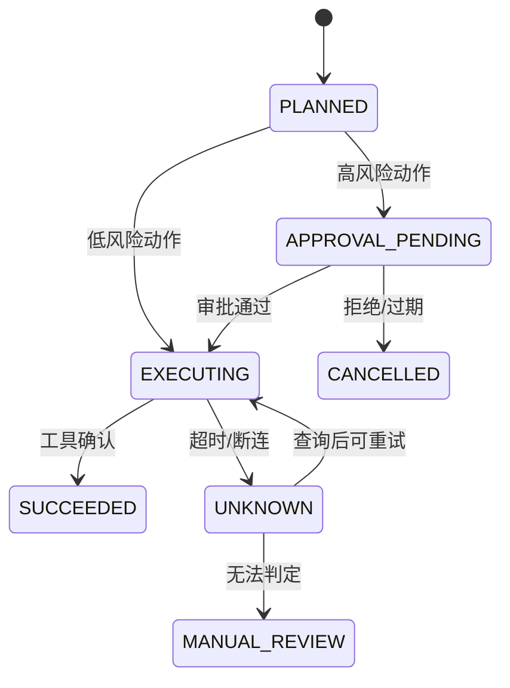

# Agent 生产化与工具安全

## 90 秒速答

我先判断任务是否真的需要 Agent：路径稳定、风险高的流程优先固定 Workflow，只有步骤依赖动态
信息、工具选择不确定时才引入 Agent。生产化时把自然语言计划落到持久化状态机，每个工具声明
输入、输出、副作用、超时、幂等和权限；读操作与写操作分级，资金、删除、外发等高风险动作在
执行前做确定性校验和人工审批。每步有预算、重试边界、checkpoint 和审计日志，恢复时从已确认
状态继续，不能靠重新播放整段对话。评测以任务成功、错误动作、人工接管、延迟和单次成功成本为主。

## Agent 还是 Workflow

| 条件 | 更适合 Workflow | 更适合 Agent |
| --- | --- | --- |
| 路径 | 稳定、可枚举 | 随输入动态变化 |
| 风险 | 高风险强控制 | 可隔离、可逆 |
| 解释 | 需要严格步骤证明 | 可接受策略性探索 |
| 失败处理 | 明确补偿 | 需要动态纠偏 |

常见做法是“Workflow 管边界，Agent 做局部决策”：外层状态机决定允许的阶段和工具，模型只在
当前阶段的白名单内选择动作。

## 工具契约必须表达副作用

```text
tool: issue_refund
permission: refund:write
idempotency_key: order_id + refund_reason
preconditions: paid=true, refunded=false, amount<=approved_amount
side_effect: irreversible_after_settlement
timeout: 3s
approval: amount > 500 requires human
```

schema 校验只保证格式正确，不保证业务授权。工具执行端必须从可信身份重新校验租户、对象权限、
金额上限和状态前置条件，不能相信模型生成的“管理员已同意”。

## 可恢复状态机



超时是未知，不等于失败。先用幂等键查询工具结果，再决定重试；否则退款、发信或建单可能重复。

## Prompt Injection 的系统边界

把网页、邮件和 RAG 文档视为不可信数据，而不是指令；系统策略与工具权限在模型外强制执行。
对外发、删除、付款等动作展示结构化预览，让人确认具体对象和影响。输出过滤、Prompt 提醒可以
降低风险，但不能替代授权、隔离和审计。

## 预算与终止条件

- 最大步骤数、模型调用数、token、墙钟时间和工具费用。
- 检测重复状态、重复工具参数和无进展循环。
- 达到预算后返回 checkpoint、已完成动作和需要人工处理的信息。
- 多 Agent 共享同一任务账本，避免互相对话无限放大成本。

## 面试官三级追问

### L1：工具调用失败能否直接重试？

先按错误分类。明确未执行的瞬态错误可退避重试；超时或断连属于未知结果，应使用幂等键查询；
参数、权限和业务拒绝不重试。

### L2：人工审批放在哪里？

放在不可逆副作用之前，审批内容必须是已解析的具体动作、对象和影响，而不是模糊计划。审批后若
关键参数变化，应重新审批。

### L3：如何证明 Agent 比固定流程更好？

在同一任务集比较完成率、错误动作率、人工耗时、TP99 和单次成功成本；若动态能力没有带来足够
收益，却增加审计和恢复复杂度，就应退回 Workflow。

## 25 分自测

| 维度 | 5 分要求 |
| --- | --- |
| 正确性 | 区分计划、授权、执行和确认 |
| 深度 | 覆盖未知结果、幂等、checkpoint 和注入 |
| 取舍 | Agent 自主性与 Workflow 控制边界清楚 |
| 表达 | 风险分级 → 状态机 → 工具契约 → 验收 |
| 可运维性 | 预算、审批、审计、恢复和人工入口完整 |

## 复述任务

不看正文回答：Agent 调用退款工具超时后应该如何处理？为什么“再试一次”可能造成财务事故？

