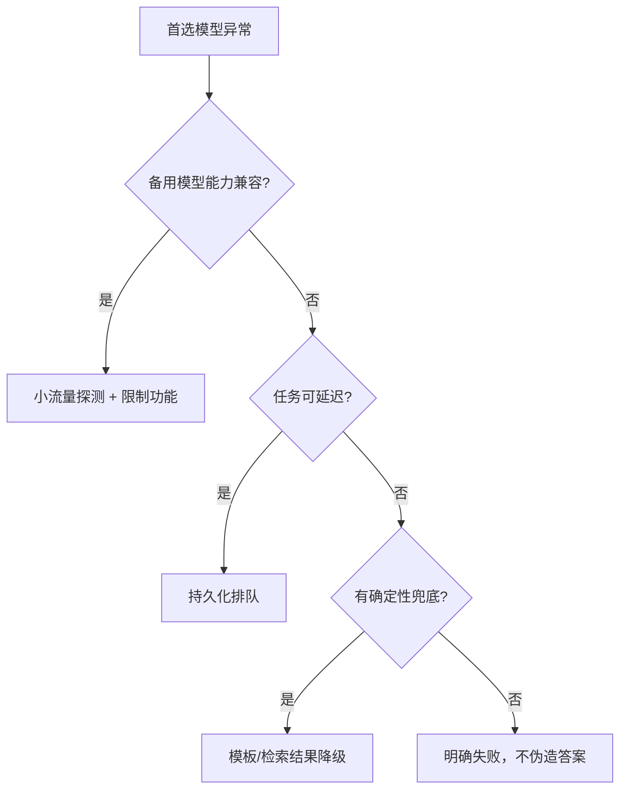

# 模型路由、SLA 与成本

## 90 秒速答

模型路由先按业务任务和风险建立质量门槛，再把请求按语言、上下文长度、工具需求、复杂度和租户
预算分类。低风险简单任务优先小模型，高风险或低置信度升级强模型；路由规则必须在固定评测集和
线上灰度中验证。网关统一做配额、deadline、缓存、供应商熔断、可观测与版本控制。成本不只看
token 单价，而看 `总推理与检索成本 / 成功完成任务数`，同时观察 TTFT、TP99、失败重试和升级率。
供应商故障时按能力矩阵降级，不能把不兼容模型当透明替换。

## 路由决策维度

| 维度 | 示例信号 | 路由影响 |
| --- | --- | --- |
| 任务 | 分类、摘要、代码、复杂推理 | 决定基础能力门槛 |
| 风险 | 内部草稿、客户承诺、医疗金融 | 决定验证与强模型升级 |
| 上下文 | token 长度、图像、工具 schema | 过滤不兼容模型 |
| SLA | TTFT、完成时延、可用性 | 选择地域、服务档和降级 |
| 成本 | 租户预算、剩余额度 | 限制模型、长度和重试 |

路由器本身也会误判。要记录“为什么选择该模型”、候选模型、置信度和最终结果，持续用失败样本
更新规则或分类器。

## 单次成功任务成本

```text
成功任务成本 =（输入 token + 输出 token + 检索 + 重排 + 工具 + 重试）总成本 / 成功任务数
```

小模型单次调用便宜，但如果低质量导致更多重试和人工接管，成功任务成本可能更高。还应报告每
业务结果成本，例如每个成功解决的客服问题、每份通过审核的报告，而不是每千 token。

## AI 网关的职责边界

网关负责鉴权、配额、路由、超时、供应商适配、缓存、审计和指标；业务语义、事实校验和高风险
审批仍在业务服务。避免把所有 Prompt 和流程塞进网关形成新的单体。

## 降级矩阵



备用模型要提前验证函数调用 schema、上下文长度、内容安全、多语言和输出格式。切换后监控质量，
而不只是 HTTP 成功率。

## 延迟和成本优化顺序

先减少无价值工作：Prompt 与上下文裁剪、检索去重、输出上限、缓存和取消；再做小模型路由、并行
或批处理。实时请求关注 TTFT 与 TP99，离线任务可用批量和低优先级队列。不能通过截断关键证据
换取便宜，也不能让失败重试无限消耗预算。

## 面试官三级追问

### L1：什么时候应从小模型升级大模型？

当任务类型或风险要求更强能力，或小模型置信度、规则校验、检索覆盖低于门槛时升级。门槛来自
评测与业务损失，不应只靠 Prompt 长度猜测。

### L2：缓存如何避免数据泄露？

缓存键包含租户、权限范围、模型与 Prompt/知识版本；敏感请求可禁用共享缓存。命中后仍校验当前
授权和数据有效性，并设置删除传播机制。

### L3：供应商切换后 HTTP 成功率正常，为什么仍可能事故？

备用模型可能不兼容工具参数、拒答策略、引用格式或多语言质量。切换验收必须包含任务成功率、
错误动作、质量抽样、TTFT、TP99 和单位成功成本。

## 25 分自测

| 维度 | 5 分要求 |
| --- | --- |
| 正确性 | 路由信号、能力门槛和降级语义明确 |
| 深度 | 覆盖升级率、重试、供应商兼容与缓存隔离 |
| 取舍 | 质量、延迟、成本、可用性共同决策 |
| 表达 | 任务分层 → 路由 → 降级 → 运营 |
| 可运维性 | 有预算、配额、审计、灰度和回滚 |

## 复述任务

不看正文回答：小模型单价低 70%，为什么未必更省钱？请给出路由门槛和单位经济性指标。

