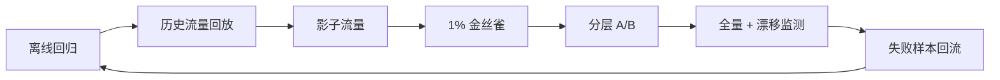

# AI 评测与发布门禁

## 90 秒速答

AI 评测先从业务任务定义成功与不可接受失败，再建立覆盖常规、长尾、高风险和拒答场景的版本化
数据集。指标同时包含任务质量、安全、延迟、成本和稳定性；规则评测、模型评审和人工专家分层
使用，并用专家仲裁集校准评审器。升级时冻结模型、Prompt、检索、工具和参数版本，依次经过离线、
回放、影子、金丝雀和 A/B；任何硬门槛越线自动回滚。线上失败进入分类样本库，监控输入、质量
与成本漂移，避免一次评测通过后永久放行。

## 评测对象不是只有模型

一次结果由模型版本、系统 Prompt、采样参数、检索索引、重排器、工具 schema、业务规则共同
决定。实验记录必须保存完整配置和数据版本，否则无法复现，也无法判断退化来源。

## 指标分层

| 层 | 指标示例 | 门禁方式 |
| --- | --- | --- |
| 任务质量 | 完成率、事实正确率、忠实度 | 相对基线 + 绝对下限 |
| 安全 | 越权动作、敏感泄露、有害输出 | 高风险零容忍硬门槛 |
| 产品 | 采纳率、解决率、转人工率 | A/B 或分阶段观察 |
| 性能 | TTFT、TP99、超时率 | SLO 门槛 |
| 成本 | 单次成功成本、token、升级率 | 预算门槛 |
| 稳定性 | 格式失败、工具失败、供应商错误 | 回归门槛 |

不要把多个目标压成一个总分后放行。安全退化不能被成本改善抵消，核心质量也不能被平均分掩盖。

## 评测集结构

- 真实生产分布用于估计整体效果。
- 高风险与长尾集合用于设置硬门槛。
- 近期失败样本用于防止复发。
- 对抗与无答案集合用于验证边界。
- 留出集防止团队针对公开用例过拟合。

样本包含输入、上下文、关键事实点、允许答案、禁止错误、风险等级和来源时间，并定期去重、审计
标签和更新过期知识。

## 发布阶梯

影子阶段不执行真实副作用；Agent 写操作只能使用沙箱或 dry-run。A/B 要固定分流单元、防止用户
跨组污染，并观察足够完整的业务周期。

## 模型评审器的边界

模型评审适合大规模筛查和开放文本比较，但会有位置偏差、风格偏好、自我偏好和提示敏感。通过
交换候选顺序、隐藏模型身份、多次采样、规则交叉检查和专家仲裁集校准。高风险结果不能只依赖
单一模型评审器。

## 漂移与回滚

监控输入主题、语言、长度、检索命中、路由比例、拒答、人工接管、成本和质量抽样。回滚要覆盖
模型别名、Prompt、索引、工具 schema 与路由配置，保证旧版本仍兼容当前数据。出现越权、敏感
泄露或关键任务失败时优先关闭能力，而不是等待统计显著性。

## 面试官三级追问

### L1：离线准确率提升为何线上解决率可能下降？

离线集可能过期或不代表生产分布，新版本也可能更慢、更贵、拒答更多，影响用户行为。需要分层
线上实验与失败样本分析。

### L2：A/B 多久才可信？

由基线转化、最小可检测效应、流量和业务周期决定，不是固定七天。高风险安全指标使用硬门槛，
不等待常规显著性检验。

### L3：如何避免失败样本集越积越大？

按失败机制聚类、去重和分层抽样；保留高风险、代表性和历史复发样本，过期知识及时更新。门禁集
追求覆盖机制，而不是无限堆数量。

## 25 分自测

| 维度 | 5 分要求 |
| --- | --- |
| 正确性 | 评测对象、指标和发布版本定义完整 |
| 深度 | 覆盖评审偏差、长尾、漂移和多配置回滚 |
| 取舍 | 离线效率、线上真实性和风险权衡明确 |
| 表达 | 目标 → 数据 → 指标 → 发布 → 回流 |
| 可运维性 | 硬门槛、金丝雀、审计和自动回滚完整 |

## 复述任务

不看正文回答：新模型离线得分提升 8%，你为什么仍不直接全量？请设计发布阶梯和回滚门槛。

