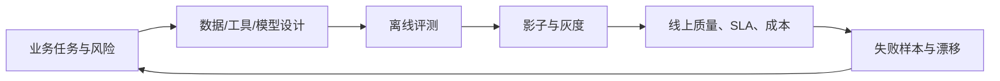

# AI 架构深度专题

这组内容不以模型名称为主线，而以生产问题为主线：回答为什么可信、动作为什么安全、模型为什么
这样路由，以及一次升级如何证明质量、延迟和成本都没有退化。

## 学习地图

| 专题 | 核心问题 | 面试产出 |
| --- | --- | --- |
| [RAG 质量闭环](./01-rag-quality-loop) | 从检索到答案，问题到底坏在哪一层 | 指标树、失败分类、引用与降级 |
| [Agent 生产化与工具安全](./02-agent-production-safety) | 多步任务如何可控、可恢复、可审计 | 状态机、权限、审批、幂等 |
| [模型路由、SLA 与成本](./03-model-routing-cost) | 多模型如何按任务、质量和预算动态选择 | 路由策略、降级、单位经济性 |
| [AI 评测与发布门禁](./04-evaluation-release-gates) | 离线变好为什么线上可能变差 | 评测集、A/B、漂移、回滚 |

## 一条完整的生产链

## 完成标准

- 能区分检索失败、生成失败和评测失败。
- 能把 Agent 的自然语言计划约束为可验证的状态迁移。
- 能计算单次成功任务成本，而不只报告每 token 单价。
- 能给模型、Prompt、检索配置和工具版本设置联合发布门禁。

