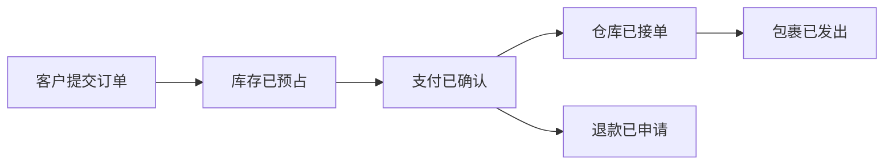

# 领域发现与限界上下文

## 90 秒速答

我不会先按订单表、用户表拆服务，而会先和业务梳理从触发到结果的关键事件、命令、规则、角色和
异常路径，建立统一语言。边界主要看四件事：业务能力是否独立、规则是否经常一起变化、数据是否
需要同一不变量、团队是否能端到端负责。相同词在不同语境含义不同时应拆限界上下文，例如销售
订单、履约单和财务应收不是一个模型。最后通过上下文映射明确上下游、开放主机服务、发布语言或
反腐层，并用变更耦合、跨团队等待和事故影响验证边界，而不是一次建模后永久固定。

## 从业务时间线开始

事件用过去式表达已经发生的事实；命令表达意图；策略描述“当什么发生时做什么”。把热点、争议和
例外标出来，往往比画类图更快暴露真正边界。

## 边界判断表

| 信号 | 倾向同一上下文 | 倾向拆分上下文 |
| --- | --- | --- |
| 语言 | 同一术语同一含义 | 同名词含义不同 |
| 规则 | 必须原子维护 | 各自演进、允许延迟 |
| 变化 | 经常一起发布 | 变化原因和节奏不同 |
| 所有权 | 一个团队端到端负责 | 跨团队目标不同 |
| 规模 | 负载和存储相似 | 独立容量与合规需求 |

任何一个信号都不是单独的拆分理由。高并发不一定要新领域，代码目录分开也不代表业务边界成立。

## 上下文映射

- **Customer/Supplier**：上游与下游共同协商契约。
- **Conformist**：下游直接接受上游模型，成本低但耦合高。
- **Anti-Corruption Layer**：下游翻译遗留或外部模型，保护自身语言。
- **Published Language**：通过稳定 schema 共享事实，不共享内部对象。

映射必须记录数据所有权、契约版本、SLO、失败语义和负责人；“通过 MQ 解耦”不等于语义解耦。

## 面试官三级追问

### L1：一个数据库表能否被两个领域使用？

物理上可以，治理上应有唯一写入所有者。其他领域通过 API、事件或只读投影获取，避免共同修改语义。

### L2：两个团队经常改同一服务，是否必须拆？

这是边界问题的信号，但也可能是组织或模块化不足。先分析变更原因、事务不变量和调用模式，再决定
模块化单体还是独立服务。

### L3：如何证明领域划分合理？

观察需求是否能在单团队内完成、跨上下文同步调用是否减少、变更是否集中、事故爆炸半径是否缩小，
以及业务语言是否稳定；再根据新证据调整边界。

## 25 分自测

| 维度 | 5 分要求 |
| --- | --- |
| 正确性 | 事件、命令、语言与上下文边界清晰 |
| 深度 | 覆盖变化原因、不变量、所有权和上下文映射 |
| 取舍 | 模块化单体与微服务选择有依据 |
| 表达 | 业务事实 → 边界信号 → 协作契约 |
| 可运维性 | 有 owner、SLO、版本和边界验证指标 |

## 复述任务

不看正文回答：订单、支付、履约为什么不应因为共享 `order_id` 就建成一个领域？

