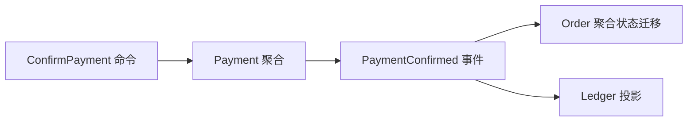

# 聚合、不变量与领域事件

## 90 秒速答

聚合是强一致不变量的最小事务边界，不是把有关联的对象全部装进一个对象图。我先列出任何时候都
不能被破坏的规则，再确定由哪个聚合根接收命令并串行化修改；聚合外只引用标识，不跨聚合持有事务。
跨聚合或跨上下文通过已发生的领域事件协作，允许明确的一致性窗口，并配幂等、状态机、补偿和对账。
聚合太大会造成锁竞争、加载和团队耦合，太小会让本应原子的规则无法保证，所以需要用并发热点、
事务冲突、规则归属和失败成本验证。

## 从不变量反推边界

| 不变量 | 建议边界 |
| --- | --- |
| 订单应付金额等于有效明细之和 | 订单聚合内维护 |
| 同一支付请求不能扣款两次 | 支付聚合 + 唯一业务键 |
| 库存不能小于已确认销售 | 库存聚合原子条件更新 |
| 支付成功后订单最终变为已支付 | 跨聚合事件收敛与对账 |

最后一条通常不需要跨服务数据库事务；资金事实和订单状态各自有所有者，通过事件和对账收敛。

## 命令、事件和状态机

命令可以被拒绝，事件是已经发生的事实，不能命名为 `DoSomethingEvent`。事件包含稳定业务 ID、
版本、发生时间和最小必要事实；消费者不能依赖发布方内部对象布局。

## 聚合过大的信号

- 一个命令加载数千个子对象。
- 不相关操作争抢同一版本或锁。
- 每次修改都需要跨多个团队发布。
- 为了“保持一致”把远程调用放进事务。

可把历史明细、统计和查询投影移出聚合，只保留执行不变量所需状态；热点计数用分桶、预留或条件
更新，但必须重新证明业务不变量。

## 面试官三级追问

### L1：聚合根是否等于数据库主表？

不等于。聚合由业务一致性规则定义，存储可以是一张或多张表；一张表也可能承载多个模型投影。

### L2：领域事件是否一定异步？

不一定。同一进程内可同步触发，但跨事务副作用应在提交后可靠发布。关键是语义和事务边界，而非 MQ。

### L3：最终一致期间用户看到什么？

显式展示处理中状态、限制冲突操作并定义收敛时限；失败后自动补偿、对账或转人工，不能隐藏不确定性。

## 25 分自测

| 维度 | 5 分要求 |
| --- | --- |
| 正确性 | 聚合由强一致不变量定义 |
| 深度 | 命令、事件、状态机、补偿与投影完整 |
| 取舍 | 一致性、并发、复杂度和失败成本平衡 |
| 表达 | 不变量 → 聚合 → 跨域收敛 |
| 可运维性 | 幂等、版本、对账和一致性 SLO 完整 |

## 复述任务

不看正文回答：支付成功与订单已支付为什么通常属于两个事务？怎样保证用户最终看到正确状态？

