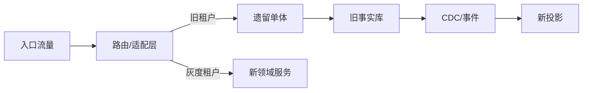

# 单体渐进迁移

## 90 秒速答

我不会先把单体全面改成微服务，而是先用变更耦合、事故、容量和团队等待选择一个边界清楚、价值
足够且风险可控的薄切片。先在单体内建立模块边界和契约，再通过网关或适配层把一类流量导向新实现；
读路径先做影子比较，写路径明确事实源，优先使用事件复制和对账，谨慎双写。按租户或业务键稳定
灰度，设置数据差异、SLO 和业务结果门禁。新路径稳定后停止旧写入、迁移存量、保留回读窗口，
最终删除旧代码、表和运维流程；没有旧路径退场就不算迁移完成。

## 第一刀选择矩阵

| 因素 | 更适合先切 | 不适合先切 |
| --- | --- | --- |
| 边界 | 语言和所有权清楚 | 跨全站共享模型 |
| 价值 | 交付/容量痛点明确 | 纯技术偏好 |
| 数据 | 可识别事实源、可校验 | 双向多写且无账本 |
| 风险 | 可灰度、可回退 | 核心不可逆链路 |
| 依赖 | 少量明确契约 | 高扇入高扇出循环依赖 |

## 绞杀路径

初期单体仍是事实源，新服务用影子读校验；切换写所有权时要设置明确写栅栏和版本，不能形成无期限
双主。反向依赖通过 ACL 暂时翻译，但要记录退场日期。

## 迁移门禁

- 契约兼容率和影子读差异。
- 新旧路径业务成功率、TP99 和错误类型。
- CDC 位点、一致性延迟和对账差异。
- 灰度租户投诉、人工修复量和回退耗时。
- 旧代码调用量、旧表写入量和退场完成率。

## 面试官三级追问

### L1：为什么先模块化再拆服务？

先暴露边界和依赖，以更低成本验证模型；直接分进程只会把代码耦合变成网络耦合。

### L2：双写为什么危险？

两个写入存在部分成功、重试和顺序窗口。应明确唯一事实源，通过 Outbox/CDC 复制并对账；若必须
双写，要有持久意图、幂等、版本和可证明恢复协议。

### L3：什么情况下停止迁移？

数据差异持续超阈值、业务收益不成立、团队无法承担双轨成本或边界证据被推翻时，应暂停并复盘，
而不是为了完成路线图继续扩大风险。

## 25 分自测

| 维度 | 5 分要求 |
| --- | --- |
| 正确性 | 第一刀、事实源、灰度和退场顺序合理 |
| 深度 | 覆盖影子、CDC、写栅栏、双轨成本 |
| 取舍 | 迁移收益、风险和组织承载力平衡 |
| 表达 | 选择 → 切流 → 数据 → 验证 → 退场 |
| 可运维性 | 门禁、回退、对账、旧路径指标完整 |

## 复述任务

不看正文回答：如何把订单查询先从单体拆出，同时保证写入事实源唯一并能在 30 分钟内回退？

