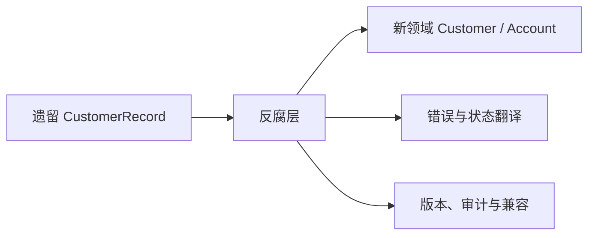

# 遗留系统与模型腐化治理

## 90 秒速答

遗留系统治理先识别业务仍依赖的能力、数据事实源、隐含规则和高风险操作，不能以“代码旧”直接
判定重写。我会在新领域与遗留模型之间建立反腐层，把旧字段、状态和错误语义翻译为新语言；通过
契约测试和生产样本验证。改造按业务旅程薄切片，数据迁移采用快照、增量追平、影子校验和可回退
切换。每个临时适配、双写和例外都有 owner、成本指标与退场条件。成功不仅是新系统上线，还包括
旧写入归零、旧作业关闭、数据归档和团队不再维护两套心智模型。

## 不要直接共享遗留模型

ACL 保护新模型，但也可能变成永久复杂层。记录调用量、翻译失败、维护工时和退场里程碑，避免
适配器无限膨胀。

## 重写、替换还是包裹

| 方案 | 适用 | 主要风险 |
| --- | --- | --- |
| 包裹/API 化 | 核心规则稳定但接口混乱 | 延续内部债务 |
| 局部替换 | 边界和价值清楚 | 双轨与数据迁移复杂 |
| 完整重写 | 系统小、规则可证明、迁移窗口明确 | 遗漏隐含规则、长期无业务收益 |
| 维持现状 | 风险和变化很低 | 未来选项成本上升 |

始终把维持现状作为候选，用事故、交付延迟、运维成本和机会损失比较，而不是把现代化当信仰。

## 数据迁移四阶段

1. 盘点数据所有权、质量、保留和敏感等级。
2. 快照回填，保存来源版本和可重复转换规则。
3. CDC 追平增量，影子比较数量、金额、状态和业务不变量。
4. 写栅栏切换事实源，保留回读与审计窗口，最后归档旧库。

## 成功指标

| 维度 | 指标示例 |
| --- | --- |
| 业务 | 关键旅程成功率、迁移投诉、人工修复 |
| 交付 | 前置时间、跨团队等待、发布频率 |
| 稳定 | 事故、MTTR、数据差异、一致性延迟 |
| 退场 | 旧写入、旧接口调用、旧作业和旧值班量 |
| 经济 | 双轨成本、基础设施、维护工时与机会收益 |

## 面试官三级追问

### L1：为什么不直接读旧数据库？

会绕过所有权和业务契约，让新系统绑定旧 schema 与隐含语义。短期只读也应通过明确适配层并设退场。

### L2：如何发现隐含业务规则？

结合代码、数据异常、批任务、客服流程、生产 trace 和领域专家访谈；用历史流量回放比较新旧结果。

### L3：新系统上线后何时能删除旧系统？

旧写入归零、所有消费者迁移、数据对账通过、争议和保留窗口结束、回退策略转为备份恢复，且业务
owner 明确签收后，才能分阶段下线。

## 25 分自测

| 维度 | 5 分要求 |
| --- | --- |
| 正确性 | 事实源、ACL、迁移与退场边界清晰 |
| 深度 | 覆盖隐含规则、双轨、历史数据和审计 |
| 取舍 | 包裹、替换、重写、维持现状比较完整 |
| 表达 | 业务风险 → 薄切片 → 数据 → 退场 |
| 可运维性 | 有质量门禁、成本、owner 和退场指标 |

## 复述任务

不看正文回答：怎样证明一个“新系统已上线、旧系统仍在写”的项目其实还没有完成？

