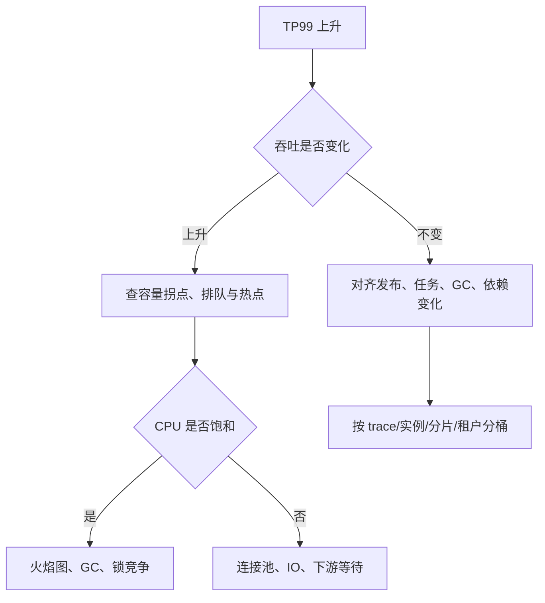

# 尾延迟与性能回归

## 90 秒速答

性能问题先确认用户 SLO、流量和变更时间线，再把端到端延迟拆成排队、应用执行、依赖、数据库、
网络和运行时暂停。平均值会掩盖少量严重慢请求，因此同时看 TP50、TP95、TP99、最大值和分桶
维度，并用 trace、线程栈、火焰图、GC、池等待和数据库证据缩小假设。优化后不能只比较一次
平均值，要在固定基线下做多轮回归，设置吞吐、TP99、错误率、资源和成本的联合门禁。

## 为什么尾延迟决定用户体验

一个页面并行调用 20 个成功率均为 99% 的依赖，全部成功概率约为：

```text
0.99 ^ 20 ≈ 81.8%
```

扇出越大，遇到至少一个慢节点的概率越高。端到端 TP99 也不能简单等于各依赖 TP99 相加；
应保留同一请求 trace，分析关键路径和相关性。

## 延迟预算表

假设下单接口 TP99 目标 300 ms：

| 阶段 | 预算 | 观测方式 |
| --- | ---: | --- |
| 网关与网络 | 30 ms | Gateway 指标、跨区 RTT |
| 服务排队 | 20 ms | executor queue wait |
| 应用计算 | 40 ms | CPU profile、方法 trace |
| 核心数据库 | 100 ms | SQL、连接等待、锁等待 |
| 外部依赖 | 60 ms | client span |
| 序列化与返回 | 20 ms | server span |
| 安全余量 | 30 ms | 吸收抖动 |

预算不是强行平均分配，而是用来发现哪一段侵蚀了用户承诺，并指导超时、隔离和优化优先级。

## TP99 劣化决策树



不要先重启。重启会改变堆、缓存、连接和实例流量，可能暂时恢复，却同时销毁关键证据。

## 三种常见的“平均值正常”

1. **热点少数用户慢**：按租户、key、分片分桶才看到。
2. **周期暂停**：GC 或批任务只影响少量时间窗口。
3. **排队尾部**：服务时间不高，但线程池或连接池等待很长。

所以指标要区分 queue time、service time 和 downstream time，不能只有一个总耗时直方图。

## 性能回归门禁

| 指标 | 示例门禁 | 说明 |
| --- | ---: | --- |
| 吞吐 | 不低于基线 98% | 防止容量退化 |
| TP99 | 不高于基线 110% 且满足 SLO | 同时看相对与绝对目标 |
| 错误率 | 不增加 0.05 个百分点 | 防止用失败换低时延 |
| CPU/请求 | 不增加 8% | 衡量效率 |
| 内存/请求 | 不增加 10% | 防止分配和 GC 债务 |
| DB 调用/请求 | 不增加 | 防止隐藏扇出 |

门禁阈值应来自历史波动和业务风险。微基准、组件压测、链路压测和生产金丝雀分层执行，不能让
一次耗时很长的全链路测试承担所有反馈。

## 如何评估优化是否值得

报告应给出：用户影响、瓶颈证据、改造成本、性能收益、资源节省、风险和回滚。把“TP99 从
280 ms 降到 210 ms”进一步翻译为超时减少、实例节省或转化率变化；若接口本来远低于 SLO，
10% 优化却引入复杂缓存和一致性风险，可能不值得做。

## 面试官三级追问

### L1：TP99 降了，为什么吞吐可能也降了？

可能通过严格限流、减少并发或提前失败降低了排队。要联合检查成功吞吐和错误率，避免把拒绝
请求包装成性能优化。

### L2：异步化一定能降低延迟吗？

它能缩短同步等待，但只把工作转移到队列；端到端完成时间可能更长，还引入积压、一致性和
可观测性成本。需要区分“受理延迟”和“业务完成延迟”。

### L3：如何防止一次优化三个月后失效？

把负载模型、数据集、基线和门禁版本化，持续采集生产分布校准测试；金丝雀阶段自动比较 SLI
和资源效率，越线停止发布。性能是持续约束，不是一次专项。

## 25 分自测

| 维度 | 5 分要求 |
| --- | --- |
| 正确性 | 区分排队、执行、依赖与暂停时间 |
| 深度 | 理解扇出、分位数和多维分桶 |
| 取舍 | 延迟、吞吐、正确性、成本共同评估 |
| 表达 | 现象 → 假设 → 证据 → 优化 → 验证 |
| 可运维性 | 基线、门禁、金丝雀和回滚完整 |

## 复述任务

不看正文回答：流量没有增长但 TP99 从 200 ms 升到 2 秒，你会如何保护证据、分解延迟、缩小
假设，并证明优化不是靠拒绝请求换来的？

