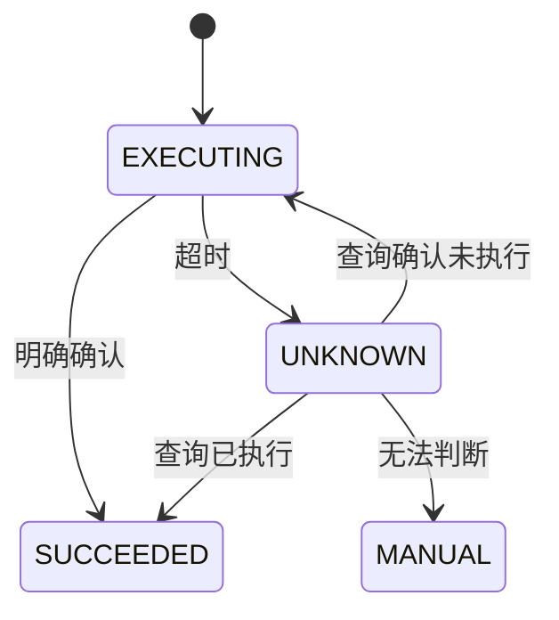

# 案例：Agent 超时导致重复退款

## 业务现场

客服 Agent 调用退款工具后 3 秒未收到响应，规划器判断失败并重试。支付网关第一次实际上已成功，
第二次使用了新 requestId，造成 126 笔重复退款；审计日志只有自然语言对话，没有工具确认状态。

## 场景数据

工具超时率 2.1%，平均每次超时重试 1.8 次；126 笔重复退款共影响 8.4 万元，最大自动退款权限
为 5,000 元，未设置人工审批。

## 面试版事故回答

根因不是模型“想错了”，而是把超时误当失败、幂等键不稳定、权限过大且没有持久状态机。立即
关闭自动退款、按订单和支付流水对账并冻结重复请求。长期用订单号与退款意图生成稳定幂等键，
将超时转为 UNKNOWN 状态并先查询结果；金额分级审批，执行端重新鉴权，完整记录计划、参数、
审批、工具结果和状态迁移。

## 状态与恢复

## 止血、修复与验收

- 止血：撤销写权限，转人工，按业务键对账并联系支付侧拦截未结算重复退款。
- 修复：稳定幂等键、状态机、审批阈值、最大步骤与费用预算、工具端业务前置校验。
- 验收：重复副作用为 0、UNKNOWN 全部可查询或转人工、审计字段完整率 100%。
- 演练：注入响应丢失、进程崩溃、工具慢响应和审批过期。

## 面试官追问与评分

1. 为什么 requestId 不能每次重试重新生成？——它必须标识同一业务意图，否则执行端无法去重。
2. Agent 只读是否就安全？——仍可能泄露跨租户数据或被注入诱导外发，需要权限与数据隔离。
3. 审批后能否修改金额？——关键参数变化使审批失效，必须重新展示并确认。

| 维度 | 5 分要求 |
| --- | --- |
| 正确性 | 把超时识别为未知结果 |
| 证据 | 幂等键、状态和支付流水闭环 |
| 取舍 | 自动化与审批边界合理 |
| 可运维性 | 对账、审计、恢复和演练完整 |
| 表达 | 不把系统缺陷归咎于模型一句话 |

## 复述任务

用 90 秒回答“第一次工具调用到底成功了吗”，并给出确定答案前的处理路径。参考
[Agent 生产化与工具安全](/deep-dives/ai-architecture/02-agent-production-safety)。

## 延伸学习

[RAG 质量回退](./rag-quality-regression) · [模型供应商故障](./model-provider-outage) · [返回](./)

