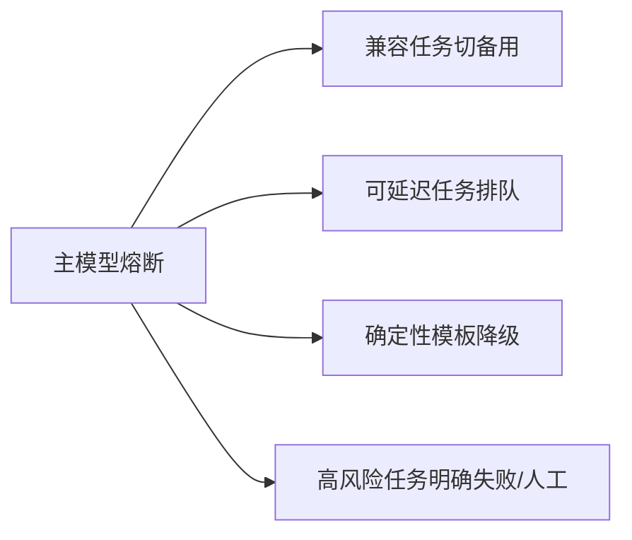

# 案例：模型供应商故障与成本失控

## 业务现场

主模型供应商出现间歇性超时，网关自动切换备用模型并重试两次。HTTP 成功率恢复到 99.8%，但
工具参数失败率升到 14%，输出 token 增长 2.6 倍，单小时成本达到日预算的 42%。

## 从观察到结论

| 证据 | 结论 |
| --- | --- |
| 主模型超时 18% | 需要熔断而非持续重试 |
| 备用工具失败 14% | 能力/schema 不兼容 |
| token 2.6× | 输出控制与路由配置失效 |
| HTTP 成功 99.8% | 传输成功不等于任务成功 |

## 面试版事故回答

先熔断主供应商并关闭多层重试；对备用模型只开放已验证的摘要和问答，工具任务转排队或人工，
同时设置 token 与租户费用硬上限。长期维护模型能力矩阵和灾备评测集，网关按任务风险、兼容性、
SLA 与预算路由；切换门禁同时看任务成功、工具错误、TTFT/TP99 和单次成功成本。

## 降级顺序

## 修复与验收

- 为每种任务保存已验证模型、Prompt、工具 schema 与输出限制。
- 费用燃烧率超过预算 4 倍时停止低优先级流量，防止重试继续放大。
- 灾备演练验证主模型超时、限流、区域故障和恢复回切。
- 验收：任务成功率满足基线、工具错误 `<0.5%`、成本不超过预算 110%、无重复副作用。

## 面试官追问与评分

1. 为什么不全部切备用？——能力不等价，高风险和工具任务可能产生更大业务损失。
2. 成本告警为何看燃烧率？——固定金额发现太晚，燃烧率能反映预算将在何时耗尽。
3. 主模型恢复后如何回切？——半开探测、低风险小流量、质量与成本联合观察，再阶梯放量。

| 维度 | 5 分要求 |
| --- | --- |
| 正确性 | 区分服务成功与任务成功 |
| 证据 | 超时、工具失败、token 和成本闭环 |
| 取舍 | 切换、排队、模板和失败边界明确 |
| 可运维性 | 配额、燃烧率、演练和回切完整 |
| 表达 | 先保护业务，再恢复能力 |

## 复述任务

用 90 秒说明为何 HTTP 成功率恢复仍算事故，并设计一套质量、SLA、成本联合切换门禁。参考
[模型路由、SLA 与成本](/deep-dives/ai-architecture/03-model-routing-cost)。

## 延伸学习

[RAG 质量回退](./rag-quality-regression) · [Agent 重复退款](./agent-duplicate-refund) · [返回](./)

