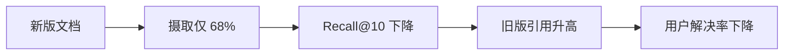

# 案例：RAG 更新后答案质量回退

## 业务现场

企业客服知识库周一发布产品政策新版。HTTP 成功率与模型延迟正常，但“答案有帮助”从 81% 降到
64%，客服发现系统仍引用旧版退款规则。生成模型与 Prompt 均未变。

## 场景数据

| 指标 | 变更前 | 变更后 |
| --- | ---: | ---: |
| Recall@10 | 91% | 74% |
| 新版摄取完成率 | 100% | 68% |
| 旧版引用占比 | 4% | 37% |
| 忠实度 | 94% | 93% |

## 面试版事故回答

生成忠实度未变而召回和摄取同时下降，优先判断为知识摄取/版本过滤退化，而不是换大模型。先将
索引别名回滚到已验证快照，对高风险退款问题转人工；再检查摄取位点、解析失败和新版过滤条件。
长期采用双索引构建、完整性门禁、版本新鲜度 SLI、引用版本校验和删除传播演练。

## 证据链

忠实度稳定说明模型大多忠实于“错误版本的上下文”。若只评最终答案，容易误判为生成幻觉。

## 止血、修复与验收

- 止血：回滚索引别名、关闭高风险自动回答、保留失败样本。
- 修复：摄取完成率与文档清单对账；新索引离线回归后再原子切换。
- 验收：Recall@10 `>90%`、新版引用 `>98%`、错误旧版引用为 0、解决率恢复且 TP99 不退化。
- 回滚：任一高风险问题引用旧政策，立即切回旧索引并转人工。

## 面试官追问与评分

1. 为什么忠实度高仍然答错？——忠实度只证明答案受给定证据支持，不证明证据正确或最新。
2. 为什么不能直接删除旧版？——需处理历史问题、审计和回滚；应按有效期过滤并隔离索引版本。
3. 如何防复发？——摄取清单对账、双索引、引用版本校验、失败样本回归和新鲜度告警。

| 维度 | 5 分要求 |
| --- | --- |
| 正确性 | 区分摄取、检索和生成退化 |
| 证据 | 指标能闭合到版本问题 |
| 取舍 | 高风险转人工与可用性权衡明确 |
| 可运维性 | 双索引、门禁、回滚完整 |
| 表达 | 先止血，再定因和验收 |

## 复述任务

用 90 秒说明为什么不先换模型，并给出三层定位指标和一个硬回滚条件。参考
[RAG 质量闭环](/deep-dives/ai-architecture/01-rag-quality-loop)。

## 延伸学习

[Agent 重复退款](./agent-duplicate-refund) · [模型供应商故障](./model-provider-outage) · [返回](./)

