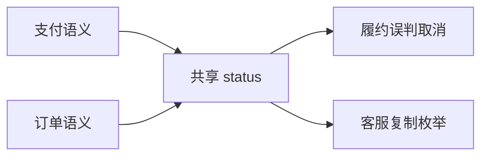

# 案例：订单与支付共享模型引发跨域事故

## 业务现场

订单团队在共享 `orders.status` 中新增 `PARTIALLY_REFUNDED`。支付、履约和客服各自复制状态枚举，
其中履约将未知值当作取消，停止了 2,340 个已付款订单发货。四个团队共用表并可直接更新状态。

## 面试版事故回答

先冻结状态写入并恢复履约映射，按支付流水和订单事实对账受影响订单。根因是销售订单、支付状态、
履约状态共享一个模型和写权限，不是少加了一个枚举分支。长期划分上下文与唯一数据所有者：支付
发布 `RefundPartiallyCompleted` 事实，订单维护自己的支付视图，履约只消费影响发货的稳定契约；
通过 schema 兼容、契约测试和 ACL 隔离遗留表。

## 验收

共享表非 owner 写入为 0；未知事件不会改变履约状态；契约破坏在流水线阻断；状态差异 15 分钟内
对账，历史错误订单全部补发或人工确认。

## 面试官追问与评分

1. 换成 MQ 是否解耦？——若仍共享同一状态语义，只是把耦合换成异步传播。
2. orderId 能否跨域共享？——稳定标识可以，内部对象和状态机不应共享。
3. ACL 是否永久保留？——应有调用量、owner 和退场计划，否则会成为新遗留层。

| 维度 | 5 分要求 |
| --- | --- |
| 正确性 | 识别模型与写所有权耦合 |
| 证据 | 状态变化到履约事故闭环 |
| 取舍 | 契约、事件、ACL 边界合理 |
| 可运维性 | 有对账、兼容测试和退场 |
| 表达 | 从业务语义而非技术组件切分 |

## 复述任务

用 90 秒解释同一个 `status` 为什么在三个上下文中不是同一个概念。参考
[领域发现与限界上下文](/deep-dives/business-evolution/01-domain-discovery)。

## 延伸学习

[聚合热点](./oversized-aggregate-hotspot) · [双写分叉](./monolith-dual-write-divergence) · [返回](./)

