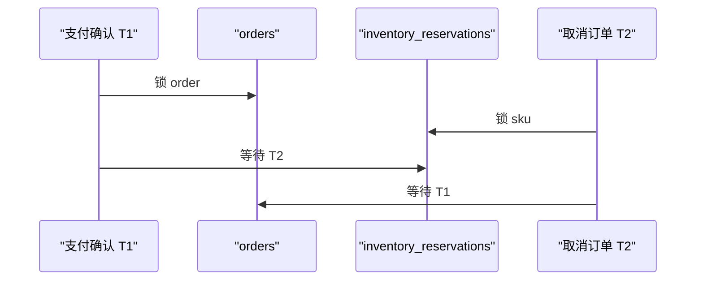

# 案例：死锁与锁等待激增

> [!IMPORTANT]
> 本案例为教学构造，重点是等待图、事务边界和可验证修复。

## 业务现场与变更线索

热门商品活动中，支付成功订单偶发回滚，客户端重试后又可能成功。支付确认与取消订单由
两个团队维护；取消流程当天调整为先释放库存再更新订单，支付流程仍先订单后库存。平均
TPS 基本不变，但单个 SKU 占 43%，使低概率锁序冲突成为持续事故。

> [!NOTE]
> 请先画两个事务各自持有什么锁、等待什么锁；没有等待环就不能称为死锁。
## 场景数据

| 项目 | 正常 | 故障 |
| --- | ---: | ---: |
| 峰值事务 | 2,400 TPS | 2,500 TPS |
| 死锁 | `< 1/min` | 48/min |
| 锁等待 TP99 | 18 ms | 2.7 s |
| 回滚率 | 0.03% | 4.6% |
| 热门 SKU 流量占比 | 8% | 43% |

## 面试版事故回答

两条流程分别按“订单→库存预占”和“库存预占→订单”更新相同行，热门 SKU 放大并发后形成
环形等待。`SHOW ENGINE INNODB STATUS` 给出最近死锁，`performance_schema.data_locks`
和事务 trace 还原锁顺序。先降低热门 SKU 并发、缩短事务并对死锁做带抖动的有限重试；
长期统一为“订单→库存”顺序，把远程调用移出事务，并用唯一业务键保证重试幂等。压测
必须保持 43% 热点分布，平均流量测试无法证明修复。

## 架构与故障传播



## 时间线

| 时间 | 证据 | 动作 |
| --- | --- | --- |
| 20:00 | 热门活动开始 | TPS 正常 |
| 20:03 | 死锁 21/min | 保存死锁样本 |
| 20:06 | 回滚率 4.6% | 限制热门 SKU 并发 |
| 20:12 | 等待图确认反向加锁 | 下线取消流程新版本 |
| 20:28 | 死锁降至 2/min | 统一锁顺序灰度 |
| 21:10 | 峰值回放通过 | 恢复流量 |

## 从观察到结论

| 观察 | 推断 | 尚不能断言 |
| --- | --- | --- |
| TPS 基本不变 | 不是整体流量暴涨 | 无热点 |
| 热门 SKU 43% | 行竞争显著 | 一定存在死锁 |
| 等待图形成环 | 两事务互相等待 | 只需无限重试 |
| 事务含远程调用 | 持锁时间被放大 | 移出后业务一定正确 |

## 取证过程

```sql
SHOW ENGINE INNODB STATUS\G
SELECT * FROM performance_schema.data_lock_waits;
SELECT * FROM performance_schema.data_locks
WHERE OBJECT_NAME IN ('orders', 'inventory_reservations');
SELECT trx_id, trx_started, trx_query
FROM information_schema.innodb_trx
ORDER BY trx_started;
```

## 止血决策

1. 按 SKU 串行化最热的更新，保护其他商品。
2. 回滚引入反向锁序的新流程。
3. 死锁仅重试 2 次，使用指数退避和抖动；锁超时不盲目重试。
4. 暂停事务内风险校验远程调用，改用已缓存结果。

## 永久修复

```sql
START TRANSACTION;
SELECT id FROM orders WHERE id = ? FOR UPDATE;
SELECT id FROM inventory_reservations
 WHERE order_id = ? AND sku_id = ? FOR UPDATE;
UPDATE inventory_reservations SET state = ? WHERE id = ?;
UPDATE orders SET state = ? WHERE id = ?;
COMMIT;
```

所有写流程采用同一锁序；远程调用在事务前完成，事务内只做本地校验与写入。预占表增加
`UNIQUE(order_id, sku_id)`，重试不会重复创建记录。

## 方案取舍

| 方案 | 收益 | 风险 | 使用 |
| --- | --- | --- | --- |
| 有限死锁重试 | 吸收偶发冲突 | 放大持续争用 | 必须幂等 |
| 统一锁序 | 消除主要环路 | 需改所有路径 | 主修复 |
| 降低隔离级别 | 可能减少部分锁 | 一致性语义变化 | 不作为首选 |
| 热点排队 | 控制单行并发 | 增加热点延迟 | 活动期保护 |

## 验证与回滚

| 指标 | 故障 | 通过标准 |
| --- | ---: | ---: |
| 死锁 | 48/min | `< 1/min` |
| 锁等待 TP99 | 2.7 s | `< 50 ms` |
| 回滚率 | 4.6% | `< 0.1%` |
| 热点分布 | 43% | 压测保持 43% |

灰度死锁超过 5/min、库存对账不平或事务 TP99 超 150 ms 即回滚。

## 复盘与防复发

- 数据访问层记录事务名、锁序和持锁时间。
- 代码评审禁止事务中远程调用。
- 压测模型保留 Zipf 热点，不只做均匀流量。
- 死锁样本自动归档并按 SQL digest 聚类。

## 面试官追问与评分

### 追问一：死锁和普通锁等待有什么区别？

**参考回答：**普通等待只有等待边，持锁事务提交后可能继续；死锁形成环形等待，不回滚
其中一个事务就无法推进。应使用 InnoDB deadlock 日志和 `data_lock_waits` 还原事务、
锁对象与顺序，不能看到超时就称为死锁。

### 追问二：为什么统一加锁顺序能消除主要死锁？

**参考回答：**所有事务都按“订单→库存”获得锁后，就不会出现一个持有订单等库存、另一个
持有库存等订单的环。它不能消除热点行等待，因此还要缩短事务、把远程调用移出事务，并
对热门 SKU 控制并发。

### 追问三：死锁后为什么可以重试，重试又为什么必须幂等？

**参考回答：**数据库会完整回滚死锁牺牲事务，因此本地数据库操作可以重新执行；但事务外
可能已发送消息、调用支付或写缓存。重试必须携带稳定业务键，并限制次数、指数退避和抖动。
持续重试会放大热点争用，不能替代根因修复。

### 追问四：降低隔离级别能否解决死锁？

**参考回答：**某些场景下从 RR 到 RC 可减少 gap/next-key 锁，但本案例是记录锁顺序相反，
降低隔离级别不消除等待环，还可能改变幻读与一致性语义。只有识别具体锁类型并评估业务
语义后才能调整，不能把隔离级别当通用开关。

### 追问五：统一锁序后仍有严重锁等待怎么办？

**参考回答：**说明问题从死锁变成热点串行化。可缩小事务范围、按 SKU 排队、拆分计数、
预聚合或重新设计库存模型。选择取决于是否要求强一致和实时值。压测必须保留 43% 热点
分布，并用锁等待 P99、回滚率和库存对账验收。

失分信号：把所有锁等待称为死锁；无限重试；事务内保留远程调用；均匀压测掩盖热点。

| 维度 | 5 分要求 |
| --- | --- |
| 正确性 | 能画出等待环 |
| 证据 | 使用 InnoDB 与 performance_schema |
| 取舍 | 重试、隔离级别、排队边界清晰 |
| 可运维性 | 有热点压测和对账 |
| 表达 | 锁序与事务边界讲清楚 |

## 延伸学习

[慢 SQL 案例](./slow-sql-timeout) · [订单存储设计](./high-concurrency-order-storage) ·
[返回数据库案例](./)
