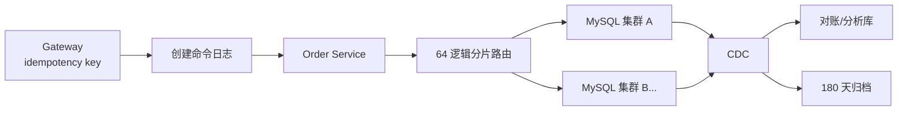

# 案例：高并发订单存储设计

> [!IMPORTANT]
> 本文是架构面试教学场景，所有容量均为显式假设。

## 需求与约束

| 目标 | 数值 |
| --- | ---: |
| 峰值创建 | 50,000 写/s |
| 年增长 | 20 亿订单 |
| 保留 | 热数据 180 天，总计 7 年 |
| 查询 | 用户订单、商户对账、按订单号查询 |
| 一致性 | 不重复建单；支付状态最终收敛 |
| 可用性 | 99.99% |

## 面试版设计回答

先以订单号做全局幂等键，入口把创建命令写入分区日志，再由订单服务按用户哈希路由到 64
个逻辑分片。主表只保留查询必需字段，明细分表；用户列表索引以
`(user_id,created_at,id)` 支持游标分页，商户对账走独立 CDC 明细库，避免跨分片聚合压
在线库。180 天后归档对象存储并保留订单号路由索引。扩容采用逻辑分片到物理集群的映射，
先影子回放、双读校验再切换，不直接做不可回滚的全量双写。

## 容量估算

20 亿/年约 63 单/s 平均，50,000/s 峰值说明峰均比极高。按每订单主表 1 KiB、明细与索引
4 KiB 估算，年原始量约 10 TB，三副本和临时空间需至少 40 TB。64 逻辑分片在峰值平均
781 写/s；物理集群需按热点用户、复制和故障后 70% 水位压测。

## 核心架构



## 数据模型与接口

```sql
CREATE TABLE orders (
  id BIGINT PRIMARY KEY,
  request_id VARBINARY(32) NOT NULL,
  user_id BIGINT NOT NULL,
  merchant_id BIGINT NOT NULL,
  status TINYINT NOT NULL,
  amount BIGINT NOT NULL,
  created_at DATETIME(3) NOT NULL,
  UNIQUE KEY uk_request(request_id),
  KEY idx_user_time(user_id, created_at, id)
);
```

`POST /orders` 必须携带 `request_id`；重复请求返回原订单，而不是再次扣库存。

## 关键链路

创建日志确认后进入订单状态机；本地事务同时写订单和 outbox，CDC 发布订单事件。按订单号
查询先从 ID 中解析逻辑分片；用户列表天然单分片；商户跨分片对账使用 CDC 库并与财务
账本核对。

## 方案取舍

| 方案 | 优点 | 风险 | 决策 |
| --- | --- | --- | --- |
| 单库分区 | 简单 | 写入和维护上限低 | 早期可用 |
| 直接按用户分片 | 用户查询局部 | 商户查询跨片 | 主方案+对账库 |
| 日志先行 | 削峰、可重放 | 可见性稍延迟 | 创建链路采用 |
| 全局二级索引 | 查询灵活 | 一致性与写放大 | 仅订单号路由索引 |

## 一致性与故障处理

- `request_id` 唯一约束保证建单幂等。
- 状态机只允许合法跃迁，事件携带版本拒绝乱序。
- 日志已确认但数据库未写入时可重放；写入成功但事件未发由 outbox/CDC 补发。
- 对账比较订单、支付、库存和消息位点，差异进入补偿队列与人工审批。
- 单集群故障时暂停对应逻辑分片写入或切主，禁止跨分片随意重建订单。

## 扩容与演进

逻辑分片数预留，物理映射可变。迁移一个逻辑分片时：快照回填 → CDC 追平 → 影子读校验
→ 短暂写栅栏 → 路由切换；保留旧库只读 24 小时用于回退。超过单集群 60% 写水位或维护
窗口无法满足时触发拆分。

## 指标与验收

| 指标 | 目标 |
| --- | ---: |
| 创建 P99 | `< 200 ms` |
| 重复订单 | `0` |
| 分片最高写水位 | `< 60%` |
| CDC 延迟 P99 | `< 5 s` |
| 对账差异未闭环 | `< 10 min` |
| 单集群恢复 RTO/RPO | `< 15 min / < 5 s` |

## 面试官追问与评分

1. 一级：为何不用商户 ID 分片？——主要在线访问是用户订单，商户对账可异步聚合。
2. 二级：日志确认后何时向用户成功？——取决于产品语义；通常订单落库后返回，日志用于削峰和重放。
3. 三级：如何无损扩容？——逻辑分片、回填、增量追平、校验、写栅栏和可回退路由。

| 维度 | 5 分要求 |
| --- | --- |
| 正确性 | 分片键匹配访问模式 |
| 证据 | 容量、热点和水位量化 |
| 取舍 | 在线查询与对账分离合理 |
| 可运维性 | 迁移、对账、灾备完整 |
| 表达 | 需求到演进路径清晰 |

## 延伸学习

[慢 SQL 案例](./slow-sql-timeout) · [死锁案例](./deadlock-and-lock-wait) ·
[返回数据库案例](./)
