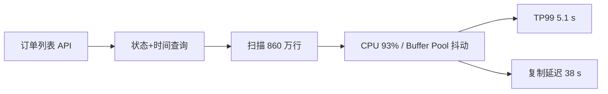

# 案例：慢 SQL 导致接口超时

> [!IMPORTANT]
> 本文是基于常见生产模式构造的教学案例，不对应任何实际企业。

## 场景数据

| 项目 | 正常 | 故障 |
| --- | ---: | ---: |
| `orders` 行数 | 1.2 亿 | 未变化 |
| 查询量 | 180 QPS | 190 QPS |
| 扫描行数/次 | 1,200 | 860 万 |
| 数据库 CPU | 42% | 93% |
| 接口 TP99 | 260 ms | 5.1 s |
| 返回行数 | 20 | 20 |

## 面试版事故回答

流量只增加 6%，但单次扫描从 1,200 行升到 860 万，因此先查执行计划而不是扩容。慢日志
和 `EXPLAIN ANALYZE` 显示查询按商户、状态和时间过滤，却只有 `(merchant_id,
created_at)` 索引；新增状态 `REFUNDING` 占比从 0.2% 升到 31%，优化器选择时间范围后
大量回表并 filesort。先关闭非核心导出、限制查询时间窗；长期增加
`(merchant_id,status,created_at,id,amount)` 覆盖索引并改为游标分页。在线建索引以影子
流量验证，若写延迟或复制延迟越线立即停止。

## 架构与故障传播



## 时间线

| 时间 | 证据 | 动作 |
| --- | --- | --- |
| 15:02 | TP99 超 1 s | 对齐慢日志与发布 |
| 15:07 | rows examined 激增 | 限制导出与时间窗 |
| 15:14 | `EXPLAIN ANALYZE` 扫 860 万行 | 检查索引和分布 |
| 15:22 | `REFUNDING` 占比 31% | 影子库验证组合索引 |
| 16:10 | 在线索引完成 10% | 观察写放大和复制延迟 |
| 17:05 | 灰度查询 TP99 85 ms | 逐步放量 |

## 从观察到结论

| 观察 | 可以推断 | 不能直接断言 |
| --- | --- | --- |
| DB CPU 93% | 数据库是主要瓶颈 | 一定缺索引 |
| 扫描/返回比 43 万:1 | 访问路径低效 | 索引越多越好 |
| 状态分布突变 | 旧基数估计可能失效 | 强制索引是长期方案 |
| 新索引扫描 24 行 | 候选路径有效 | 写入代价可接受 |

## 取证过程

```sql
SELECT id, amount
FROM orders
WHERE merchant_id = 981
  AND status = 'REFUNDING'
  AND created_at >= '2026-07-04 00:00:00'
ORDER BY created_at DESC, id DESC
LIMIT 20;

EXPLAIN ANALYZE SELECT /* 同上 */;
CREATE INDEX idx_m_status_time_id_amount
ON orders(merchant_id, status, created_at, id, amount)
ALGORITHM=INPLACE, LOCK=NONE;
```

## 止血决策

1. 暂停大时间窗导出，列表最多查询 7 天。
2. 超过 500 ms 的非核心查询快速失败，保护连接池。
3. 报表流量转只读副本，但检查复制延迟，不把强一致读取迁走。
4. 不直接强制旧索引；数据分布再次变化时可能更差。

## 永久修复

索引顺序对齐等值条件、范围和排序；以 `id` 形成稳定游标，删除深分页 `OFFSET`。更新表
统计信息并为关键 SQL 建立 plan digest 监控。索引上线后评估写放大和磁盘，确认无冗余
索引再清理。

## 方案取舍

| 方案 | 收益 | 风险 | 结论 |
| --- | --- | --- | --- |
| SQL/时间窗限制 | 最快止血 | 功能受限 | 立即执行 |
| 覆盖索引 | 读延迟显著下降 | 写放大、占空间 | 主修复 |
| 强制索引 | 短期稳定计划 | 分布变化后失效 | 仅临时 |
| 分库分表 | 扩展上限高 | 迁移复杂 | 当前无必要 |

## 验证与回滚

| 指标 | 故障 | 通过标准 |
| --- | ---: | ---: |
| 扫描行数 | 860 万 | `< 100` |
| API TP99 | 5.1 s | `< 300 ms` |
| DB CPU | 93% | `< 60%` |
| 复制延迟 | 38 s | `< 2 s` |
| 写 TP99 | 90 ms | `< 120 ms` |

在线建索引期间写 TP99 超 150 ms、复制延迟超 10 秒或磁盘低于 20% 即暂停/回滚。

## 复盘与防复发

- 对扫描/返回比、临时表、filesort 和计划变化告警。
- 上线新状态枚举前做数据分布和关键 SQL 回放。
- 索引评审同时检查读收益、写放大、磁盘和回滚。
- 列表统一游标分页，大导出走异步任务。

## 面试官追问与评分

1. 一级：为何 `(merchant_id,created_at)` 不够？——缺少状态过滤，需扫描并回表。
2. 二级：覆盖索引为何包含 `amount`？——减少 20 条结果回表，但需权衡索引宽度。
3. 三级：何时才分片？——单机写入、容量或维护窗口成为可证明瓶颈时。

| 维度 | 5 分要求 |
| --- | --- |
| 正确性 | 索引顺序与查询模式匹配 |
| 证据 | 慢日志、计划、分布、扫描比闭环 |
| 取舍 | 说明写放大与分片阈值 |
| 可运维性 | 在线变更、灰度、回滚明确 |
| 表达 | 从现象到最低风险修复 |

## 延伸学习

[死锁案例](./deadlock-and-lock-wait) · [订单存储设计](./high-concurrency-order-storage) ·
[返回数据库案例](./)

