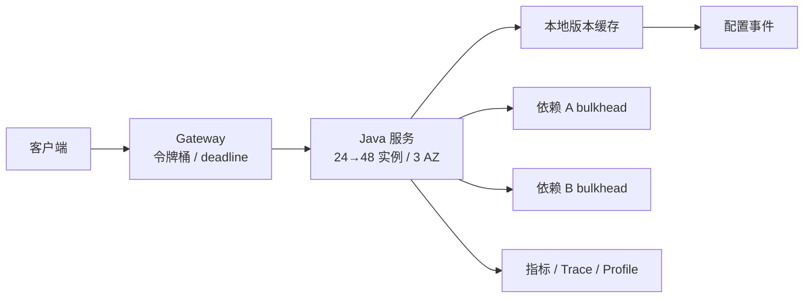

# 案例：低延迟 Java 服务设计

> [!IMPORTANT]
> 这是架构面试教学场景。容量数字是显式假设，真实设计必须以压测和生产分布校准。

## 业务现场与现状约束

这是交易风控前置服务，超时会阻断支付，因此 80 ms TP99 比平均延迟更重要。现有系统在
普通流量下稳定，但活动突发时依赖排队、JVM 冷启动和缓存回源叠加。团队只能维护一种
主要 GC 配置，且两个下游的安全并发各为每实例 32。

> [!NOTE]
> 先分配 80 ms 延迟预算，再决定线程模型、缓存、GC 和扩容；不要从“使用 ZGC”开始。
## 需求与约束

| 目标 | 数值 |
| --- | ---: |
| 峰值流量 | 8,000 QPS，12 秒内允许 3× 突发 |
| 延迟 | TP99 `< 80 ms` |
| 可用性 | 99.95% |
| 请求 | 读多写少，调用两个依赖 |
| 一致性 | 配置 5 秒内收敛 |
| 部署 | JDK 21，Kubernetes，跨 3 AZ |

## 面试版设计回答

我先把 80 ms 分成入口 5、业务 15、两个依赖各 20、网络与抖动 20 ms，并设置端到端
deadline。常态 8,000 QPS 按单实例安全能力 600 QPS 需要 14 台，考虑 N+1、AZ 故障和
3× 突发，常驻 24 台并预留快速扩容到 48 台，入口用令牌桶削掉超过承诺的尖峰。请求路径
避免共享大池：阻塞依赖用虚拟线程配合连接并发上限，CPU 密集任务用固定平台线程池。
读热点使用本地缓存并以版本推送 5 秒内失效。GC 从 G1 基线开始；只有堆和暂停证据表明
G1 无法满足目标时才评估 ZGC。最后用突发、慢依赖、单 AZ 故障和冷启动压测验收。

## 容量估算

单实例 600 QPS、平均服务时间 30 ms 时平均在途约 `600 × 0.03 = 18`。连接池按依赖
实际并发和安全水位分别限制为 32，而不是跟线程数绑定。24 台常驻提供 14,400 QPS 安全
能力；3× 突发的剩余部分靠预扩容、短队列、缓存和限流共同吸收，不能假设 HPA 在 12 秒
内完成。

| 容量层 | 常态 | 突发策略 |
| --- | ---: | --- |
| 实例 | 24 | 活动前预扩至 48 |
| 单实例安全 QPS | 600 | 不提高水位 |
| 依赖并发/实例 | 32 | 超限快速失败 |
| 本地缓存命中率 | 92% | 目标 `> 95%` |

## 核心架构



## 数据模型与接口

```java
record RequestContext(Instant deadline, String configVersion) {}

Result handle(Command command, RequestContext ctx) {
    if (ctx.deadline().isBefore(Instant.now())) throw new DeadlineExceeded();
    var config = localCache.get(ctx.configVersion());
    return service.execute(command, config, ctx.deadline());
}
```

接口携带幂等键和 deadline；服务端拒绝已过期请求，避免客户端放弃后仍消耗容量。

## 关键链路

入口先做身份和租户限流，再读取本地配置；两个独立依赖可并行，但各有并发上限和超时。
非核心依赖失败返回带版本的降级结果，核心依赖失败快速结束，不跨层叠加重试。

## 方案取舍

| 决策 | 选项 A | 选项 B | 选择依据 |
| --- | --- | --- | --- |
| GC | G1 | ZGC | 先用 G1 基线；大堆低暂停再选 ZGC |
| 并发 | 平台线程池 | 虚拟线程 | 阻塞 IO 用虚拟线程，但仍限制依赖并发 |
| 缓存 | 本地 | 远程 | 热配置本地，版本事件保证 5 秒收敛 |
| 扩容 | HPA 被动 | 活动前预扩 | 12 秒突发不能等 HPA |

## 一致性与故障处理

- 配置事件携带单调版本；丢事件时每 30 秒拉取校验。
- 单 AZ 故障后剩余两 AZ 水位不得超过 70%。
- 依赖变慢先触发 bulkhead 和熔断，降级结果标记新鲜度。
- 本地缓存冷启动从快照加载，禁止所有实例同时回源。
- 发布采用分 AZ 金丝雀，TP99 或错误预算异常自动停止。

## 扩容与演进

先维持模块化单服务和明确 bulkhead；当 CPU profile 证明特定计算独立扩缩收益明显，才拆
计算服务。若堆超过 16 GiB 且 G1 暂停持续侵蚀 80 ms 预算，再以同负载对比 ZGC，不因
“低延迟”标签直接换收集器。

## 指标与验收

| 指标 | 目标 | 验证 |
| --- | ---: | --- |
| TP99 | `< 80 ms` | 常态与 3× 突发 |
| 可用性 | `> 99.95%` | 单 AZ 故障 30 分钟 |
| CPU 安全水位 | `< 60%` | 预留故障容量 |
| GC 暂停 P99 | `< 10 ms` | 2 小时稳态 |
| 配置收敛 | `< 5 s` | 丢事件与乱序测试 |

## 对应题库

这个案例可以反向支撑下面这些题库问题：

- 基础模块2：JVM 基础
- GC 如何选型和调优？
- 低延迟服务如何减少对象分配和停顿？


## 面试官追问与评分

### 追问一：80 ms 的延迟预算如何分配？

**参考回答：**先保留入口、网络和抖动预算，例如入口 5 ms、业务 15 ms、两个依赖各
20 ms、余量 20 ms。每个下游超时必须小于入口剩余 deadline，并允许取消。预算要用 trace
分位数验证，不能把两个并行依赖的平均耗时简单相加。

### 追问二：为什么不能只依靠 HPA 吸收 12 秒突发？

**参考回答：**指标采集、扩容判定、调度、拉镜像、启动和 JVM 预热通常超过 12 秒，突发在
新实例可用前已击穿系统。活动前预扩、入口令牌桶、本地缓存和可控降级是第一道防线，HPA
用于持续流量变化而非瞬时尖峰。

### 追问三：虚拟线程为何仍需要 bulkhead？

**参考回答：**虚拟线程只降低线程资源成本，连接池、CPU、远端 QPS 和数据库锁仍有限。
每个依赖要独立设置并发上限、超时和降级，防止一个慢依赖占用全部在途请求。CPU 密集任务
仍适合有限的平台线程池。

### 追问四：什么时候从 G1 切换到 ZGC？

**参考回答：**先用同负载收集堆规模、暂停分布、GC CPU、分配率和 live set。若大堆下
G1 暂停持续侵蚀 80 ms 预算，且 ZGC 的并发 CPU 和内存开销可接受，再做 A/B 压测与灰度。
不能因为“低延迟”标签直接选择 ZGC。

### 追问五：如何验证单 AZ 故障仍满足 SLO？

**参考回答：**容量规划保证任一 AZ 下线后剩余实例低于 70% 安全水位。演练中真实摘除一个
AZ，验证负载均衡收敛、连接重建、缓存回源、TP99 和错误预算；同时检查恢复时是否产生
冷启动洪峰。只做单实例故障不足以证明 AZ 级容灾。

失分信号：只列技术名词；依赖 HPA 吸收 12 秒突发；使用虚拟线程却无并发上限；无故障容量。

| 维度 | 5 分要求 |
| --- | --- |
| 正确性 | 延迟预算和容量计算自洽 |
| 证据 | 用压测/指标触发技术选择 |
| 取舍 | 解释 G1/ZGC、线程和缓存边界 |
| 可运维性 | 覆盖灰度、AZ 故障、冷启动 |
| 表达 | 从约束到验证闭环 |

## 复述任务

1. 根据 8,000 QPS 和单实例 600 QPS 的安全容量，推导常态与单 AZ 故障所需实例数。
2. 解释 12 秒三倍突发为什么不能依赖 HPA，并给出入口保护方案。
3. 将 80 ms TP99 拆成延迟预算，并说明如何压测冷启动、慢依赖和故障恢复。

容量计算参考[容量模型与安全水位](/deep-dives/capacity-performance/01-capacity-model)，延迟验收参考
[尾延迟与性能回归](/deep-dives/capacity-performance/03-tail-latency-regression)。

## 延伸学习

[GC 选型与调优](../../jvm-concurrency/01-gc-selection-and-tuning) ·
[线程池容量模型](../../jvm-concurrency/03-thread-pool-sizing) · [返回 JVM 案例](./)
