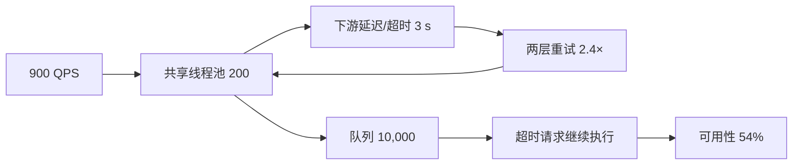

# 案例：线程池耗尽与服务雪崩

> [!IMPORTANT]
> 本案例基于常见生产模式构造，数字用于训练容量推理，不代表通用线程池参数。

## 业务现场与变更线索

订单聚合页同时调用库存、优惠和物流。用户量稳定，却在一次配置中心变更后大面积超时；
重启实例只能恢复几十秒。变更把物流超时从 300 ms 调到 3 s，而 Gateway 和 SDK 都保留
重试。候选原因包括线程池、连接池、下游变慢和重试风暴。

> [!NOTE]
> 在看答案前用 Little's Law 估算 900 QPS、3 秒等待至少需要多少在途请求。
## 场景数据

| 项目 | 正常 | 故障 |
| --- | ---: | ---: |
| 用户请求 | 900 QPS | 900 QPS |
| 请求线程 | 200 | 200，active=200 |
| 队列 | 80 | 10,000 满 |
| 下游超时 | 300 ms | 配置误改为 3 s |
| 每请求下游调用 | 1.05 | 重试后 2.4 |
| TP99 | 240 ms | 8.7 s |
| 可用性 | 99.95% | 54% |

## 面试版事故回答

入口 900 QPS 没变，但下游超时被从 300 ms 改成 3 秒，且两层重试把每个用户请求放大为
2.4 次调用。即使不算重试，Little's Law 给出并发需求约 `900 × 3 = 2,700`，远超 200
线程，因此 active 很快满、队列堆到 10,000，已经超时的请求还继续占线程。先关闭外层
重试、把超时恢复为 300 ms、熔断问题下游并返回兜底；长期按依赖拆线程池，使用端到端
deadline、有界小队列和重试预算。验证时不仅看成功率，还要确认队列等待、下游并发和
超时后任务取消都恢复。

## 架构与故障传播



## 时间线

| 时间 | 事件 | 决策 |
| --- | --- | --- |
| 09:30 | 配置平台推送 3 s 超时 | 无业务发布 |
| 09:32 | 下游连接数快速上升 | 检查依赖拓扑 |
| 09:34 | active=200、队列 6,400 | 关闭入口重试 |
| 09:36 | 队列达到 10,000 | 熔断依赖、返回兜底 |
| 09:39 | 超时恢复 300 ms | 新请求开始恢复 |
| 09:47 | 队列清空 | 保持 20% 流量验证 |

## 从观察到结论

| 观察 | 推断 | 尚需验证 |
| --- | --- | --- |
| active=200 | 线程池饱和 | CPU 还是等待 |
| CPU 仅 32% | 大量线程可能阻塞 | 阻塞在哪个依赖 |
| 栈停在 HTTP read | 下游等待占线程 | 为何等待变长 |
| 超时配置变为 3 s | 并发需求扩大 10× | 是否还有重试 |
| 调用/请求=2.4 | 重试继续放大 | 哪一层应保留重试 |

## 取证过程

```bash
curl -s localhost:8080/actuator/metrics/executor.active
jcmd "$PID" Thread.print -l > /tmp/threads.txt
rg 'socketRead|HttpClient' /tmp/threads.txt
# 并发近似：900 QPS × 3 s × 2.4 = 6,480 个在途下游调用
```

要同时查看队列等待时间、执行时间、连接池等待和调用放大率；只看线程数会误把连接池或
下游容量问题当成“线程池太小”。

## 止血决策

1. 关闭入口层重试，仅保留一次受预算约束的客户端重试。
2. 超时恢复 300 ms，并让下游超时小于入口 deadline。
3. 熔断问题依赖，非核心字段使用缓存或空结果。
4. 限制入口 QPS，让旧队列先排空；不直接继续扩队列。

## 永久修复

```java
var pool = new ThreadPoolExecutor(
    64, 64, 0L, TimeUnit.MILLISECONDS,
    new ArrayBlockingQueue<>(128),
    new ThreadPoolExecutor.AbortPolicy());

Duration remaining = requestDeadline.remaining();
client.call(timeout(min(remaining, Duration.ofMillis(250))));
```

按依赖建立 bulkhead；队列容量由允许排队延迟反推；请求取消必须传递到下游。重试需满足
幂等、指数退避、随机抖动和全链路预算，不能每层独立重试。

## 方案取舍

| 方案 | 优点 | 风险 | 结论 |
| --- | --- | --- | --- |
| 增大线程池 | 短期提高在途量 | 压垮连接池和下游 | 不作为根治 |
| 增大队列 | 少拒绝新请求 | 延迟更高、旧请求无价值 | 不选 |
| 小队列+快速失败 | 保护容量 | 高峰会拒绝 | 配合降级 |
| 异步化 | 减少阻塞线程 | 状态和取消更复杂 | 高并发链路评估 |

## 验证与回滚

| 指标 | 故障值 | 通过标准 |
| --- | ---: | ---: |
| active | 200/200 | 峰值 `< 70%` |
| 队列 | 10,000 | P99 等待 `< 20 ms` |
| 调用放大率 | 2.4 | `< 1.1` |
| TP99 | 8.7 s | `< 350 ms` |
| 可用性 | 54% | `> 99.9%` |

灰度时若拒绝率超过 0.5% 或下游并发超过安全水位，立即降流并回滚池参数。

## 复盘与防复发

- 配置变更纳入审计、灰度和自动回滚。
- 每个依赖暴露 active、queue、wait、timeout 和放大率。
- 混沌演练覆盖慢响应、连接拒绝和部分超时。
- SLO 预算从入口向下分配，禁止下游超时超过剩余 deadline。

## 对应题库

这个案例可以反向支撑下面这些题库问题：

- 基础模块3：并发基础
- 线程池参数如何设置？
- 线程池耗尽如何止血？


## 面试官追问与评分

### 追问一：为什么 200 个线程处理不了 900 QPS？

**参考回答：**吞吐不仅取决于线程数，还取决于服务时间。下游等待 3 秒时，仅原始请求平均
在途量就是 `900×3=2700`；再乘 2.4 次调用放大约为 6480，远超 200。线程迅速占满后，
新请求进入队列，排队时间又进一步放大端到端延迟。

### 追问二：为什么不直接增加到 3,000 个线程？

**参考回答：**这会把更多并发推向连接池和下游，而下游容量没有增加；上下文切换、栈内存
和超时任务也会增加。应先关闭叠加重试、恢复合理超时并隔离依赖。只有确认下游有余量且
当前线程配置确实偏小时，才小步调整线程数。

### 追问三：虚拟线程能否解决线程池耗尽？

**参考回答：**虚拟线程降低阻塞线程成本，适合大量独立 IO，但不会提高下游吞吐，也不会
自动限制连接和重试。仍需用 Semaphore、连接池或 bulkhead 控制并发，传播 deadline 并
取消过期任务，否则只是用更便宜的方式制造更多在途请求。

### 追问四：队列容量应如何确定？

**参考回答：**由允许的排队时间和到达率反推。例如最多允许 20 ms、入口 900 QPS，理论
平均排队容量只有约 18 个，还需结合突发分布压测。大队列会让已经失去业务价值的请求继续
等待；推荐小有界队列配合快速失败和降级。

### 追问五：如何验证超时后任务真的停止？

**参考回答：**客户端超时不等于服务端和下游取消。通过 trace 检查请求超时后是否仍执行，
观察 active、连接数和“已取消任务完成数”；注入慢依赖验证 deadline 能传递到每一跳。
无法取消的调用需更严格并发隔离，避免幽灵请求继续消耗资源。

失分信号：盲目增加线程和队列；认为虚拟线程创造下游容量；不检查连接池与超时后取消。

| 维度 | 5 分要求 |
| --- | --- |
| 正确性 | 用并发模型解释饱和 |
| 证据 | 串联池、栈、连接和重试指标 |
| 取舍 | 不把加线程当根治 |
| 可运维性 | 有 bulkhead、deadline、演练 |
| 表达 | 先影响，再止血、根因、验证 |

## 复述任务

1. 用 `L = λ × W` 计算 900 QPS、3 秒等待和 2.4 倍调用放大对应的在途量。
2. 区分线程池、连接池、队列和下游容量，解释为什么增加到 3,000 个线程可能更危险。
3. 设计慢依赖压测，证明超时任务已取消、调用放大受控且 TP99 恢复。

计算框架参考[容量模型与安全水位](/deep-dives/capacity-performance/01-capacity-model)，取证方法参考
[真实性压测与瓶颈证据](/deep-dives/capacity-performance/02-realistic-load-testing)。

## 延伸学习

[线程池容量模型](../../jvm-concurrency/03-thread-pool-sizing) ·
[低延迟 Java 服务](./low-latency-java-service) · [返回 JVM 案例](./)
