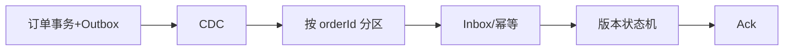

# 案例：消息重复、丢失与乱序

> [!IMPORTANT]
> 本案例为教学构造；“恰好一次”必须落到业务效果而非中间件口号。

## 业务现场

财务日终对账发现支付成功金额比订单入账金额多 86 万元；客服同时收到重复发券和订单状态
从“已支付”退回“待支付”的投诉。故障覆盖 37 分钟，支付渠道账本可信，内部事件链路需要
逐笔解释重复、缺失和状态倒退，不能用“最终一致”搪塞。

## 系统画像与事故前变更

支付回调服务写 MySQL 后发送 Kafka；订单消费者处理后写订单库并提交位点。Topic 原本按
orderId 分区，新版本错误改用 eventId；消费者为减少延迟把位点提交移到数据库事务之前。
Producer 超时配置从 3 秒降为 500 ms，但未设置稳定幂等事件 ID。

> [!NOTE]
> 推演时把“生产重复、传输重复、消费重复、业务副作用重复”分开，分别说明证据和防线。

## 场景数据
| 问题 | 影响 |
| --- | ---: |
| Producer 重试重复 | 0.7% |
| Consumer 先 ack 后落库丢失 | 1,240 条 |
| 跨分区乱序 | 386 个订单状态倒退 |

## 面试版事故回答
三个问题分别治理：生产者重试用事件 ID 和业务幂等；丢失来自先 ack 后事务，改为业务写入
与 inbox 同事务后再提交位点；乱序来自订单事件未按 orderId 分区，改固定 Key 并让状态机
按版本拒绝倒退。生产侧用 outbox/CDC 消除“数据库成功、消息未发”的双写窗口，最后通过
订单、支付和消息位点对账证明业务效果。

## 架构与故障传播


## 时间线
| 时间 | 证据 | 动作 |
| --- | --- | --- |
| 16:00 | Producer 超时重试 | 重复升至 0.7% |
| 16:12 | Consumer 崩溃 | 发现 1,240 条缺口 |
| 16:25 | 状态版本倒退 | 暂停消费者 |
| 17:10 | 补数和版本守卫上线 | 限速重放 |

## 从观察到结论
| 观察 | 结论 | 仍需验证 |
| --- | --- | --- |
| 相同 eventId 多次 | 传输至少一次 | 业务一定重复 |
| ack 位点已过、DB 无记录 | 提交时序错误 | Producer 未发送 |
| 同订单跨分区 | 全局顺序无保证 | 状态机无法防护 |

## 分阶段证据与候选假设

第一轮：渠道账本有 12,480 笔成功，订单库只有 11,240 笔，先确认是真缺失还是查询延迟。
第二轮：缺失事件的 Kafka 位点已经提交，但 inbox 无记录，锁定“先 ack 后落库”；重复事件
payload 不同却共享同一支付单，说明 eventId 不稳定。第三轮：倒退订单的版本 7 先于版本 6
到达，且落在不同分区，最终形成三个独立根因。

## 取证过程
```sql
SELECT event_id, COUNT(*) FROM payment_inbox GROUP BY event_id HAVING COUNT(*) > 1;
SELECT o.id FROM orders o LEFT JOIN payment_result p ON p.order_id=o.id
WHERE o.status='PAID' AND p.order_id IS NULL;
```

## 止血决策
暂停问题分区；按订单版本过滤倒退事件；从支付账本补出缺失清单；以限速方式重放并开启
幂等表，禁止手工直接改最终状态而无审计。

## 永久修复
```sql
BEGIN;
INSERT INTO payment_inbox(event_id) VALUES (?) ON DUPLICATE KEY UPDATE event_id=event_id;
UPDATE orders SET status=?, version=? WHERE id=? AND version < ?;
COMMIT;
-- 成功后才提交消费位点
```

## 方案取舍
| 方案 | 收益 | 风险 |
| --- | --- | --- |
| Broker EOS | 减少队列内重复 | 不覆盖外部 DB 副作用 |
| Inbox | 业务幂等可证明 | 存储与清理成本 |
| 固定分区 Key | 保证局部顺序 | 热点订单可能倾斜 |
| 版本状态机 | 抵抗乱序 | 需定义合法跃迁 |

## 验证与回滚
重复副作用为 0、对账缺口为 0、状态倒退为 0、消费 P99 小于 3 秒；重放前后账本总额和
订单状态数量必须一致，异常即暂停位点。

## 复盘与防复发
统一事件 ID、业务 Key 和 schema；ack 时序纳入代码模板；每日对账；演练生产超时、消费
崩溃、乱序和毒消息。

## 面试官追问与评分

### 追问一：Broker 的 exactly-once 能否保证用户只收到一张券？

**参考回答：**不能。Broker 的事务语义通常只覆盖消息系统内部读写，数据库、发券接口等
外部副作用不在同一事务中。消费者仍需稳定 eventId、inbox 唯一约束和发券业务幂等键，
最终用权益账本证明业务效果没有重复。

### 追问二：业务事务成功，但消费位点提交失败会怎样？

**参考回答：**消息会再次投递，这是正常的至少一次语义。第二次消费先插入 inbox，唯一
约束发现 eventId 已处理后直接返回；业务表也应以订单和动作建立幂等约束。不能为了避免
重放而先提交位点，否则进程崩溃会造成静默丢失。

### 追问三：如何保证订单状态不会因乱序而倒退？

**参考回答：**按 orderId 分区提供局部顺序，同时事件携带单调版本；数据库执行
`WHERE version < incomingVersion` 的条件更新，并校验状态机合法跃迁。分区顺序不是唯一
防线，因为重放、跨地域复制和补偿事件都可能乱序。

### 追问四：幂等记录会无限增长，如何清理？

**参考回答：**按事件时间分区，保留期至少覆盖 Broker 保留、最大重放期和业务争议期。
清理前确认相关 Topic 位点和补数任务已经越过该窗口；高价值支付事件可归档到低成本存储。
不能仅按“七天前”删除而忽略 30 天重放能力。

### 追问五：如何证明补数没有再次发券或扣款？

**参考回答：**先生成只读影响清单并做影子执行，核对预计变更数量；真实重放使用原 eventId、
限速和幂等副作用。完成后比较渠道账、订单账、支付账和权益账，并抽样事件轨迹。出现差异
立即暂停，而不是继续重放后统一处理。

失分信号：声称“MQ 保证绝不重复”；先提交位点；用时间戳作为幂等键；重放前没有影响面
清单；只修消息不修状态机。

| 维度 | 5 分要求 |
| --- | --- |
| 正确性 | 分开重复、丢失、乱序 |
| 证据 | 位点、DB、事件 ID 可对账 |
| 取舍 | 中间件语义边界准确 |
| 可运维性 | 重放、隔离、审计 |
| 表达 | 业务效果可证明 |

## 延伸学习
[积压案例](./message-backlog) · [事件架构](./reliable-event-driven-architecture) · [返回](./)
