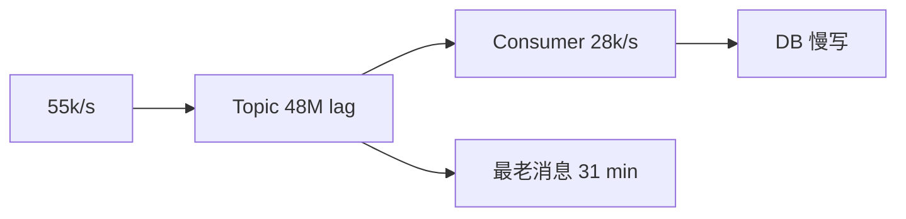

# 案例：消息积压与消费延迟

> [!IMPORTANT]
> 本案例基于常见生产模式构造，不对应实际企业。

## 业务现场

大促开始 18 分钟后，用户已支付的订单仍显示“待处理”，仓库出库波次也开始缺单。订单
核心库写入正常，问题集中在“订单状态同步”Topic：它同时驱动搜索索引、风控明细和客服
查询。业务要求 95% 状态在 60 秒内可见，超过 10 分钟会触发人工工单。

## 系统画像与事故前变更

- Kafka Topic 48 分区，24 个消费者实例，每实例 2 个线程。
- 消费后批量写 Elasticsearch，再同步调用风控明细库；正常 20,000 条/s。
- 当日上午为降低 ES 写放大，批次从 500 改为 100，并新增同步风控校验。
- 活动预估 40,000 条/s，实际达到 55,000 条/s；消费者未提前扩容。

> [!NOTE]
> 先回答：Broker、分区、消费者和下游四层分别看什么？为什么“加 100 个消费者”可能无效？

## 场景数据
| 指标 | 正常 | 故障 |
| --- | ---: | ---: |
| 生产速率 | 20,000/s | 55,000/s |
| 消费能力 | 28,000/s | 28,000/s |
| 积压 | `< 10万` | 4,800 万 |
| 最老消息 | 20 s | 31 min |

## 面试版事故回答
净积压为每秒 2.7 万，不能只看“消费者在线”。我先按分区比较 lag、消费耗时和错误率，
确认活动流量增长且下游批量写入变慢；先关闭非核心生产、扩分区对应消费者，并给数据库
设并发水位。若总消费提升到 8 万/s，扣除 5.5 万新流量，理论清理需 `4800万/2.5万≈32`
分钟。长期做容量告警、批处理、背压和可重放降级。

## 架构与故障传播


## 时间线
| 时间 | 证据 | 动作 |
| --- | --- | --- |
| 10:00 | 活动流量上线 | 生产升至 55k/s |
| 10:08 | lag 900 万 | 限非核心事件 |
| 10:16 | DB 批写 P99 1.2s | 限下游并发、调批次 |
| 10:25 | 消费升至 80k/s | 估算 32 分钟清理 |
| 10:58 | lag 回安全线 | 逐步恢复 |

## 从观察到结论
| 观察 | 推断 | 不能断言 |
| --- | --- | --- |
| 生产大于消费 | 必然积压 | 只需加消费者 |
| 少数分区 lag 高 | 分区/Key 倾斜 | Broker 总容量不足 |
| DB P99 上升 | 下游限制吞吐 | 可无限扩消费者 |

## 分阶段证据与候选假设

**第一轮：** Broker CPU 41%、磁盘 52%、无 ISR 抖动，排除 Broker 整体容量；48 个分区都
有 lag，但其中 6 个高出均值 4 倍，保留“消费不足”和“Key 倾斜”两个假设。

**第二轮：** poll 获取消息只占 8 ms，业务处理 P99 1.4 s；ES 批写从 120 ms 升到 630 ms，
同步风控调用再增加 410 ms，说明瓶颈在消费逻辑和下游。

**第三轮：** 回滚批次和异步化风控后单实例能力从 1,167 提升至 3,340 条/s。此时才能按
`4800万/(8万-5.5万)` 计算约 32 分钟清理，并为热点分区单独限速。

## 取证过程
```bash
kafka-consumer-groups --bootstrap-server broker:9092 --describe --group order-indexer
# drainSeconds = backlog / (safeConsumeRate - ingressRate)
```

## 止血决策
先减非核心生产；仅在分区数和下游允许时扩消费者；批量写入但限制事务大小；毒消息转隔离
队列，不能阻塞整个分区；清理期间保护在线查询。

## 永久修复
按峰值 55k/s 的 1.5 倍配置安全消费能力；lag 同时按条数和 oldest age 告警；生产端接受
背压，消费者暴露处理、等待、失败和下游耗时；回放工具支持限速、暂停和断点。

## 方案取舍
| 方案 | 收益 | 风险 |
| --- | --- | --- |
| 扩消费者 | 快 | 超过分区无收益、压垮下游 |
| 增分区 | 提升并行 | 顺序和迁移变化 |
| 批处理 | 提升吞吐 | 单批失败影响扩大 |
| 丢弃 | 快速降压 | 仅可丢业务且需审计 |

## 验证与回滚
| 指标 | 目标 |
| --- | ---: |
| oldest age | `< 60 s` |
| 安全消费能力 | `>= 80k/s` |
| DB CPU | `< 65%` |
| 重放错误率 | `< 0.1%` |

## 复盘与防复发
压测保留热点分区；活动前预扩；积压演练包含毒消息和 DB 降速；容量评审必须计算净清理
速率，不以实例数代替吞吐。

## 面试官追问与评分

### 追问一：为什么增加消费者可能完全无效？

**参考回答：**消费者并行度首先受分区数限制，超过 48 个活跃消费者后，多出的实例不会
获得分区。即使分区足够，本案例瓶颈在 ES 批写和同步风控，扩消费者只会提高下游并发。
应拆分 poll、业务计算和下游写入耗时，再结合分区与下游安全水位决定扩容。

### 追问二：必须在 20 分钟内清完 4,800 万积压，需要多少吞吐？

**参考回答：**仅清历史积压需要 `48M/1200=40k/s`，同时还要处理 55k/s 新流量，所以总
消费能力至少 95k/s。生产环境还需预留失败重试和流量波动，目标可设 105k/s，但前提是
ES、风控和数据库在该并发下仍低于安全水位。

### 追问三：少数分区积压特别严重，可能是什么原因？

**参考回答：**常见原因包括业务 Key 倾斜、毒消息反复重试、某消费者实例变慢或分区对应
下游热点。应比较每分区 ingress、消费耗时、错误率和 Key 分布。不能直接重分区，因为
映射变化可能破坏同订单局部顺序。

### 追问四：如何处理阻塞整个分区的毒消息？

**参考回答：**记录失败原因和尝试次数，有限重试后把原消息、异常、schema 版本和位点送入
隔离队列，再推进主分区。修复后以原 eventId 限速重放，并依靠业务幂等防重复。不能无期限
重试，也不能静默丢弃。

### 追问五：积压清空后如何安全恢复被暂停的生产流量？

**参考回答：**按 10%→30%→60%→100% 分阶段恢复，每阶段观察 oldest age、净消费速率、
ES/DB 水位和错误率。若净消费速率接近零或下游超过 70% 水位，停止放量。恢复标准应同时
包含 lag 条数和消息年龄，避免“大量新消息但年龄尚低”造成误判。

失分信号：只看 lag 条数不看 oldest age；盲目扩消费者；不计算净清理速率；忽略毒消息、
热点分区和下游保护。

| 维度 | 5 分要求 |
| --- | --- |
| 正确性 | 会计算净积压与清理时间 |
| 证据 | 分区、消费、下游指标完整 |
| 取舍 | 并行与顺序边界清楚 |
| 可运维性 | 背压、隔离、重放 |
| 表达 | 先止血后恢复 |

## 延伸学习
[消息可靠性](./duplicate-loss-and-disorder) · [事件架构](./reliable-event-driven-architecture) · [返回](./)
