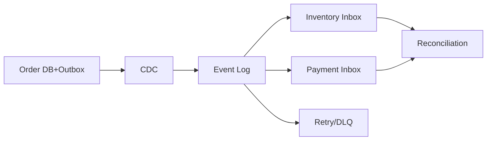

# 案例：可靠事件驱动架构设计

> [!IMPORTANT]
> 本文是架构教学场景，产品特性以 Kafka/RocketMQ 共通语义为主。

## 业务现场

平台准备把订单、库存和支付从同步 RPC 链改造成事件驱动。现网峰值 30,000 个命令/s，
任一服务短暂停机都不能造成静默丢单；运营要求能够重放 30 天事件，财务要求每笔订单都能
追溯到支付与库存变化。团队只有 6 人维护消息平台，因此方案不能依赖大量人工补数。

## 现状与设计陷阱

旧系统在订单事务提交后直接发送消息，约万分之三出现“订单成功但消息未发”；消费者用
业务代码重试，无统一 DLQ、schema 或 eventId。库存要求 orderId 局部顺序，分析事件不
要求顺序。跨地域灾备为异步复制，RPO 目标 5 秒。

> [!NOTE]
> 先明确：哪些状态是事实源？何时可以向用户返回成功？“不丢”通过什么记录和对账证明？

## 需求与约束
| 目标 | 数值 |
| --- | ---: |
| 命令峰值 | 30,000/s |
| 端到端 P99 | `< 3 s` |
| 静默丢失 | 0 |
| 可重放 | 30 天 |

## 面试版设计回答
订单本地事务写状态和 outbox，CDC 按 orderId 发布；库存、支付各自用 inbox 幂等和版本
状态机消费，成功提交业务事务后才提交位点。失败指数退避，超过阈值进 DLQ，但原始事件
保留 30 天。Trace 使用 eventId 贯穿，日常对账比较订单、支付、库存和位点。Kafka 与
RocketMQ 的事务能力可以优化实现，但不能替代业务幂等和补偿。

## 容量估算
按每条 2 KiB、30k/s 计算入口约 60 MiB/s；三副本和 30 天原始保留约 456 TB，实际需
按压缩率、冷热分层和法规重新预算。分区数以单分区实测吞吐和热点余量决定。

## 核心架构


## 数据模型与接口
```json
{"eventId":"01J...","orderId":8848,"type":"OrderCreated","version":3,"occurredAt":"...","payload":{}}
```

## 关键链路
创建、预占、支付均为独立状态机；事件只陈述已发生事实。消费者写 inbox、业务数据和待
发 outbox 于同一本地事务。取消和退款使用补偿事件，不跨服务持有数据库事务。

## 分阶段设计推演

**阶段一：可靠发布。** 比较数据库后发消息、事务消息和 Outbox+CDC，选择可从数据库日志
恢复且可审计的 Outbox。**阶段二：可靠消费。** 位点提交晚于 inbox+业务事务，接受重复
投递但保证业务效果幂等。**阶段三：异常恢复。** 可重试错误退避，永久错误进入带原因的
DLQ；重放使用原 eventId，状态机拒绝旧版本。**阶段四：证明。** 按订单生成事件轨迹，
每日比较订单、库存、支付、outbox 和消费位点。

## 方案取舍
| 方案 | 优点 | 风险 |
| --- | --- | --- |
| Outbox+CDC | 双写窗口可恢复 | CDC 运维成本 |
| Broker 事务消息 | 集成直接 | 绑定产品、仍需幂等 |
| Saga 事件协作 | 服务自治 | 状态和补偿复杂 |
| 同步 RPC | 即时结果 | 耦合和级联故障 |

## 一致性与故障处理
唯一 eventId、实体版本、局部顺序、有限重试、DLQ、人工审批和周期对账共同形成闭环。
Schema 只做兼容演进；消费者先升级兼容新旧字段，再切生产者。

## 扩容与演进
先扩消费者到分区上限，再按 Key 分布增加分区；大促预扩并验证下游水位。跨地域使用异步
复制和单写 fencing，灾备切换后按位点和账本对账。

## 指标与验收
端到端 P99 `<3s`、oldest age `<60s`、对账缺口 `0`、DLQ `<0.01%`、重放成功率
`>99.99%`，演练覆盖 Broker、CDC、消费者和地域故障。

## 面试官追问与评分

### 追问一：订单已提交，但 CDC 延迟 20 秒，算不算消息丢失？

**参考回答：**不算丢失，因为 outbox 中仍有可恢复记录，但已经违反端到端 3 秒 SLO。应
按 outbox age、CDC 位点延迟和 oldest event age 告警；必要时暂停依赖实时事件的功能或
切换备用发布链路。不能用“最终会到”掩盖时效性故障。

### 追问二：为什么不在订单事务提交后直接调用 Broker？

**参考回答：**数据库提交成功而发送失败会形成无法自动恢复的双写窗口；先发消息又可能
出现订单回滚但事件已发布。Outbox 把订单和待发事件写入同一本地事务，再由 CDC 重试发布，
代价是额外存储、延迟和 CDC 运维，但恢复证据完整。

### 追问三：Outbox 达到十亿行如何治理？

**参考回答：**按时间或业务域分区，发布状态和创建时间建立轻量索引；已发布数据异步归档。
清理水位必须小于所有 CDC/订阅位点，并覆盖最大重放与审计窗口。还要监控表膨胀、清理延迟
和未发布最老年龄，不能把定期 `DELETE` 当作完整方案。

### 追问四：事件 schema 如何做到不停机升级？

**参考回答：**遵循向后兼容：先让消费者兼容新旧字段，再发布生产者；新增字段提供默认值，
不复用旧字段语义。破坏性变更使用新版本事件或新 Topic，并用历史事件回放验证。Schema
Registry 只能执行规则，不能替代业务兼容设计。

### 追问五：灾备地域缺最后 5 秒事件，如何恢复？

**参考回答：**先以 fencing epoch 确保只有新地域可写，再比较数据库、outbox 和 Broker
复制位点。能从原地域补拉则按原 eventId 重放；原地域不可用时从业务账本重建事件。消费者
的 inbox 和版本状态机保证恢复可重复执行，完成后做订单—库存—支付对账。

失分信号：技术选型清单化；把最终一致当作无期限；无 schema 演进；无重放限速与对账；
承诺跨地域零 RPO 却不说明成本。

| 维度 | 5 分要求 |
| --- | --- |
| 正确性 | 投递语义与业务效果分开 |
| 证据 | 位点、事件、账本可追踪 |
| 取舍 | RPC、事务消息、Outbox 对比 |
| 可运维性 | 重试、DLQ、重放、灾备 |
| 表达 | 链路和边界清楚 |

## 延伸学习
[积压案例](./message-backlog) · [可靠性事故](./duplicate-loss-and-disorder) · [返回](./)
