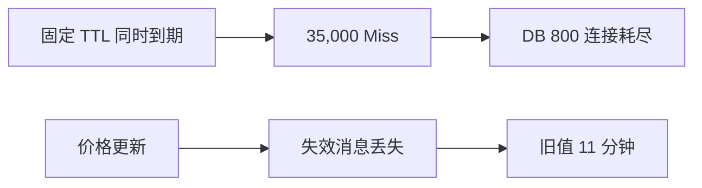

# 案例：缓存击穿与数据不一致

> [!IMPORTANT]
> 本案例为教学构造。击穿和不一致是两个问题，不能用一个“加锁”结论覆盖。

## 业务现场

午间抢购开始后，商品页大量超时；故障恢复后又出现另一类投诉：部分用户看到的价格比
结算价低。前者持续 6 分钟，后者持续 11 分钟。客服希望“马上清缓存”，但价格团队要求
先确认影响范围，避免把全部热门商品同时打到数据库。

## 缓存拓扑与事故前变更

商品服务使用本地缓存 + Redis + MySQL，热门商品 Redis TTL 固定 20 分钟。价格后台更新
MySQL 后发送失效消息；消息发送不在数据库事务内。活动脚本在 11:40 批量预热 2,000 个
Key，因此它们在 12:00 同秒过期；当天消息客户端升级后出现短暂连接失败。

> [!NOTE]
> 先把两个症状拆开：哪些证据证明是击穿？哪些证据证明价格不一致不是数据库更新失败？

## 场景数据

| 项目 | 数值 |
| --- | ---: |
| 商品 TTL | 固定 20 分钟 |
| 同时 Miss | 35,000 |
| DB 连接 | 800/800 |
| DB TP99 | 4.3 s |
| 价格旧值 | 持续 11 分钟 |
| 允许陈旧 | 5 秒 |

## 面试版事故回答

固定 TTL 让热门商品同时失效，3.5 万请求穿透到数据库造成击穿；价格旧 11 分钟则是更新
事务成功后失效消息投递失败，二者要分开治理。先用旧值兜底、single-flight 和回源限流
保护 DB，暂停价格展示之外的非核心查询。长期采用逻辑过期、TTL 抖动和异步刷新；价格
更新通过 outbox/CDC 发布版本事件，缓存值携带版本，读到旧版本可回源校验。验收同时看
回源峰值、数据库连接和陈旧时间。

## 架构与故障传播



## 时间线

| 时间 | 事件 | 动作 |
| --- | --- | --- |
| 12:00 | 热门 Key 同时到期 | DB 连接打满 |
| 12:02 | 开启旧值兜底与单飞 | 回源下降 |
| 12:06 | 发现价格旧版本 | 查更新事件 |
| 12:11 | outbox 补发成功 | 缓存刷新 |
| 12:20 | 加抖动版本灰度 | 峰值恢复 |

## 从观察到结论

| 观察 | 支持 | 不支持 |
| --- | --- | --- |
| 同秒大量 Miss | 同时失效 | Redis 宕机 |
| DB 连接耗尽 | 回源放大 | 只需扩 DB |
| DB 已是 v42、缓存 v41 | 不一致 | TTL 已足够 |
| 失效事件无投递记录 | 消息链路缺口 | 数据库事务失败 |

## 分阶段证据与候选假设

第一轮：Redis 命中率从 96% 降至 21%，DB 连接 800/800，候选为 Redis 故障、批量过期或
缓存穿透。第二轮：Redis 节点健康，2,000 个 Key 的 TTL 集中在同一秒，确认同步过期造成
回源峰值。第三轮：价格 DB 为 v42、缓存为 v41，outbox 无 v42 事件且客户端当时断线，
确认不一致来自不可恢复的“事务后直接发消息”，与击穿是两条根因。

## 取证过程

```bash
redis-cli GET product:8848
redis-cli PTTL product:8848
redis-cli INFO stats
```

```sql
SELECT id, price, version, updated_at FROM product WHERE id=8848;
SELECT * FROM cache_outbox WHERE aggregate_id=8848 ORDER BY id DESC;
```

## 止血决策

1. 在允许范围内返回旧值，标记新鲜度。
2. 每 Key 只允许一个重建者，其余等待短时间或返回旧值。
3. 设置全局回源并发上限，保护 DB。
4. 对价格等敏感字段直接回源校验，不把“可用性兜底”错误用于强一致场景。

## 永久修复

```text
value = { version: 42, logicalExpireAt: 1720084805, payload: ... }
physical TTL = logical TTL + random(5m, 10m)
```

数据库事务写业务行和 outbox；CDC 投递失效事件。缓存更新采用版本 CAS，旧事件不能覆盖
新值；消费者失败可重放，周期校验扫描异常版本。

## 方案取舍

| 方案 | 击穿 | 一致性 | 代价 |
| --- | --- | --- | --- |
| 互斥重建 | 有效 | 不保证 | 请求可能等待 |
| 逻辑过期 | 可返回旧值 | 有陈旧窗口 | 实现复杂 |
| 延迟双删 | 部分改善 | 时序仍有窗口 | 依赖经验延迟 |
| Outbox/CDC+版本 | 不直接处理 | 可审计、可重放 | 基础设施成本 |

## 验证与回滚

| 指标 | 故障 | 目标 |
| --- | ---: | ---: |
| 同 Key 回源并发 | 35,000 | `<= 1/实例` 且全局受限 |
| DB 连接 | 800/800 | `< 60%` |
| 价格陈旧 | 11 min | `< 5 s` |
| 失效事件积压 | 无监控 | P99 `< 2 s` |

## 复盘与防复发

- TTL 默认加入抖动，热门数据使用逻辑过期。
- 缓存值携带业务版本和生成时间。
- 更新事件必须可重放、可对账。
- 演练 Redis 冷启动、消息暂停和 DB 限流。

## 对应题库

这个案例可以反向支撑下面这些题库问题：

- 基础模块6：缓存与消息基础
- 缓存击穿和缓存不一致如何处理？
- 缓存更新策略如何设计？


## 面试官追问与评分

### 追问一：击穿、穿透和雪崩有什么区别？

**参考回答：**击穿是单个热点 Key 失效导致大量并发回源；穿透是持续查询不存在的数据，
缓存和数据库都无法命中；雪崩是大量 Key 同时失效或缓存集群不可用。三者证据和治理不同：
单飞重建、空值/布隆过滤器、TTL 抖动与多级降级不能混用成一个答案。

### 追问二：为什么更新数据库后删除缓存，仍可能读到旧值？

**参考回答：**并发读可能在数据库更新前读到旧值，却在删除缓存后才把旧值写回；删除事件
也可能丢失。需要版本化缓存、受控回填和可重放失效事件。延迟双删只能缩小部分窗口，不能
形式化保证一致性。

### 追问三：互斥锁重建缓存有什么边界？

**参考回答：**它能限制同一 Key 同时只有一个回源者，但锁持有者失败、重建过慢或跨实例锁
超时仍会造成等待和重复回源。应设置短等待、旧值兜底、全局回源水位和失败释放；不能让
所有请求无限等待锁。

### 追问四：价格要求强一致，应如何设计？

**参考回答：**展示页可以使用带版本和新鲜度的缓存，但真正下单或结算必须以价格事实源
校验，或者使用能验证的版本令牌。缓存事件用于降低读压力，不作为最终交易依据。需向业务
明确“展示价格”和“成交价格”的语义。

### 追问五：如何验证修复而不再次压垮数据库？

**参考回答：**在影子环境构造同秒 35,000 次请求，验证全局回源并发、连接池和旧值策略；
再注入失效消息丢失和乱序，确认版本最终收敛。生产灰度按热点 Key 小比例开启，DB 超过
60% 水位立即停止，不能全量批量删除后观察。

失分信号：把击穿、穿透、雪崩混为一谈；只说加分布式锁；把价格旧值无限期作为降级；
没有版本、重放和对账；批量删除缓存却不控制 DB 回源。

| 维度 | 5 分要求 |
| --- | --- |
| 正确性 | 分离击穿与不一致 |
| 证据 | TTL、版本、outbox 证据充分 |
| 取舍 | 说明可用性与陈旧窗口 |
| 可运维性 | 回源保护、重放、对账 |
| 表达 | 两条根因线清晰 |

## 延伸学习

[热 Key 案例](./hot-key-overload) · [高可用缓存设计](./highly-available-cache) ·
[返回 Redis 案例](./)
