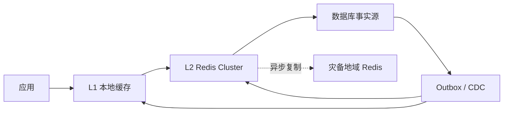

# 案例：高可用缓存体系设计

> [!IMPORTANT]
> 这是架构面试教学场景，容量数字用于展示决策方法。

## 业务现场

平台正在统一商品、用户权益和风控标签三套缓存。普通商品允许 5 秒陈旧，权益扣减要求读后
写一致，风控标签允许 30 秒陈旧。过去一次 Redis 整集群故障让 80 万请求/s 同时回源，
MySQL 在 40 秒内被压垮，因此本次设计首先要保证“缓存失败不能拖死事实源”。

## 现状与设计约束

业务部署在两个地域、每地域三个 AZ；主地域承担写入，灾备异步复制。团队要求 60 秒内
切换，但不接受双写脑裂。应用发布经常造成本地缓存冷启动，活动热点无法提前完全预测。
预算允许常态 40% 冗余，不允许为了理论零陈旧使用跨地域同步写。

> [!NOTE]
> 先按数据类型定义一致性等级。若不区分商品、权益和风控，统一“缓存五秒”会在哪里出错？

## 需求与约束

| 目标 | 数值 |
| --- | ---: |
| 峰值读取 | 1,200,000/s |
| 峰值写入 | 80,000/s |
| 可用性 | 99.99% |
| 地域切换 | `< 60 s` |
| 允许陈旧 | `< 5 s` |
| DB 承受回源 | 50,000/s |

## 面试版设计回答

采用进程内缓存加地域内 Redis Cluster 两级结构：本地层承接超热点，Redis 按业务域和 Key
分片，数据库是事实源。写入数据库与 outbox 同事务，CDC 推版本失效；缓存只接受更高
版本。单 Key 有 single-flight，全局有回源令牌桶，Redis 故障时返回 5 秒内旧值并按业务
优先级降级，不能让 120 万请求直冲 DB。跨地域复制用于灾备而非同步强一致；切换前检查
复制位点，敏感读回源。容量按单分片 60% 水位部署并演练节点、分片和整地域故障。

## 容量估算

本地命中 70% 后 Redis 约 36 万读/s；按单主节点安全 60,000 ops/s，考虑写入、热点和
N+1 至少 10 个主分片。故障后剩余节点仍不得超过 70%。DB 回源令牌固定低于 50,000/s，
其余请求走旧值或降级。

## 核心架构



## 数据模型与接口

```json
{"key":"product:8848","version":42,"generatedAt":1720084800,"payload":{}}
```

`GET` 返回数据版本与新鲜度；业务明确 `maxStaleness=5s`。失效事件包含 Key、版本和事件
ID，重复与乱序消费都安全。

## 关键链路

读：L1 → L2 → 受限回源；写：DB+outbox → CDC → 删除/刷新 L2 → 广播 L1。L1 订阅失败
时通过短 TTL 和周期版本校验收敛。冷启动先加载热点快照，再逐步放流。

## 分阶段设计推演

第一步先按业务定义最大陈旧与降级方式：权益关键读回源校验，商品可返回短期旧值。第二步
用 L1 命中率把 120 万/s 降到 Redis 36 万/s，再按单分片 60% 水位算 10 个主分片。第三步
设计 Redis 故障：single-flight、全局回源令牌和旧值兜底，确保 DB 不超过 5 万/s。第四步
设计地域切换：检查复制位点、提升 fencing epoch、切单写地域并对敏感数据回源校验。

## 方案取舍

| 选择 | 优点 | 风险 | 决策 |
| --- | --- | --- | --- |
| Cache Aside | 简单、DB 为事实源 | 短暂不一致 | 主模式 |
| Write Through | 写后缓存及时 | 缓存故障阻塞写 | 不用于核心写 |
| 双地域同步缓存 | 更强一致 | 延迟和复杂度高 | 不选 |
| 异步灾备 | 延迟低 | 切换有陈旧 | 配合版本/回源 |

## 一致性与故障处理

- 版本 CAS 防止乱序事件覆盖新值。
- Redis 故障时 L1 仅服务 5 秒内数据，之后按业务降级。
- 热 Key 复制，大 Key 拆分并限制序列化成本。
- 跨地域切换使用 fencing epoch，旧地域写入被拒绝。
- DB 回源令牌桶、熔断和 single-flight 防止缓存故障拖垮事实源。

## 扩容与演进

先扩普通分片并迁槽；热点独立治理，不能只看平均 OPS。新增地域先影子消费 CDC、比对版本
和命中率，再承接只读流量。分片持续超 60%、内存超 65% 或迁槽窗口不足时提前扩容。

## 指标与验收

| 指标 | 目标 |
| --- | ---: |
| 端到端命中率 | `> 97%` |
| 缓存读 TP99 | `< 20 ms` |
| 数据陈旧 P99 | `< 5 s` |
| 分片 CPU/内存 | `< 60% / 65%` |
| 地域 RTO | `< 60 s` |
| DB 回源 | `< 50,000/s` |

## 对应题库

这个案例可以反向支撑下面这些题库问题：

- 架构模块6：稳定性与高可用
- 多级缓存如何设计？
- Redis 故障时如何降级保护数据库？


## 面试官追问与评分

### 追问一：为什么需要进程内 L1 缓存？

**参考回答：**120 万读/s 若全部进入 Redis，会增加网络、连接和分片成本，单 Key 热点仍
集中在一个节点。L1 承接高频读并降低延迟，但会引入多副本不一致、冷启动和内存占用。
因此只缓存明确可陈旧的数据，并设置容量、版本和淘汰策略。

### 追问二：Redis 整集群故障时如何保护数据库？

**参考回答：**不能把所有 Miss 直接回源。使用本地旧值、每 Key single-flight、全局回源
令牌桶和业务优先级降级，把 DB 流量限制在 5 万/s 以下。权益等敏感请求可以快速失败或
受限回源，普通商品允许 5 秒旧值。

### 追问三：如何处理 L1 与 Redis 的不一致？

**参考回答：**值携带单调业务版本，CDC 事件推动 L2 和 L1 失效；短 TTL 与周期校验兜底
丢事件。旧事件不能覆盖新值。不同数据类型分别定义最大陈旧时间，不能用统一 TTL 假装
解决一致性。

### 追问四：扩容 Redis 分片时需要关注什么？

**参考回答：**除平均 OPS 外，还要看单分片 CPU、内存、热点槽、迁槽网络和客户端重定向。
迁槽期间限制速率并预留双份内存；热点 Key 单独治理。扩容完成后以相同负载确认 P99 和
故障后水位，而不是只确认节点加入成功。

### 追问五：跨地域切换如何避免双写和旧数据覆盖？

**参考回答：**使用租约或 fencing epoch 保证单写地域，提升 epoch 后旧地域写请求被拒绝。
切换前检查复制位点，敏感读暂时回源事实库；切换后按版本对账并补偿缺口。异步复制意味着
存在 RPO，若业务要求零 RPO，必须接受同步跨地域写的延迟和可用性成本。

失分信号：所有数据使用同一一致性策略；只讲 Redis Sentinel/Cluster 名词；缓存故障直接
回源；没有冷启动和热点治理；承诺跨地域强一致却不计算延迟与可用性代价。

| 维度 | 5 分要求 |
| --- | --- |
| 正确性 | 多级缓存与事实源边界清晰 |
| 证据 | 容量估算和安全水位自洽 |
| 取舍 | 一致性、延迟、灾备权衡 |
| 可运维性 | 冷启动、回源保护、演练 |
| 表达 | 从约束到验收闭环 |

## 延伸学习

[热 Key 案例](./hot-key-overload) · [击穿与不一致](./cache-breakdown-and-inconsistency) ·
[返回 Redis 案例](./)
