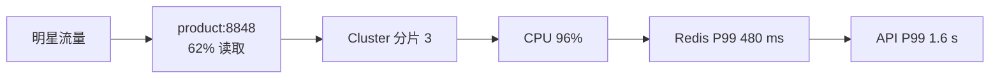

# 案例：Redis 热 Key 导致单节点过载

> [!IMPORTANT]
> 本案例基于常见生产模式构造，不对应任何实际企业。

## 业务现场

晚间直播开始后，明星同款商品详情页间歇性加载失败，但其他商品基本正常。运营看到在线
人数只比预估高 12%，基础设施看板中的 Redis 集群平均 CPU 也只有 49%，因此最初误判为
商品服务扩容不足。故障持续 9 分钟后，购物车和价格查询也开始变慢。

## 缓存拓扑与事故前变更

商品服务 120 实例访问 12 主 12 从的 Redis Cluster；商品详情 Key 通常 5 KiB、TTL
30 分钟。当天新版本把明星商品的价格、库存和直播状态合并成一个 Key，并把客户端本地
缓存关闭，以确保直播状态“绝对实时”。监控只有集群平均值，没有分片和 Key 访问占比。

> [!NOTE]
> 先回答：为什么集群平均 CPU 正常仍可能是 Redis 故障？迁槽为什么不能根治单 Key 热点？

## 场景数据

| 指标 | 正常 | 故障 |
| --- | ---: | ---: |
| 集群 OPS | 180,000/s | 186,000/s |
| 热 Key 占读流量 | 4% | 62% |
| 热分片 CPU | 46% | 96% |
| Redis TP99 | 12 ms | 480 ms |
| API TP99 | 90 ms | 1.6 s |

## 面试版事故回答

总 OPS 只增 3%，但一个明星商品 Key 占 62% 读取，Cluster 哈希不能把单 Key 拆到多分片，
所以单节点 CPU 到 96%。先对比各分片 OPS/CPU，用 `--hotkeys` 和客户端采样确认 Key；
止血采用应用本地缓存、请求合并和热点接口限流。长期用版本化本地缓存承接高频读，超热
Key 按后缀复制 16 份并随机读取，更新时广播失效；设置 3 秒陈旧上限和自动升降级，避免
永久维护热点名单。

## 架构与故障传播



## 时间线

| 时间 | 证据 | 动作 |
| --- | --- | --- |
| 19:00 | 直播开始 | 总 OPS 正常 |
| 19:02 | 单分片 CPU 91% | 按分片对比 |
| 19:05 | Key 占比 62% | 开启本地缓存 |
| 19:09 | TP99 回落 80 ms | 热 Key 复制 16 份 |
| 19:25 | CPU 55% | 灰度恢复流量 |

## 从观察到结论

| 观察 | 推断 | 不能断言 |
| --- | --- | --- |
| 总 OPS 稳定 | 不是整体容量不足 | 无访问倾斜 |
| 单分片 CPU 96% | 分片热点 | 一定是大 Key |
| 单 Key 62% | 读热点成立 | 复制后绝对一致 |

## 分阶段证据与候选假设

第一轮：应用实例 CPU 和线程池正常，Redis 请求 P99 上升；候选为网络、慢命令、大 Key 或
热 Key。第二轮：只有分片 3 CPU 96%，网络包量高但单次响应仅 5 KiB，基本排除大 Key。
第三轮：客户端采样显示 `product:8848` 占该分片 62% 读取，且本地缓存关闭时间与故障
吻合，根因收敛为“访问倾斜 + 保护层移除”，不是集群总容量不足。

## 取证过程

```bash
redis-cli --cluster call node-a:6379 INFO commandstats
redis-cli -h replica-a --hotkeys -i 0.1
redis-cli --latency-history -h node-a
# 生产环境优先在副本和采样客户端取证，避免 KEYS/全量扫描。
```

## 止血决策

1. 应用本地缓存 1 秒并使用 single-flight 合并回源。
2. 对热点接口按租户限流，保留核心读取。
3. 只读副本分担读前先确认允许的陈旧窗口。
4. 不通过迁槽解决单 Key 热点：迁移只会把热点换到另一个节点。

## 永久修复

```java
int bucket = ThreadLocalRandom.current().nextInt(16);
String key = "product:8848:v" + version + ":" + bucket;
Product value = localCache.get(key, redis::get);
```

更新先写数据库，再发布版本失效事件并异步刷新 16 份；客户端最多接受 3 秒旧版本。监控
Key 访问占比，超过分片 OPS 15% 自动提升为热点，连续 30 分钟低于 3% 后降级。

## 方案取舍

| 方案 | 收益 | 风险 | 用途 |
| --- | --- | --- | --- |
| 本地缓存 | 延迟最低、保护 Redis | 短暂不一致 | 第一层 |
| Key 复制 | 跨分片读扩展 | 更新复杂 | 超热只读数据 |
| 读副本 | 简单扩读 | 复制延迟 | 可陈旧数据 |
| 迁槽 | 均衡普通分片 | 无法拆单 Key | 不解决本问题 |

## 验证与回滚

| 指标 | 故障 | 通过标准 |
| --- | ---: | ---: |
| 热分片 CPU | 96% | `< 60%` |
| 单 Key 占单分片 OPS | 62% | `< 10%` |
| Redis TP99 | 480 ms | `< 20 ms` |
| 陈旧时间 | 未定义 | `< 3 s` |

若缓存版本错误、陈旧超 3 秒或数据库回源超过安全水位，停止放量并回退到只读兜底。

## 复盘与防复发

- 监控分片而非只看集群平均值。
- 客户端采样 top key，避免高风险全量命令。
- 活动前预热本地缓存并演练热点切换。
- 热点策略必须有升降级和一致性边界。

## 面试官追问与评分

### 追问一：为什么 Redis Cluster 不能自动解决单 Key 热点？

**参考回答：**Cluster 按 Key 的槽位路由，一个 Key 固定落到一个主节点；增加分片或迁槽
只能改变热点所在节点，不能把该 Key 的一次读取拆到多个主节点。需要在业务层使用本地
缓存、Key 副本或请求合并分散读取，并明确一致性代价。

### 追问二：如何在生产环境安全确认热 Key？

**参考回答：**先比较各分片 CPU、OPS、网络和延迟，再通过客户端采样、代理统计或副本上的
`--hotkeys` 收集访问分布。避免执行 `KEYS *` 或无节制 MONITOR。还要同时检查 value 大小，
区分“调用频率高”的热 Key 与“单次成本高”的大 Key。

### 追问三：本地缓存如何失效？

**参考回答：**缓存值携带业务版本，数据库更新后通过 outbox/CDC 发布版本事件；实例只接受
更高版本。短 TTL 和周期拉取作为丢事件兜底。价格、库存等敏感数据应定义更短陈旧窗口或
关键操作回源，不能笼统承诺本地缓存强一致。

### 追问四：把热点 Key 复制 16 份有什么风险？

**参考回答：**读取能分散到多个槽，但更新要维护 16 份，可能出现部分成功、乱序覆盖和
短期不一致。应使用版本化值、异步刷新和读时版本校验；只适合读多写少且允许短暂陈旧的
数据，不适合余额、库存扣减等强一致写热点。

### 追问五：热点是写操作时怎么处理？

**参考回答：**不能简单多主复制。计数类可按桶分片后异步聚合；状态变更可先写日志并按
业务 Key 串行消费；库存使用原子条件更新和限流。方案取决于是否要求实时精确值，必须
说明聚合延迟、幂等和对账。

失分信号：只看集群平均值；建议 `KEYS *` 在生产取证；把迁槽当根治；增加副本却不说明
读取路由和复制延迟；没有热点自动降级。

| 维度 | 5 分要求 |
| --- | --- |
| 正确性 | 区分热 Key、大 Key、集群容量 |
| 证据 | 分片指标与 Key 采样闭环 |
| 取舍 | 明确一致性代价 |
| 可运维性 | 自动升降级、预热、回滚 |
| 表达 | 先倾斜再方案 |

## 延伸学习

[缓存击穿案例](./cache-breakdown-and-inconsistency) · [高可用缓存设计](./highly-available-cache) ·
[返回 Redis 案例](./)
