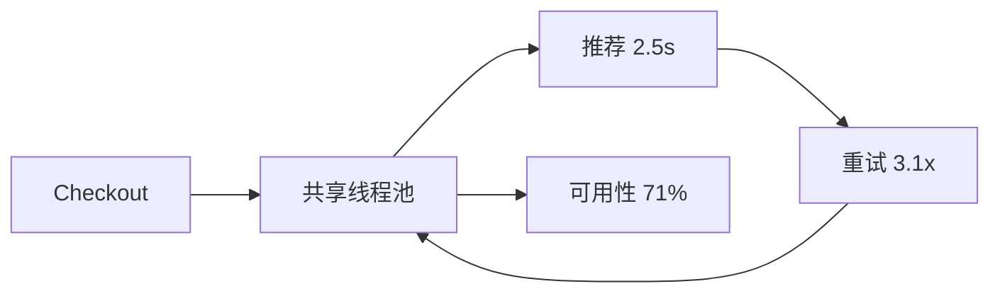

# 案例：下游故障引发级联雪崩
> [!IMPORTANT]
> 教学案例，不对应实际企业。

## 业务现场

工作日上午 10:00，结算页开始间歇性白屏。推荐模块只负责“顺手买一件”，理论上不应影响
下单，但 18 分钟内结算可用性从 99.97% 降到 71%。值班人员发现重启结算实例后只能恢复
约两分钟；支付和订单数据库指标正常，推荐团队刚完成模型服务切换。

## 系统画像与事故前变更

结算服务 60 实例，使用 200 线程的共享请求池，同步调用价格、库存、优惠、推荐四个依赖。
入口超时 3 秒；结算 SDK、Service Mesh 和客户端各有一次重试。推荐切换后 P99 从 80 ms
升到 2.5 s，但健康检查仍返回成功，熔断规则只按错误率、不按慢调用触发。

> [!NOTE]
> 先判断：为什么重启只能短暂恢复？推荐没有报错为何仍应被熔断？
## 场景数据
推荐依赖 80ms→2.5s；重试放大 3.1×；共享线程池耗尽；结算可用性降至 71%。
## 面试版事故回答
非核心推荐变慢占满共享线程池，多层重试把故障传播到结算。先熔断推荐、关闭外层重试并
隔离线程池；长期采用端到端 deadline、bulkhead、重试预算、降级和错误预算演练。
## 架构与故障传播

## 时间线
10:00 推荐变慢；10:03 线程池满；10:05 结算告警；10:07 熔断；10:15 恢复。
## 从观察到结论
| 证据 | 结论 |
| --- | --- |
| CPU 低、线程满 | 阻塞等待 |
| 调用/请求 3.1 | 重试放大 |
| 熔断后恢复 | 推荐是传播源 |

## 分阶段证据与候选假设

第一轮：CPU 34%、线程 active=200、队列满，排除 CPU 饱和，候选为锁、连接池或远程等待。
第二轮：76% 线程停在推荐 socket read，调用量是入口的 3.1 倍，确认慢调用和叠加重试。
第三轮：推荐降级后结算 90 秒内恢复，证明传播路径；仍需解释共享池、3 秒 deadline 和只按
错误率熔断为何让非核心依赖拖垮核心链路。
## 取证过程
```bash
jcmd "$PID" Thread.print -l
curl localhost:8080/actuator/metrics/http.client.requests
```
## 止血决策
熔断非核心依赖、返回空推荐、关闭重复重试、保护结算专属池。
## 永久修复
入口 800ms deadline 分配到各依赖；独立并发上限；仅幂等调用有限重试；超时任务可取消。
## 方案取舍
| 手段 | 作用 | 风险 |
| --- | --- | --- |
| 超时 | 限等待 | 过短误伤 |
| 熔断 | 快速隔离 | 降级质量下降 |
| Bulkhead | 限传播 | 容量碎片 |
## 验证与回滚
结算可用性 `>99.95%`、调用放大 `<1.1`、队列 P99 `<20ms`；慢依赖演练 30 分钟。
## 复盘与防复发
依赖拓扑、deadline lint、重试预算、共享池禁用和季度故障演练。
## 对应题库

这个案例可以反向支撑下面这些题库问题：

- 架构模块6：稳定性与高可用
- 级联故障如何治理？
- 超时、重试、熔断、隔离如何组合？


## 面试官追问与评分

### 追问一：现场只能先做一个动作，调超时还是熔断推荐？

**参考回答：**先熔断推荐并返回无推荐结果，因为它是非核心依赖，切断传播路径能立即释放
结算线程。随后关闭叠加重试，并把推荐超时限制在入口剩余 deadline 内。单独缩短超时仍会
产生大量失败调用；单独熔断但保留多层重试，也可能在半开阶段再次放大流量。

### 追问二：为什么不能直接把线程池从 200 调到 1,000？

**参考回答：**线程池扩大只会允许更多请求同时阻塞，连接池、推荐服务和网络容量没有增加，
可能把 3.1 倍调用放大成更大的下游压力。应先用 Little's Law 估算在途量，再按下游安全
并发设置 bulkhead 和小队列。扩线程只能作为已有容量但线程配置偏小的修正，不能治疗慢依赖。

### 追问三：换成虚拟线程能否解决雪崩？

**参考回答：**虚拟线程降低阻塞线程的内存和调度成本，但不会创造连接、CPU、带宽或下游
吞吐，也不会自动提供 deadline、取消和隔离。可以用虚拟线程简化阻塞 IO 编程，但仍要用
Semaphore/连接池限制每个依赖并发，并保留熔断、重试预算和超时传播。

### 追问四：推荐恢复后为什么不能立即关闭熔断器？

**参考回答：**积压请求、客户端重试和缓存冷启动会形成恢复洪峰。应进入半开状态，只允许
少量探测请求；按成功率、P99 和下游 CPU 逐级放量，同时限制并发并预热缓存。若指标再次
越线，自动回到打开状态，而不是依靠人工观察。

### 追问五：如何证明改造真正阻止了级联故障？

**参考回答：**在压测环境注入推荐 2.5 秒延迟、部分超时和连接拒绝，验证结算可用性仍高于
99.95%、调用放大率低于 1.1、队列 P99 低于 20 ms，且降级结果符合业务预期。还要验证
推荐恢复时的半开放量和单 AZ 故障，避免只证明“正常情况下可用”。

失分信号：只扩线程池；把超时设得更长；每层独立重试；不区分核心与非核心依赖。

| 维度 | 5 分要求 |
| --- | --- |
| 正确性 | 解释慢调用如何形成级联 |
| 证据 | 线程、调用放大和依赖延迟闭环 |
| 取舍 | 超时、熔断、隔离边界清楚 |
| 可运维性 | 半开恢复和故障演练完整 |
| 表达 | 故障传播路径清晰 |

## 复述任务

1. 用 60 秒画出推荐慢调用如何通过共享线程池和多层重试拖垮结算。
2. 解释为什么先熔断非核心依赖，而不是扩容线程池或延长超时。
3. 给出半开恢复的放量步骤、回退条件和三个验收指标。

答不完整时回到[流量保护与级联故障](/deep-dives/distributed-stability/02-traffic-protection)重练。

## 延伸学习
[秒杀事故](./flash-sale-overload) · [订单系统](./high-concurrency-order-system) · [返回](./)
