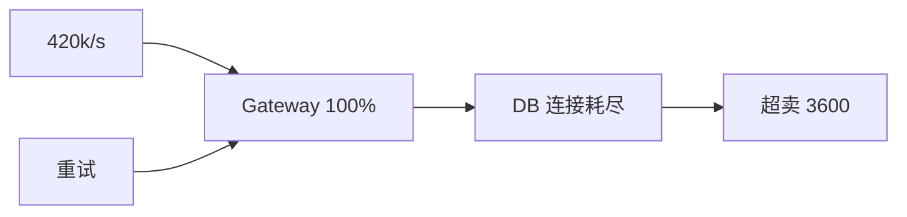

# 案例：秒杀流量击穿系统
> [!IMPORTANT]
> 教学案例，不对应实际企业。

## 业务现场

周六 12:00，平台为一款限量球鞋开放 20,000 件库存。活动页提前两小时预热，预约用户
180 万，运营预计峰值 10 万请求/s。实际开售链接在社交平台扩散，并出现脚本重复提交。
12:01 起用户看到“排队中”后反复刷新；客服同时收到“已付款但订单不存在”和“显示有货
却无法购买”两类投诉。支付链路本身正常，故障集中在活动入口、库存和订单创建。

## 系统画像与事故前变更

- 入口：CDN → Gateway（40 实例）→ 秒杀服务（80 实例）。
- 数据：Redis 保存活动令牌，MySQL 保存库存和订单；订单创建同步调用营销、风控和支付预下单。
- 正常容量：Gateway 压测上限 12 万/s，MySQL 安全写入 2 万/s。
- 当日上午变更：为提升“实时库存感”，前端轮询从 5 秒改为 1 秒；客户端超时后最多重试 2 次。
- 未完成事项：活动令牌预热脚本只执行到 60%，入口租户限流规则未启用。

> [!NOTE]
> 推演时先回答：第一分钟你会看哪五个指标？哪些动作能立即止损，哪些动作可能让超卖更严重？

## 场景数据
| 指标 | 故障值 |
| --- | ---: |
| 流量 | 12 秒内 8,000→420,000/s |
| Gateway CPU | 100% |
| DB 连接 | 2,000/2,000 |
| 超卖 | 3,600 件 |

## 面试版事故回答
入口没有准入控制，库存采用“先查后扣”，失败重试和同步依赖进一步放大流量。先在 CDN、
Gateway、用户和商品四层限流，关闭非核心链路并冻结异常订单；长期用活动令牌、原子库存
预占、排队建单、幂等键和对账。恢复必须先验证库存账，再限速放流。

## 架构与故障传播

## 时间线
12:00 流量突增；12:01 网关满载；12:03 DB 耗尽；12:05 分层限流；12:18 对账并恢复。
## 从观察到结论
| 证据 | 结论 |
| --- | --- |
| 峰值远超容量 | 缺准入控制 |
| 库存出现负数 | 扣减非原子 |
| 调用放大 2.8× | 重试加剧故障 |

## 分阶段证据与候选假设

**第一轮证据：** CDN 回源 42 万/s，Gateway CPU 100%，但支付 CPU 仅 35%。候选是假流量、
入口容量或同步依赖阻塞。此时不能先改库存。

**第二轮证据：** 同一用户平均提交 7.4 次；Gateway 到秒杀服务调用放大 2.8×；营销接口
P99 1.7 秒。应立即关闭客户端和服务端叠加重试，并降级营销。

**第三轮证据：** 3,600 个 SKU 记录出现 `available < 0`；代码是先 SELECT 再 UPDATE，
事务之间没有条件更新。根因由“流量过载”收敛为“准入缺失 + 重试放大 + 非原子扣减”。
## 取证过程
```sql
SELECT sku_id, available, reserved, sold FROM inventory WHERE sku_id=8848 FOR UPDATE;
```
## 止血决策
分层限流、关闭重试、静态排队页、冻结异常订单、保护支付与数据库。
## 永久修复
令牌预热；`UPDATE inventory SET available=available-1 WHERE sku_id=? AND available>0`；请求
幂等；队列削峰；订单、库存、支付定期对账。
## 方案取舍
| 方案 | 收益 | 风险 |
| --- | --- | --- |
| DB 原子扣减 | 正确简单 | 峰值上限低 |
| Redis 预扣 | 高吞吐 | 需补偿对账 |
| 排队 | 平滑流量 | 用户等待 |
## 验证与回滚
入口不超 100k/s、DB `<60%`、超卖 `0`、建单 P99 `<3s`；账不平立即停止放流。
## 复盘与防复发
活动容量评审、令牌预热、重试预算、热点压测和超卖演练。
## 对应题库

这个案例可以反向支撑下面这些题库问题：

- 架构模块1：系统设计与容量规划
- 秒杀系统如何限流削峰？
- 库存扣减如何保证一致性？


## 面试官追问与评分

### 追问一：现在只能做一个动作，你选限流还是回滚？

**参考回答：**如果尚不确定回滚是否改变库存语义，先在入口限流并关闭客户端与服务端叠加
重试，快速保护数据库和库存事实源。回滚需要确认版本、数据兼容和已生成订单的处理方式。
限流不是最终修复，但它可逆、见效快，并为取证与回滚争取时间。

### 追问二：Redis 预扣成功，但订单落库失败怎么办？

**参考回答：**预扣记录必须有 `reserved/confirmed/released` 状态和业务幂等键。建单失败后
由可重放任务重试；超过窗口仍失败才释放库存。释放也必须幂等，并通过库存、订单、支付
三方对账发现遗漏。不能只依赖 TTL，因为进程暂停、消息延迟和已付款状态可能让自动过期误释放。

### 追问三：同一用户使用脚本并发提交 100 次，如何处理？

**参考回答：**入口按用户、设备、IP 和活动维度限流，业务层以“用户+活动+商品”作为幂等
和限购约束，数据库保留唯一约束作为最后防线。验证码或排队令牌用于提高脚本成本，但不能
代替业务幂等；网络重试必须返回同一受理结果。

### 追问四：为什么不能把 2 万库存全部直接放到 Redis？

**参考回答：**可以把令牌放 Redis 承接高并发，但数据库或库存账本仍是最终核对依据。
需要处理缓存丢失、主从切换、重复扣减、订单失败释放和活动结束对账。若商品价值高或超卖
成本极高，可采用更保守的令牌量和分批放量，而不是追求极限吞吐。

### 追问五：如何证明系统不会超卖？

**参考回答：**先定义不变量：`可售+已预占+已确认=活动总库存`，任何状态迁移都使用原子
条件更新和唯一业务键。测试要注入并发、超时、重复消息、Redis 切主和订单库故障；最后
比较库存账、订单账和支付账。仅一次压测没有出现负库存，不足以证明正确性。

失分信号：只说“上 Redis”“加 MQ”；不计算入口与 DB 容量；忽略重复请求；把已付款订单
直接删除；没有恢复顺序和对账。

| 维度 | 5 分要求 |
| --- | --- |
| 正确性 | 识别三条故障链并保护库存不变量 |
| 证据 | 能按轮次缩小假设 |
| 取舍 | 解释限流、排队、预扣的代价 |
| 可运维性 | 有止损、恢复、对账和演练 |
| 表达 | 先影响与约束，再方案 |

## 复述任务

1. 用容量数据说明为什么入口必须先做准入控制。
2. 定义库存不变量，并说明 Redis 预扣、订单失败和重复提交如何收敛。
3. 说明恢复时为什么先对账、再限速放流，以及什么条件下立即回退。

一致性部分参考[分布式一致性选择树](/deep-dives/distributed-stability/01-distributed-consistency)，
流量部分参考[流量保护与级联故障](/deep-dives/distributed-stability/02-traffic-protection)。

## 延伸学习
[级联雪崩](./cascading-failure) · [订单系统](./high-concurrency-order-system) · [返回](./)
