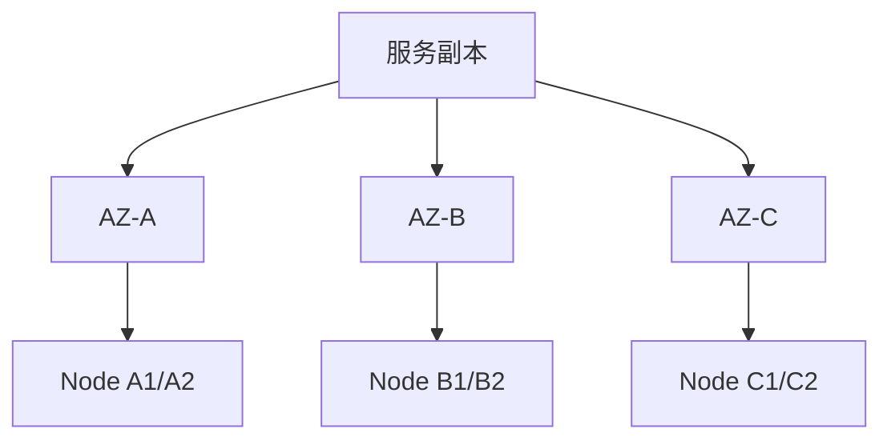

# Kubernetes 可靠性边界

## 90 秒速答

我先明确 Kubernetes 解决的是调度、自愈和声明式交付，不会自动让有状态、依赖和容量设计正确。
服务可靠性要同时设计 startup、readiness、liveness 的不同语义，按压测和历史数据设置 requests，
谨慎设置 CPU/memory limits；通过拓扑分布、反亲和、PDB 和优先级控制节点/AZ 故障；在终止时先
摘流、停止接新请求、等待在途任务并保证消息和副作用可恢复。最后演练节点丢失、单 AZ 故障、
镜像拉取失败、DNS 抖动和控制面异常，并用业务 SLO 验收，而不是只看 Pod 是否 Running。

## 三类探针不能互相替代

| 探针 | 回答的问题 | 失败动作 | 常见误用 |
| --- | --- | --- | --- |
| startup | 应用是否完成首次启动 | 延迟其他探针 | 启动慢就无限放宽 |
| readiness | 当前能否安全接流量 | 从 Service 摘除 | 检查所有非核心依赖导致全摘流 |
| liveness | 进程是否无法自愈 | 重启容器 | 把下游超时当进程死亡，引发重启风暴 |

健康检查必须轻量、有超时并表达业务语义。数据库短暂慢不一定应该重启所有应用；就绪失败也不应
在所有副本同时发生，否则负载会集中到少数 Pod。

## requests、limits 与 QoS

- `requests` 影响调度与 HPA 利用率基准，应来自真实工作集和压测，不是复制模板。
- CPU limit 可能带来 throttling 和尾延迟；内存超 limit 会触发 OOMKill，没有“慢慢降级”。
- limits 总和不等于节点真实可用容量，还要预留 kubelet、DaemonSet、突发和驱逐空间。
- 只提高 limit 而不修复内存泄漏，会把故障延后并扩大单 Pod 影响。

## 故障域设计

副本数 3 不代表高可用；如果调度在同一节点或同一 AZ，仍是单故障域。拓扑约束必须与剩余 AZ
容量、负载均衡收敛、数据副本和依赖部署共同设计。

## 优雅终止的真实顺序

1. Pod 进入 Terminating，应用接收终止信号。
2. readiness 变为失败，等待端点和负载均衡传播。
3. 停止接新任务，等待在途请求、消息和事务到安全点。
4. 超过业务宽限时间后退出；未完成任务依靠幂等和可重放恢复。

仅配置 `terminationGracePeriodSeconds` 不代表优雅终止；应用必须处理信号，调用方也要传播取消。

## 场景推演：发布时全部 Pod 重启

新版 liveness 把数据库 P99 超 500 ms 判为失败。数据库短暂抖动后所有 Pod 同时重启，缓存冷启动
又放大回源。先暂停发布并回滚探针，限制重启爆炸半径；长期将依赖健康放入指标与降级，不放入
liveness，配置启动保护、探针抖动和 PDB，并演练数据库慢而非完全宕机。

## 面试官三级追问

### L1：Pod Running 为什么用户仍然失败？

Running 只表示容器进程存在，应用可能未就绪、线程/连接耗尽、依赖异常或业务错误。需看业务 SLI。

### L2：PDB 能否保证节点故障时副本可用？

PDB 主要约束自愿驱逐，不能阻止节点突然宕机；还需拓扑分布、剩余容量和故障演练。

### L3：HPA 为什么可能在故障时越扩越慢？

指标延迟、冷启动、缓存回源和下游瓶颈会使新 Pod 无法形成有效容量。应结合准入、预留容量、
外部指标和扩容稳定窗口，而不是只追 CPU。

## 25 分自测

| 维度 | 5 分要求 |
| --- | --- |
| 正确性 | 探针、资源、调度和终止语义准确 |
| 深度 | 覆盖 throttling、驱逐、传播和故障域 |
| 取舍 | 利用率、成本、恢复速度与爆炸半径平衡 |
| 表达 | 平台能力边界 → 机制 → 故障 → 验收 |
| 可运维性 | 业务 SLO、演练、回滚和容量预案完整 |

## 复述任务

不看正文回答：数据库变慢为什么不应触发所有 Pod 的 liveness 重启？应该如何止血和改造？

