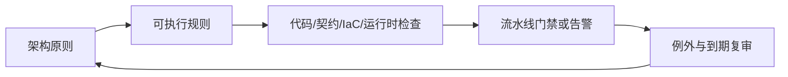

# ADR、技术债与架构守护

## 90 秒速答

架构治理的目标是提高决策质量和演进速度，而不是集中审批。我会把少量稳定原则转成可自动验证的
适应度函数，例如依赖方向、接口兼容、SLO、数据权限和成本门槛；重大选择用 ADR 记录背景、约束、
候选、决定、后果和复审触发条件。技术债按业务影响、发生概率、扩散速度和修复成本形成组合，
与产品路线一起排期。无法立即遵循标准的例外必须有补偿控制、owner 和到期日。治理效果看决策
前置时间、例外老化、同类事故、变更失败率和改造收益，不看评审会议数量。

## ADR 最小结构

```text
标题与状态：Proposed / Accepted / Superseded
背景：业务目标、约束、已知事实
候选：至少说明维持现状
决定：选择及理由
后果：收益、代价、风险、不可逆点
验证：指标、实验、复审触发条件
```

ADR 记录“为什么”，不是复制最终架构图。新证据出现时可被新 ADR 替代，避免把旧决定神圣化。

## 自动化架构守护



能自动检查的规则不要依赖评审者记忆：模块依赖、API breaking change、数据库越权访问、资源上限、
关键服务无 SLO 等都可逐步自动化。门禁要区分阻断和观察，避免噪声让团队整体绕过。

## 技术债组合管理

| 维度 | 问题 |
| --- | --- |
| 业务影响 | 是否拖慢交付、造成收入或合规风险 |
| 发生概率 | 有无事故、变更失败和趋势证据 |
| 扩散速度 | 新功能是否持续复制该模式 |
| 修复成本 | 现在修与半年后修差多少 |
| 可逆性 | 是否会形成数据、协议或供应商锁定 |

优先处理高影响、高概率、快速扩散且可低成本止血的债务。为其设置“利息”指标，如每月故障工时、
变更等待或云成本，而不是维护一个没有决策作用的长列表。

## 推动架构改造

先用业务损失和工程数据形成共同问题，再选择薄切片证明收益；设计双轨运行、兼容、迁移、回滚和
退场条件。设立按领域负责的 owner，平台团队提供工具，架构师负责原则和跨域协调。改造完成标准
必须包含旧路径关闭，否则“双轨临时方案”会变成永久债务。

## 面试官三级追问

### L1：架构评审如何不成为瓶颈？

标准场景走自助黄金路径和自动检查，只把高风险、跨域、不可逆决策升级评审；设置明确 SLA。

### L2：业务不愿还技术债怎么办？

把债务翻译成交付延迟、事故损失、成本和机会影响，提供薄切片与不治理的风险选项，共同决策。

### L3：标准例外越来越多说明什么？

可能是原则不适用、平台能力缺失或治理失效。按类型分析并更新黄金路径，而不是无限延长例外。

## 25 分自测

| 维度 | 5 分要求 |
| --- | --- |
| 正确性 | ADR、原则、规则、例外和技术债边界清楚 |
| 深度 | 覆盖自动守护、复审、迁移与旧路径退场 |
| 取舍 | 一致性、自主性、速度和风险平衡合理 |
| 表达 | 问题 → 决策 → 落地 → 度量 → 演进 |
| 可运维性 | owner、期限、适应度函数和成功指标完整 |

## 复述任务

不看正文回答：一个跨团队中间件替换项目如何避免“架构师宣布、团队被迫执行、旧系统永不下线”？

