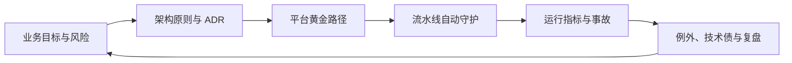

# 云原生与架构治理

云原生不是“把应用放进容器”，架构治理也不是“多开评审会”。这一模块训练如何把故障边界、
发布安全、平台能力和组织决策变成可自动执行、可度量、可回退的工程系统。

## 学习地图

| 专题 | 核心问题 | 面试产出 |
| --- | --- | --- |
| [Kubernetes 可靠性边界](./01-kubernetes-reliability) | 探针、资源、调度和终止如何影响可用性 | 故障域、预算、保护与演练 |
| [渐进式交付与多集群](./02-progressive-delivery) | 如何发布、回滚、容灾而不扩大影响 | 金丝雀门禁、兼容、恢复顺序 |
| [平台工程与黄金路径](./03-platform-engineering) | 平台怎样真正提升研发效率 | 产品化平台、自助能力、采用率 |
| [ADR、技术债与架构守护](./04-architecture-governance) | 如何做决策、管理例外并推动改造 | ADR、适应度函数、债务组合 |

## 完整治理链

## 完成标准

- 能解释容器存活、就绪、启动和业务健康的不同语义。
- 能设计包含数据兼容和自动回滚的渐进式发布。
- 能用交付前置时间、变更失败率和开发者体验衡量平台价值。
- 能通过 ADR、自动化架构测试和到期例外推动治理落地。

