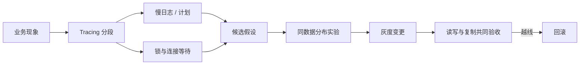

# 数据库问题如何从证据走到低风险变更？

> [!IMPORTANT]
> 文中的阈值是教学假设。真实决策必须结合数据分布、硬件、MySQL 版本、业务 SLO 和变更工具验证。

## 60–90 秒速答 {#quick-answer}

数据库问题先按“现象—证据—假设—实验—变更—验证”推进。接口慢不能直接等同于缺索引，
我会先拆数据库执行时间、连接等待、锁等待和网络时间，再用慢日志、`EXPLAIN ANALYZE`、
实际/估算行数、扫描/返回比和锁等待确认瓶颈。

如果候选修复是新索引，还要评估索引宽度、写放大、磁盘、复制延迟和在线 DDL 风险；如果是
大事务，则重点看 undo、锁持有时间、binlog 体积和从库回放；如果考虑分片，必须证明单机容量
已经成为长期边界，并先回答分片键、跨片查询、扩容和回退。

任何变更都先在影子环境或回放流量验证，再灰度上线。验收不仅看查询变快，还要确认写 TP99、
复制延迟和锁等待没有恶化；指标越线时能停止 DDL、切回旧 SQL/路由或恢复旧读路径。

## 证据链总览 {#evidence-chain}

| 观察 | 可以继续验证 | 不能直接断言 |
| --- | --- | --- |
| DB CPU 90% | 存在数据库侧压力 | 一定缺索引 |
| 扫描 100 万行只返回 20 行 | 访问路径低效 | 新增一个索引必然解决 |
| 锁等待升高 | 有并发冲突或长事务 | 数据库机器不够 |
| 复制延迟 30 秒 | 从库回放跟不上 | 网络一定有问题 |
| 单表 1 亿行 | 需要评估维护和访问成本 | 必须立即分库分表 |

## `EXPLAIN` 如何讲到决策 {#explain}

不要只背 `type`、`key`、`rows`。一条完整回答要把以下证据连起来：

1. 查询的业务访问模式：等值条件、范围、排序、返回列和分页方式。
2. 计划的估算行数和 `EXPLAIN ANALYZE` 实际行数是否偏离。
3. 扫描/返回比、回表次数、临时表、排序和执行时间集中在哪个节点。
4. 候选索引是否同时增加写放大、缓存占用和在线变更风险。
5. 数据分布再次变化后，方案是否仍成立。

微型场景：退款状态从 0.2% 增至 31%，SQL 没变但计划变差。此时先更新统计信息并比较实际
基数，再评估 `(merchant_id, status, created_at, id)`；不能因为旧索引“昨天还能用”就强制
固定计划，也不能不看写入成本就机械做覆盖索引。

## MVCC、日志与锁如何串起来 {#mvcc-logs-locks}

- MVCC 让普通一致性读通过版本链与 Read View 减少读写冲突，但不会消除当前读和写操作的锁。
- undo log 支撑回滚和历史版本；redo log 保证 InnoDB 崩溃恢复；binlog 服务复制与数据变更记录。
- 大事务会同时放大 undo、锁持有、redo/binlog、主从回放和故障恢复时间。
- 间隙锁是否出现要结合隔离级别、访问方式和索引命中，不能只背“可重复读有间隙锁”。

教学场景：一个批量任务单事务更新 50 万行，用时 90 秒。它不仅占用连接，还可能长期持锁、
制造大 binlog、拉长从库回放，并在失败时产生昂贵回滚。低风险路径通常是按稳定主键分页，
每批 500–2,000 行起步验证，记录断点并保证幂等，而不是简单把事务超时调大。

## 主从延迟怎么回答 {#replication-lag}

先区分延迟来源：主库大事务、从库单线程或并行回放能力不足、慢 SQL 抢资源、网络抖动，还是
从库规格不足。读写分离不能默认接受旧数据：登录态、支付结果、刚写后的查询可能需要读主库、
携带一致性令牌，或等待复制位点；列表、报表等可容忍陈旧的数据才适合直接读从库。

验收至少包含复制延迟时间、relay log/位点差距、从库 CPU/IO、回放吞吐和业务数据可见性。
只监控“复制线程还活着”无法证明数据新鲜。

## 什么时候才分库分表 {#sharding}

| 选择 | 先验证的条件 | 主要代价 |
| --- | --- | --- |
| SQL / 索引优化 | 扫描路径仍有明显浪费 | 收益存在上限 |
| 冷热分层 / 归档 | 历史数据很少在线访问 | 查询入口和归档治理 |
| 读写分离 | 读压力为主且允许一定陈旧 | 一致性与复制延迟 |
| 垂直拆分 | 业务边界和变更节奏清楚 | 跨域查询与事务 |
| 水平分片 | 单机写入、容量或维护窗口成为长期瓶颈 | 跨片、迁移、扩容与路由复杂度 |

### 分片键 {#shard-key}

分片键要从访问模式反推：高频查询是否单片、写入是否均匀、热点租户如何处理、数据是否需要
一起迁移。按 `user_id` 方便用户订单查询，却让商户对账成为跨片；按 `merchant_id` 则相反。
没有完美分片键，必须明确牺牲哪类查询，并为它提供汇聚索引、异步报表或二级路由。

### 不停机迁移 {#migration}

安全路径通常是：快照回填 → CDC 追增量 → 数量/金额/校验和对比 → 影子读 → 小流量切换 →
保留旧库只读回退。双写不是一句话方案：要定义写入顺序、部分成功、重试幂等和以谁为准。
若校验差异、写 TP99、复制延迟或错误率越线，应切回旧路由，而不是继续放量“观察”。

## 指标与动作 {#metrics}

| 指标 | 教学信号 | 对应动作 |
| --- | --- | --- |
| 扫描/返回比 | 持续高于 1,000:1 | 检查计划、过滤与索引，不直接扩容 |
| 锁等待 TP99 | 超过接口预算的 20% | 查长事务、锁顺序和热点行 |
| 复制延迟 | 超过业务可见性承诺 | 一致性读切主、限制大事务并查回放瓶颈 |
| 写 TP99 | 新索引后明显恶化 | 暂停放量，评估索引宽度和冗余 |
| 迁移校验差异 | 非零且无法解释 | 停止切流，保留旧事实源并修复 |

## 面试官追问 {#follow-ups}

1. `EXPLAIN` 显示用了索引，为什么仍可能很慢？
2. 覆盖索引能减少回表，为什么不把所有返回列都加进去？
3. 大事务拆批后，如何保证失败重试不会重复更新？
4. 写后立刻读必须看到新值，读写分离怎么处理？
5. 分片迁移期间新旧库都写成功，但数据内容不同，以谁为准？

优秀回答应明确事实源、版本号或幂等键、校验方式、越线指标和回退路径，而不是只给工具名。

## 25 分自评

| 维度 | 5 分要求 |
| --- | --- |
| 正确性 | 说清计划、MVCC、日志、锁和复制的职责边界 |
| 深度 | 能从业务现象构造完整证据链 |
| 取舍 | 索引、归档、读写分离和分片有触发条件 |
| 表达 | 先结论，再证据、方案和验证 |
| 可运维性 | 有灰度、校验、回滚和防复发 |

## 配套案例

[慢 SQL 超时](../cases/database/slow-sql-timeout) ·
[死锁与锁等待](../cases/database/deadlock-and-lock-wait) ·
[高并发订单存储](../cases/database/high-concurrency-order-storage)

[返回数据与消息可靠性](./)
