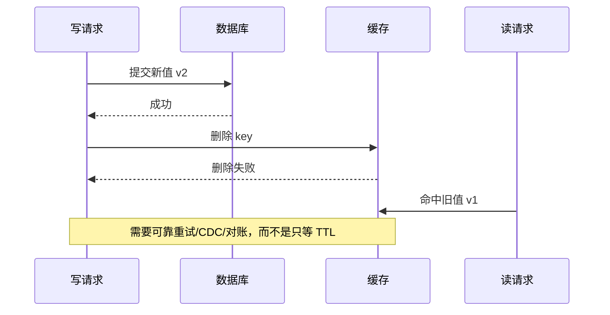

# 缓存一致性、热点与故障回源如何一起设计？

> [!IMPORTANT]
> 缓存是数据副本，不是事实源。所有方案都必须回答：错了多久能发现、如何修复、缓存失效时事实源能否承受回源。

## 60–90 秒速答 {#quick-answer}

缓存设计先给数据分级：哪些允许秒级陈旧，哪些必须读到最新，数据库或其他系统谁是事实源。
常见旁路缓存写路径是先提交数据库，再删除缓存；删除失败要通过事务消息、Outbox/CDC 或补偿
任务重试，TTL 只是最终收敛保险，不是主要一致性机制。

热点治理和一致性必须一起做。单热点 Key 失效时，我会用逻辑过期、请求合并或互斥重建限制
回源并发；极热点读取可以增加进程内短 TTL 缓存，但要接受更大的不一致窗口。大 Key 则要按
序列化大小、网络耗时、删除阻塞和集群迁移成本拆分，不能只按元素数量判断。

最后推演 Redis 超时或全站缓存失效：入口限流、核心/非核心隔离、陈旧值兜底和数据库保护必须
提前存在。验收看命中率、回源 QPS、热点倾斜、数据陈旧时间和数据库 TP99；出现回源放大或
数据库越线时，应扩大降级而不是继续重试 Redis。

## 先定义一致性契约 {#consistency-contract}

| 数据类型 | 示例 | 建议契约 |
| --- | --- | --- |
| 强业务事实 | 余额、库存扣减结果 | 关键决策读事实源，不依赖可能陈旧缓存 |
| 读多写少配置 | 商品详情、规则 | 允许短暂陈旧，变更后主动失效 |
| 可降级内容 | 推荐、榜单 | 可返回旧值或空结果 |
| 负向结果 | 用户不存在、权限拒绝 | 短 TTL，防止错误长期缓存 |

“最终一致”不是完整答案，至少要给出最大陈旧时间、删除失败重试、异常检测和人工/自动修复。

## 旁路缓存的关键竞态 {#cache-aside}



先删缓存再写数据库，可能在数据库提交前被并发读重新写入旧值；先写数据库再删缓存通常窗口
更容易控制，但删除失败仍需可靠补偿。延迟双删只能降低特定竞态概率，延迟时间无法覆盖所有
慢请求和复制延迟，也不能替代可观测的失效重试。

更稳的生产链路是：数据库事务提交后记录 Outbox，异步发布失效事件，消费者按业务版本幂等
删除；定时对账抽样比较事实源和缓存。是否值得引入这套复杂度，要由数据价值和可接受陈旧时间决定。

## 击穿与雪崩 {#breakdown-avalanche}

教学场景：商品接口峰值 60,000 QPS，其中一个爆款 Key 占 35,000 QPS，数据库只能承受
3,000 QPS。该 Key 到期后即使只有 10% 请求穿透，也会产生 3,500 QPS 回源，数据库已经越线。

候选措施：

- 逻辑过期：先返回旧值，后台单线程刷新，适合允许短暂陈旧的数据。
- 请求合并：同一 Key 只有一个重建者，其他请求等待或返回旧值。
- TTL 抖动：避免大量 Key 同时失效，但不能解决单个极热点。
- 本地缓存：把热点吸收到进程，但放大副本和失效复杂度。
- 入口限流与降级：缓存和数据库都异常时保护事实源。

互斥重建也有风险：锁持有者超时、重建失败和等待线程堆积。必须有锁超时、旧值兜底和失败后
的有限重试，不能把缓存击穿转换成线程池击穿。

## 热 Key 与大 Key {#hot-big-key}

热和大是两个维度：

| 问题 | 主要信号 | 常见治理 |
| --- | --- | --- |
| 热 Key | 单 Key QPS、单分片 CPU/带宽倾斜 | 本地缓存、请求合并、读副本、Key 拆分 |
| 大 Key | 序列化字节数、单命令耗时、迁移/删除阻塞 | 按业务边界拆分、分页读取、异步删除 |

一个 2 MiB、每秒读取 5,000 次的 Key 同时是热 Key 和大 Key，理论出网就接近 10 GiB/s，
单纯扩容节点无法解决单 Key 集中的网络与序列化成本。应先减少单次载荷，再减少读取次数。

## Redis 故障时的保护顺序 {#redis-failure}

```text
限制入口流量
→ 保核心、停非核心
→ 可接受时返回旧值/本地快照
→ 限制数据库回源并发
→ Redis 恢复后分批预热
```

不要在 Redis 超时后立即对每个请求重试并回源数据库。缓存故障时，重试会增加 Redis 压力，
无限回源会把局部故障扩散到事实源。恢复阶段也不能瞬间放开全部流量，应按热点清单预热并
逐步提升回源预算。

## 方案取舍 {#trade-offs}

| 方案 | 一致性 | 可用性 | 复杂度 |
| --- | --- | --- | --- |
| TTL 自然过期 | 陈旧窗口不可控 | 高 | 低 |
| 写库后删缓存 + 重试 | 常见业务足够 | 较高 | 中 |
| Outbox/CDC 驱动失效 | 可审计、可重放 | 高 | 较高 |
| 写穿缓存 | 写路径统一 | 缓存故障影响写 | 中高 |
| 关键读绕过缓存 | 最新 | 事实源压力增加 | 低 |

不存在一套全局方案。余额确认和商品详情不应使用同一一致性契约。

## 指标、阈值与动作 {#metrics}

| 指标 | 教学信号 | 动作 |
| --- | --- | --- |
| 命中率 | 5 分钟内从 95% 降到 70% | 查失效批次和热点，先限制回源 |
| 回源 QPS | 超过数据库安全水位 70% | 非核心降级、扩大旧值兜底 |
| Top Key 占比 | 单 Key 超过节点流量 20% | 本地吸收、请求合并或拆 Key |
| 失效事件积压 | 最大陈旧时间可能越约定 | 提升消费者并告警业务风险 |
| 缓存/事实源差异 | 出现无法解释的强业务差异 | 绕过缓存并执行修复 |

## 面试官追问 {#follow-ups}

1. 为什么常见做法是先更新数据库再删缓存，而不是更新缓存？
2. 删除缓存失败后，如何证明重试最终成功？
3. 逻辑过期返回旧值，哪些业务绝对不能使用？
4. 热 Key 拆成多个副本后，失效如何避免漏删？
5. Redis 全部不可用时，为什么不能直接让请求全部回数据库？

## 25 分自评

| 维度 | 5 分要求 |
| --- | --- |
| 正确性 | 区分事实源、缓存副本和一致性窗口 |
| 深度 | 能解释竞态、击穿和故障传播 |
| 取舍 | 能按数据等级选择失效与兜底方案 |
| 表达 | 先契约，再写读链路、故障和验证 |
| 可运维性 | 有回源水位、差异检测、预热和回滚 |

## 复述任务

不看正文回答：一个热 Key 失效后同时出现回源洪峰和旧值投诉，你如何区分击穿与一致性问题，
按什么顺序止血，并用哪些指标确认恢复？

## 配套案例

[缓存击穿与不一致](../cases/redis/cache-breakdown-and-inconsistency) ·
[热 Key 过载](../cases/redis/hot-key-overload) ·
[高可用缓存](../cases/redis/highly-available-cache)

[返回数据与消息可靠性](./)
