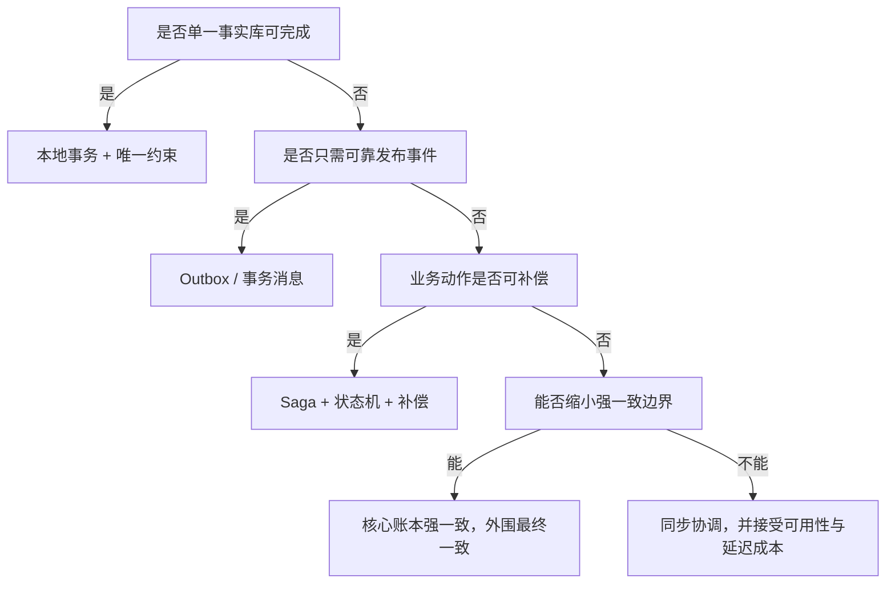

# 分布式一致性选择树

## 90 秒速答

我不会先问用 Seata、MQ 还是 TCC，而会先定义业务不变量和允许的不一致窗口。单库内优先本地
事务；本地写成功后必须可靠触发下游，优先 Outbox 或事务消息；跨服务长流程且允许补偿，
采用 Saga；只有余额扣减等无法接受中间状态、参与方少且延迟可控的链路，才评估同步强一致。
无论选哪种最终一致方案，都必须有幂等、状态机、重试边界、补偿、对账和人工修复入口。

## 先定义约束，而不是先选组件

| 约束 | 必须回答的问题 | 示例 |
| --- | --- | --- |
| 不变量 | 永远不能被破坏什么 | 同一笔钱不能扣两次 |
| 一致性窗口 | 多久内收敛可接受 | 订单后 30 秒内发积分 |
| 可见性 | 中间态能否让用户看到 | 支付中、退款中 |
| 可补偿性 | 副作用能否撤销 | 发券可撤，已发货难撤 |
| 吞吐与延迟 | 协调成本能否承受 | 峰值 5 万单/秒 |
| 失败责任 | 谁发现、谁重试、谁兜底 | 工作流服务 + 对账任务 |

## 选择树



## 方案对比

| 方案 | 适用边界 | 优点 | 主要风险 |
| --- | --- | --- | --- |
| 本地事务 | 同一数据库 | 简单、原子 | 无法覆盖外部副作用 |
| Outbox | DB 变化后发事件 | 数据与事件同事务 | 投递延迟、表膨胀、重复消费 |
| 事务消息 | Broker 支持回查 | 发送闭环较完整 | 绑定中间件、回查复杂 |
| Saga | 多步骤且可补偿 | 长事务不锁资源 | 补偿不是物理回滚 |
| TCC | 强业务控制、短链路 | 资源预留明确 | 侵入大、空回滚与悬挂 |
| 2PC/XA | 少量强一致参与方 | 原子语义强 | 协调阻塞、可用性和吞吐代价 |

## 核心机制：状态机而不是一串 if

以退款为例，状态只能单向推进：

```text
REQUESTED -> PROCESSING -> SUCCEEDED
                    \----> RETRYING -> MANUAL_REVIEW
```

每次命令携带 `businessKey` 和期望版本，只允许合法状态迁移。重复消息返回已有结果；未知结果
进入查询或对账，不能把超时直接当失败。补偿也必须有业务语义，例如“创建反向流水”，而不是
删除原流水来伪装没有发生。

## 场景推演：支付成功但订单仍待支付

已观察到：支付平台成功率 99.99%，订单消费者出现 12 分钟积压，用户重复点击 4 次。

1. **先保护不变量**：支付流水号建立唯一约束，重复通知不能重复记账。
2. **再确认事实源**：以支付平台流水为资金事实，以订单状态为业务投影。
3. **止血**：扩大消费者安全容量，暂停非核心事件，主动查询高价值订单。
4. **恢复**：按事件 ID 重放，校验状态机版本，逐批放量。
5. **长期修复**：Outbox/事务消息、积压告警、支付—订单日内对账和人工修复台。

## 指标必须绑定动作

| 指标 | 示例阈值 | 触发动作 |
| --- | ---: | --- |
| 一致性延迟 P99 | > 30 秒 | 扩消费、暂停低优先级消息 |
| 对账差异率 | > 0.01% | 停止自动结算，进入核对 |
| 补偿失败率 | > 1% | 熔断新流程，升级人工处理 |
| 幂等冲突率 | 基线 3 倍 | 排查调用方重试风暴 |
| 人工挂起量 | 超过班次容量 | 降低入口受理或扩值守 |

阈值是教学示例；生产阈值应来自业务损失、历史基线和人工处理能力。

## 面试官三级追问

### L1：最终一致是不是允许数据错？

不是。它允许在明确窗口内存在中间状态，但要求状态最终收敛，并且有检测、重试、补偿、对账
和人工兜底。没有收敛闭环的“最终一致”只是把错误延后发现。

### L2：为什么 MQ 的 exactly-once 不能替代业务幂等？

Broker 的语义无法覆盖数据库提交后确认丢失、消费者进程崩溃、外部接口副作用等边界。业务
必须用业务键、唯一约束和状态机保证同一意图只生效一次。

### L3：补偿执行失败怎么办？

补偿本身也按可重试命令设计：持久化意图、幂等执行、指数退避、最大自动重试次数、进入人工
队列，并持续对账。若补偿能力接近饱和，应暂停新请求，不能无限制造待修复债务。

## 25 分自测

| 维度 | 5 分要求 |
| --- | --- |
| 正确性 | 从业务不变量和事实源出发 |
| 深度 | 解释未知结果、幂等、状态机和补偿边界 |
| 取舍 | 能比较 Outbox、事务消息、Saga 与强一致 |
| 表达 | 约束 → 方案 → 风险 → 恢复结构清晰 |
| 可运维性 | 有对账、指标、人工入口和演练 |

## 复述任务

不看正文回答：支付成功但订单未更新时，你如何判断事实源、如何止血、如何恢复，以及怎样证明
不会重复记账？控制在 90 秒内，并至少说出两个量化指标。

