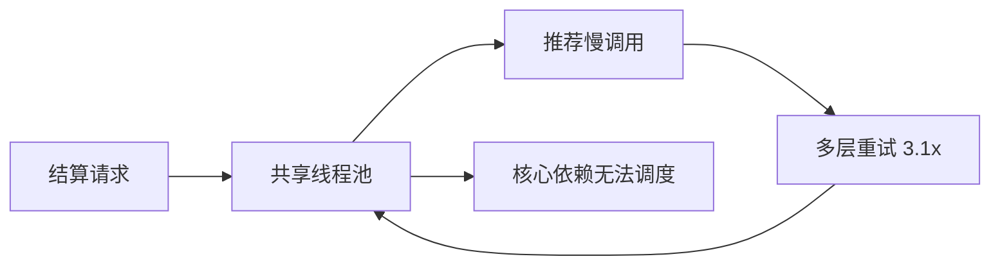

# 流量保护与级联故障

## 90 秒速答

级联故障的本质是压力或等待跨越了系统边界。治理时先按核心性划分调用链，再从入口设置准入
上限，把总 deadline 分配到各依赖；重试只给幂等、短暂错误，并受重试预算限制；慢依赖用
熔断快速失败，资源用线程池、连接池或并发信号量隔离，非核心能力返回预先设计的降级结果。
恢复时必须半开探测和阶梯放量，避免积压、重试和缓存冷启动形成第二次洪峰。

## 六道防线各自解决什么

| 手段 | 控制对象 | 关键问题 | 常见误用 |
| --- | --- | --- | --- |
| 限流 | 到达率 | 系统最多接多少请求 | 只按机器 QPS，不按租户/业务 |
| 超时/deadline | 等待时间 | 最晚何时放弃 | 每一层都设相同超时 |
| 重试 | 瞬态失败 | 多花多少资源换成功率 | 每层各重试一次 |
| 熔断 | 失败依赖 | 何时停止无效调用 | 只看错误率，不看慢调用 |
| 隔离 | 并发资源 | 哪类故障能占多少资源 | 所有依赖共享线程池 |
| 降级 | 业务结果 | 失败时交付什么 | 临时写空值，没有业务语义 |

## 端到端预算

若入口 SLO 要求 P99 小于 800 ms，不能给四个串行依赖各 800 ms。一个示意预算是：

```text
入口 800ms = 网关 40 + 服务排队 60 + 核心依赖 420 + 非核心依赖 120 + 返回与安全余量 160
```

deadline 应沿调用链传播；下游拿到的是“剩余时间”，不是重新获得完整超时。超时之后还要能
取消任务，避免客户端已经放弃，服务端仍继续消耗数据库连接。

## 重试放大怎么算

三层各重试 2 次，最坏调用次数不是 6，而是 `3 × 3 × 3 = 27`。更合理的是端到端重试预算：

- 整条链的额外请求不超过正常流量的 10%。
- 只由最了解业务语义的一层重试。
- 指数退避加随机抖动，避免同时醒来。
- 参数错误、限流、明确拒绝不重试；未知结果先查询。

## 场景推演：推荐变慢拖垮结算

入口 4,000 QPS，推荐 P99 从 80 ms 升到 2.5 秒；200 个共享线程全部 active，CPU 仅 35%，
调用放大率 3.1，结算可用性降至 71%。



**止血顺序：**熔断非核心推荐并返回空推荐 → 关闭叠加重试 → 保护结算专属并发 → 必要时入口
限流。不能先扩线程到 1,000，因为下游吞吐和连接没有增加，只会允许更多请求同时阻塞。

**长期修复：**端到端 deadline、依赖级 bulkhead、慢调用熔断、可取消请求、降级契约、重试
预算和故障注入测试。

## 阈值不是拍脑袋

- 限流上限来自压测安全容量，并保留故障冗余，不来自机器数乘经验 QPS。
- 并发上限可用 `并发量 ≈ 到达率 × 平均响应时间` 估算，再用连接池和下游容量校验。
- 熔断同时观察最小请求数、失败率、慢调用率和统计窗口，避免小样本抖动。
- 队列只吸收短暂波动；持续过载时，长队列会把故障变成高延迟和超时风暴。

## 恢复比熔断更容易被忽略

依赖恢复后先进入半开，只放少量探测；确认成功率、P99 和资源水位稳定，再按 1% → 5% →
20% → 50% 阶梯放量。任何一步越线就回到打开状态。同时控制积压重放速度并预热缓存。

## 面试官三级追问

### L1：限流应该返回 429 还是排队？

短交互且用户可重试的请求通常快速拒绝；有明确受理语义、可异步完成的任务可以排队。选择取决
于等待上限、队列容量和用户承诺，不能让无界排队伪装成高成功率。

### L2：虚拟线程能解决线程池耗尽吗？

它降低阻塞线程的成本，但不会增加数据库连接、下游吞吐或网络容量。仍需用信号量和连接池
限制依赖并发，并保留 deadline、取消、熔断和降级。

### L3：如何证明不会再发生级联故障？

注入 2.5 秒延迟、部分超时、连接拒绝和单 AZ 故障，验证核心可用性、调用放大率、队列时延、
降级正确性及半开恢复。只验证正常流量下 P99 不算稳定性验收。

## 25 分自测

| 维度 | 5 分要求 |
| --- | --- |
| 正确性 | 能解释压力和等待的传播链 |
| 深度 | deadline、重试预算、并发隔离完整 |
| 取舍 | 能说明拒绝、排队、降级和扩容的代价 |
| 表达 | 止血、修复、恢复顺序清楚 |
| 可运维性 | 阈值有来源，演练有验收指标 |

## 复述任务

不看正文回答：CPU 不高但线程池已满时，为什么扩线程可能更危险？你会按什么顺序止血，并用
哪些指标判断可以恢复流量？

