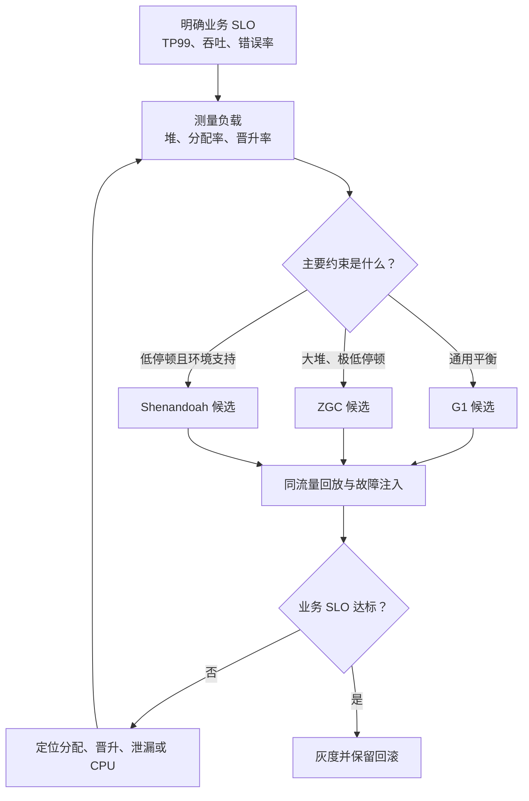

# GC 如何选型并建立调优基线？

> **适用岗位**：高级 Java 后端 / 架构师　 **难度**：进阶　 **建议回答**：90 秒

## 60–90 秒速答

GC 选型不能从“哪个收集器最好”开始，而要先定义目标：堆多大、对象分配和晋升多快、
TP99 允许多少停顿、CPU 预算多少、使用哪个 JDK。一般来说，G1 适合多数中等到较大堆、
兼顾吞吐和停顿的服务；ZGC 和 Shenandoah 更偏向大堆、低停顿，但会消耗更多并发 CPU，
也要求团队验证 JDK 和运行环境支持。

我的做法是先用真实流量建立基线，包括业务 TP99、GC pause p99、分配率、晋升率、
Full GC 次数和 GC CPU；再选择候选收集器做同流量回放。调优时一次只改一个变量，观察
业务指标而不是只看 GC 日志，效果不达标就回滚。如果老年代回收后持续上涨，先查泄漏，
因为换收集器或加堆只能延后故障。

## 面试官评分点

- 先讲 SLO、负载和约束，而不是背收集器特点。
- 区分暂停时间、吞吐量和 CPU 三类目标。
- 知道 `MaxGCPauseMillis` 是软目标，不是 SLA。
- 有“基线—压测—单变量—回滚”的验证闭环。

## 一句话记忆

**先量业务目标，再选收集器；先排泄漏，再调参数。**

## 常见失分

- “低延迟一律 ZGC”，不提 CPU、JDK、堆和团队能力。
- 只比较平均停顿，不看 TP99、分配率和晋升率。
- 一上来调整十几个参数，无法证明哪个变化有效。

## 原理与边界



三个收集器都不是“免调优”：

- **G1** 把堆拆成 Region，按收益优先回收，适合常见服务端负载；极端低停顿目标下，
  Mixed GC 来不及可能触发 Full GC。
- **ZGC** 通过并发标记、转移和染色指针降低停顿；停顿小不代表没有并发回收 CPU 和
  内存开销。
- **Shenandoah** 同样强调并发转移，选择时要确认发行版、JDK 版本和团队运维经验。

收集器解决的是“如何回收”，不能修复“对象为什么一直存活”。

## 工程落地

JDK 17/21 可先打开统一日志，不要在没有证据时堆参数：

```bash
java \
  -Xms8g -Xmx8g \
  -XX:+UseG1GC \
  -Xlog:gc*,safepoint:file=/var/log/app/gc.log:time,uptime,level,tags:filecount=10,filesize=100m \
  -jar app.jar
```

验证顺序：

1. 固定应用版本、容器配额、数据集和流量模型。
2. 记录 30–60 分钟稳定期基线和一次峰值回放。
3. 只替换收集器或只调整一个关键参数。
4. 同时比较业务 TP99、错误率、吞吐和 GC 指标。
5. 先小流量灰度；回滚条件写入变更单。

`-XX:MaxGCPauseMillis=200` 表示 G1 会努力围绕目标规划回收工作，但它不能保证每次停顿
低于 200 ms。目标过紧还可能增加 GC 频率和并发开销。

## 方案对比

| 方案 | 适用场景 | 收益 | 代价 | 风险 |
| --- | --- | --- | --- | --- |
| G1 | 中大堆、延迟与吞吐均衡 | 成熟、默认参数可用性高 | 仍有 STW 与调度开销 | 晋升过快时 Mixed GC 跟不上 |
| ZGC | 大堆、低停顿敏感 | 停顿通常与堆大小弱相关 | 并发 CPU 和额外内存 | 只看停顿会掩盖吞吐下降 |
| Shenandoah | 环境支持的低停顿服务 | 并发转移、低停顿 | 需要验证发行版和运维工具 | 团队经验不足导致误判 |
| 继续 G1 调参 | 已接近目标且瓶颈明确 | 改动小、回滚快 | 收益有上限 | 用参数掩盖泄漏或设计问题 |

## 指标与验证

| 指标 | 定义/算法 | 来源 | 示例基线 | 决策 |
| --- | --- | --- | --- | --- |
| GC pause p99 | GC 停顿时长的 99 分位 | GC log/JFR | `< 200 ms` | 超标时关联收集阶段和对象晋升 |
| 分配率 | 单位时间新分配字节 | JFR/监控代理 | `< 1.2 GiB/s` | 突升时查序列化、临时集合 |
| 晋升率 | 单位时间进入老年代字节 | GC log/JFR | `< 80 MiB/s` | 持续升高时查生命周期设计 |
| GC CPU | GC 线程 CPU / 总 CPU | JFR/容器指标 | `< 15%` | 低停顿但 CPU 超标时重评选型 |
| Full GC | 单位时间 Full GC 次数 | GC log | 稳定期 `0/h` | 非预期出现立即查晋升和泄漏 |

这些数字仅为教学示例。必须按机器配额、堆大小、对象模型和 SLO 校准，不能当作通用标准。

## 三级追问

1. **原理追问**：`MaxGCPauseMillis` 为什么不能保证最大停顿？  
   回答要点：软目标、预测模型、回收集合、分配和晋升可能超出规划。
2. **工程追问**：换 ZGC 后停顿下降但 CPU 增加 20%，你怎么决策？  
   回答要点：回到业务 TP99/吞吐与成本预算，做峰值回放和容量冗余评估。
3. **架构追问**：老年代回收后占用持续上涨，调哪个参数？  
   回答要点：先停止盲调，抓趋势、直方图、dump 和引用链，确认泄漏或高 live set。

## 自测与评分

请回答：“一个 12 GiB 堆、TP99 目标 300 ms、CPU 水位 55% 的服务如何做 GC 选型？”

| 维度 | 5 分锚点 |
| --- | --- |
| 正确性 | 能准确区分 G1、ZGC、Shenandoah 的目标与边界 |
| 深度 | 能解释分配、晋升、并发回收和 Full GC |
| 权衡推理 | 能平衡暂停、吞吐、CPU、JDK 和运维能力 |
| 表达结构 | 按目标—候选—验证—回滚组织 |
| 可运维性 | 给出指标口径、压测、灰度和回滚线 |

总分 25：`22–25` 可用于面试，`17–21` 需补权衡，`≤16` 建议重画决策图后重答。

[返回模块](./) · [Full GC 教学案例](./case-full-gc-latency) ·
[原 JVM 题库](/fundamentals/基础模块2-JVM基础-标准答案库)
