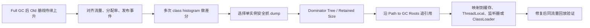

# 内存泄漏如何定位到对象引用链？

> **适用岗位**：高级 Java 后端 / 架构师　 **难度**：进阶　 **建议回答**：90 秒

## 60–90 秒速答

我不会看到 OOM 就直接抓 dump，而是先判断是不是泄漏：重点看 Full GC 后老年代基线是否
持续上升，同时结合流量、分配率和 Full GC 频率排除正常高 live set 或瞬时分配洪峰。
趋势成立后，用多次 class histogram 看哪些类持续增长，再在安全条件下抓 heap dump，
通过 dominator tree、retained size 和 GC Roots 找到“谁让对象活着”。

定位到引用链后，还要映射回业务所有者，比如无界缓存、ThreadLocal、监听器、类加载器或
未释放资源。止血可以限流、重启异常实例或暂时限制缓存，但必须保留证据。修复后用相同
流量回放，验证 Full GC 后老年代不再爬升、对象数量趋稳且 TP99 恢复。单纯加堆通常只会
把 OOM 推迟。

## 面试官评分点

- 先区分泄漏、高 live set、分配洪峰和堆太小。
- 会从时间序列缩小到类，再缩小到对象引用链。
- 知道 dump 有停顿、磁盘、隐私和上传风险。
- 修复后验证的是“回收后基线”，不是只看 OOM 消失。

## 一句话记忆

**Histogram 告诉你谁在长，GC Roots 告诉你为什么不死。**

## 常见失分

- “MAT 看大对象”就结束，没有说明 retained size 和引用链。
- 在所有实例同时抓 dump，造成磁盘或停顿二次事故。
- 把堆占用高等同于内存泄漏。

## 原理与边界



四种现象很像，但证据不同：

- **泄漏**：不可达预期对象被错误引用，回收后基线随时间增长。
- **高 live set**：对象确实仍被业务需要，基线高但可能稳定。
- **分配洪峰**：短时间创建大量临时对象，分配率高但回收后下降。
- **堆不足**：合理 live set 已接近堆上限，需要减对象或重新容量规划。

## 工程落地

先在同一实例上间隔采样，确认增长类：

```bash
jcmd <pid> GC.class_histogram > /tmp/histo-1.txt
sleep 300
jcmd <pid> GC.class_histogram > /tmp/histo-2.txt

# dump 可能触发停顿并占用接近堆大小的磁盘，只在单实例、容量允许时执行
jcmd <pid> GC.heap_dump filename=/data/dumps/app-$(date +%s).hprof

# 也可先录制低开销 JFR，观察分配热点
jcmd <pid> JFR.start name=leak settings=profile duration=10m filename=/data/dumps/leak.jfr
```

典型错误是在线程池线程上设置 ThreadLocal 却不清理：

```java
private static final ThreadLocal<byte[]> BUFFER = new ThreadLocal<>();

void handle() {
    BUFFER.set(new byte[4 * 1024 * 1024]);
    try {
        process();
    } finally {
        BUFFER.remove(); // 线程复用前释放 value
    }
}
```

Dump 中不要只按 shallow size 排序。一个很小的 `Map` 可能通过引用链保留数 GiB 对象，
retained size 才能展示“删除它后理论上可释放多少”。

## 方案对比

| 方法 | 适用场景 | 收益 | 代价 | 风险 |
| --- | --- | --- | --- | --- |
| 指标趋势 | 首轮判断 | 连续、低开销 | 只能定位到区域/趋势 | 把流量增长误判为泄漏 |
| Class histogram | 查持续增长类 | 快、可多次差分 | 缺少完整引用关系 | 单次快照容易误导 |
| Heap dump + MAT | 找 retained size 与 GC Roots | 证据最完整 | 停顿、磁盘、分析成本 | 大堆抓取引发二次事故 |
| JFR 分配分析 | 查分配热点和调用栈 | 可关联代码路径 | 不等于存活对象分析 | 把“分配多”误判为“泄漏” |

## 指标与验证

| 指标 | 定义/算法 | 来源 | 示例基线 | 决策 |
| --- | --- | --- | --- | --- |
| After-GC Old 斜率 | 每次 Major/Full GC 后 Old 占用对时间的回归斜率 | GC log | 稳定流量下接近 0 | 持续为正则进入对象差分 |
| 类实例增长 | 两次 histogram 的实例数/字节差 | `jcmd` | Top 类不持续单调增长 | 聚焦异常类及其业务所有者 |
| Retained size | 对象被回收后可连带释放的总大小 | MAT/分析器 | 无单对象异常支配堆 | 大支配对象沿 GC Roots 追踪 |
| Full GC 频率 | 单位时间 Full GC 次数 | GC log | 稳定期 `0/h` | 上升时结合回收后基线判断 |
| 分配率 | 单位时间分配字节 | JFR/APM | 与同流量历史区间接近 | 只高分配、基线稳定则查热点 |

示例基线只用于演示判断方法，必须按堆、流量、采样间隔和对象模型重新校准。

## 三级追问

1. **原理追问**：为什么 key 是弱引用的 ThreadLocalMap 仍可能泄漏？  
   回答要点：key 被回收后 value 仍由线程持有，线程池线程长期存活，必须 `remove`。
2. **工程追问**：32 GiB 堆的生产实例能直接抓 dump 吗？  
   回答要点：先评估磁盘、停顿、实例冗余和敏感数据，必要时摘流、单实例或复现环境抓取。
3. **架构追问**：加倍堆后 OOM 消失，是否可关闭事故？  
   回答要点：不能；验证 after-GC 基线和对象增长，扩容可能只是延后失效。

## 自测与评分

请回答：“发布后 Old 区从 40% 缓慢涨到 85%，你如何证明它是泄漏？”

| 维度 | 5 分锚点 |
| --- | --- |
| 正确性 | 区分泄漏、live set、洪峰和容量不足 |
| 深度 | 能解释 histogram、retained size 与 GC Roots |
| 权衡推理 | 能平衡证据完整性与生产抓取风险 |
| 表达结构 | 按趋势—类—对象—引用链—验证组织 |
| 可运维性 | 给出采样、摘流、磁盘、隐私和回滚措施 |

总分 25：`22–25` 证据链完整，`17–21` 需补抓取风险，`≤16` 建议按流程图重答。

## 复述任务

不看正文回答：Old 区发布后持续上涨，你如何区分泄漏、高 live set 和容量不足，并在不扩大
生产风险的前提下拿到引用链证据？

[返回模块](./) · [Full GC 教学案例](./case-full-gc-latency) ·
[原 JVM 题库](/fundamentals/基础模块2-JVM基础-标准答案库)
