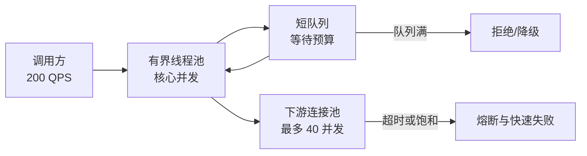

# 线程池参数如何从容量模型推导？

> **适用岗位**：高级 Java 后端 / 架构师　 **难度**：架构场景　 **建议回答**：90 秒

## 60–90 秒速答

线程池不能只套“CPU 核数乘二”。我先收集到达率 λ、任务平均和 TP99 服务时间、CPU/IO
占比、下游连接上限和接口 SLO。Little’s Law `L = λW` 可以估算系统平均并发，例如
200 QPS、平均 80 ms，大约需要 16 个并发；但它不是线程数公式，还要受 TP99、突发流量
和下游最多 40 并发约束。

我会使用有界队列，把线程数、队列等待预算和拒绝策略一起设计：核心线程覆盖稳定负载，
短队列吸收可接受抖动，超过容量则快速失败或降级，不能用无界队列把压力变成超时和 OOM。
上线前用真实流量模型压测，观察活跃线程比例、队列等待 p99、拒绝率、任务耗时和下游
饱和度；任何扩线程都必须证明下游还有容量。

## 面试官评分点

- 用到达率和服务时间估算，而不是背固定公式。
- 明确 Little’s Law 是平均稳态估算。
- 同时约束线程、队列、超时、拒绝和下游容量。
- 能解释“排队很深但拒绝率低”为什么仍是故障。

## 一句话记忆

**线程池容量上限不在本机，而在最先饱和的下游。**

## 常见失分

- 直接说 IO 密集用 `2N+1`，不看服务时间和连接池。
- 使用无界队列，误以为“不拒绝就是稳定”。
- 扩线程后没有同步评估数据库或 HTTP 连接池。

## 原理与边界



示例：`λ = 200 req/s`，平均服务时间 `W = 0.08 s`，平均在途任务
`L = λW = 16`。若 TP99 是 300 ms，峰值瞬间在途数可能显著高于 16，因此需要通过压测
确定尾部容量；但下游只允许 40 个并发调用，线程池和连接池之和不能无节制超过它。

队列长度应来自等待预算。若请求总 SLO 是 300 ms，业务执行 TP99 已用 240 ms，排队预算
仅剩约 60 ms；队列能放 10 万个任务并没有价值。

## 工程落地

```java
ThreadPoolExecutor pool = new ThreadPoolExecutor(
    16,
    32,
    30, TimeUnit.SECONDS,
    new ArrayBlockingQueue<>(64),
    Thread.ofPlatform().name("recommend-", 0).factory(),
    (task, executor) -> {
        metrics.increment("recommend.rejected");
        throw new RejectedExecutionException("recommend pool saturated");
    }
);

// 提交任务前，调用链还必须设置小于请求总预算的下游超时。
```

生产实现还应记录任务进入队列和开始执行的时间，从而分离 `queue_wait` 与
`task_duration`。只记录接口总耗时，无法判断慢在排队还是下游。

## 方案对比

| 方案 | 适用场景 | 收益 | 代价 | 风险 |
| --- | --- | --- | --- | --- |
| 固定平台线程池 | 负载稳定、并发边界清楚 | 容量可控、易隔离 | 峰值弹性有限 | 参数过小拒绝、过大压垮下游 |
| 弹性线程池 | 短突发且下游可扩展 | 临时吞吐更高 | 创建与调度开销 | 把突发直接放大到下游 |
| 虚拟线程 | 大量阻塞 IO、JDK 21+ | 编程模型简单、并发成本低 | 仍需信号量/连接池限流 | 把“线程便宜”误解为“资源无限” |
| 事件循环/异步 | 超高连接、链路可异步 | 少量线程承载大量 IO | 调试和上下文传播复杂 | 阻塞代码卡住事件循环 |

## 指标与验证

| 指标 | 定义/算法 | 来源 | 示例基线 | 决策 |
| --- | --- | --- | --- | --- |
| 活跃率 | active threads / max threads | Executor 指标 | 稳态 `< 70%` | 长期高位先查任务时间和下游 |
| 排队等待 p99 | 开始执行时间 - 入队时间 | 任务包装器 | `< 60 ms` | 超预算应扩容、降级或减任务 |
| 拒绝率 | rejected / submitted | 拒绝处理器 | 稳态接近 0 | 峰值允许受控拒绝并触发告警 |
| 任务耗时 p99 | 完成时间 - 开始执行时间 | 任务包装器/Trace | `< 240 ms` | 上升时查下游和锁 |
| 下游饱和度 | active connections / max | 客户端/连接池 | `< 75%` | 接近 100% 时禁止盲目扩线程 |

示例基线要按 SLO、突发系数、机器配额和下游承诺重新校准。

## 三级追问

1. **原理追问**：为什么 `L = λW` 不能直接等于最大线程数？  
   要点：它描述稳态平均在途量，不包含尾延迟、突发、CPU 和下游约束。
2. **工程追问**：无界队列没有拒绝，为什么接口仍大量超时？  
   要点：等待时间吞掉 SLO，请求在过期后仍执行，形成无效工作和雪崩。
3. **架构追问**：换虚拟线程后还需要线程池隔离吗？  
   要点：需要按下游资源做并发控制；线程便宜不等于连接、CPU、内存无限。

## 自测与评分

请用 `200 QPS / 80 ms / TP99 300 ms / 下游 40 并发` 设计线程池和验证方案。

| 维度 | 5 分锚点 |
| --- | --- |
| 正确性 | 正确使用到达率、时间和下游上限 |
| 深度 | 区分平均并发、尾部并发和排队预算 |
| 权衡推理 | 能比较平台线程、虚拟线程和异步方案 |
| 表达结构 | 按约束—估算—保护—验证组织 |
| 可运维性 | 指标覆盖队列、任务、拒绝和下游 |

总分 25：`22–25` 可落地，`17–21` 需补队列预算，`≤16` 需重新做容量推导。

[返回模块](./) · [锁竞争](./04-lock-contention) ·
[原并发题库](/fundamentals/基础模块3-并发基础-标准答案库)
