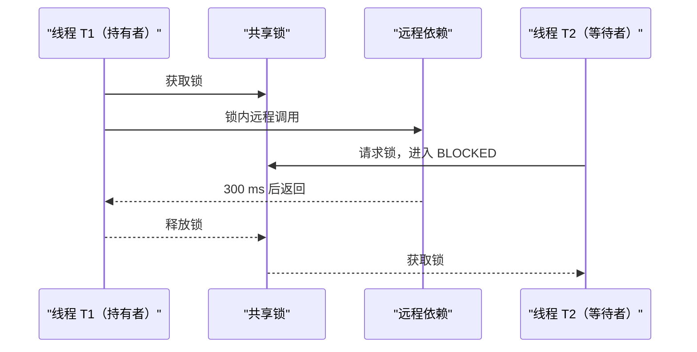

# 锁竞争如何定位和改造？

> **适用岗位**：高级 Java 后端 / 架构师　 **难度**：进阶　 **建议回答**：90 秒

## 60–90 秒速答

锁竞争的典型信号是吞吐不再增长、TP99 上升、BLOCKED 或 park 时间增加，但我不会只凭
一次线程 dump 下结论。先用多个时间点的线程栈和 JFR 看同一把锁的持有者、等待者、
持有时长和调用路径，再确认锁内是否有远程 IO、磁盘、复杂计算或过大的共享状态。

改造顺序是先保证正确性，再减少共享和临界区：把 IO 移出锁、缩小锁范围、按 key 分段，
读多写少可评估快照或读写锁，高冲突下 CAS 可能因重试更差；如果业务允许按 key 串行，
队列/Actor 往往比复杂锁更可控。用吞吐、阻塞时间 p99、锁持有时间和错误一致性共同
验证，不能只看 CPU 降了。

## 面试官评分点

- 多次采样并关联锁对象、持有者和业务调用。
- 优先把慢 IO 移出临界区。
- 知道 CAS、读写锁并非天然更快。
- 性能改造必须保留并发正确性验证。

## 一句话记忆

**竞争优化的第一步不是换锁，而是减少共享和缩短持有时间。**

## 常见失分

- 看见 `synchronized` 就改成 CAS。
- 只统计 BLOCKED 线程数，不看锁持有者在做什么。
- 缩小锁后破坏“检查—更新”的原子性。

## 原理与边界



`synchronized` 竞争通常表现为 BLOCKED；`ReentrantLock`、条件队列或并发工具可能通过
`LockSupport.park` 表现为 WAITING。状态不同不等于没有竞争，所以需要结合锁事件和调用栈。

## 工程落地

```bash
# 连续采样，不依赖单个瞬间
for i in 1 2 3; do
  jcmd <pid> Thread.print -l > "/tmp/threads-$i.txt"
  sleep 5
done

jcmd <pid> JFR.start name=locks settings=profile duration=5m filename=/tmp/locks.jfr

# async-profiler 已安装且评估过生产开销时
./asprof -e lock -d 60 -f /tmp/lock.html <pid>
```

错误写法把慢 IO 放在账户锁中：

```java
synchronized (accountLock) {
    Account account = repository.load(id);
    RiskResult risk = riskClient.check(account); // 锁内远程 IO
    account.apply(risk);
    repository.save(account);
}
```

改造时先在锁外取不可变输入和调用远端，再在锁内做版本检查与最小更新；若状态可能变化，
使用乐观版本号重新校验，而不是直接移除原子边界。

## 方案对比

| 方案 | 适用场景 | 收益 | 代价 | 风险 |
| --- | --- | --- | --- | --- |
| 缩小临界区 | 锁内存在 IO/无关计算 | 改动小、收益直接 | 需重新划分原子边界 | 检查与更新分离后竞态 |
| 按 key 分段 | 冲突集中于不同业务 key | 并行度提高 | 锁管理复杂 | 热 key 仍串行、锁对象泄漏 |
| 读写锁/快照 | 读多写少 | 读路径并发 | 写和升级复杂 | 写饥饿、读临界区仍过长 |
| CAS/原子类 | 状态小、冲突低 | 无阻塞 | 高冲突下自旋重试 | ABA、复合不变量难维护 |
| 队列/Actor | 可按 key 顺序处理 | 顺序明确、易隔离 | 增加排队和异步语义 | 队列积压、恢复复杂 |

## 指标与验证

| 指标 | 定义/算法 | 来源 | 示例基线 | 决策 |
| --- | --- | --- | --- | --- |
| 锁持有 p99 | unlock - lock acquired | JFR/埋点 | 核心锁 `< 10 ms` | 长尾对应持有者栈查 IO |
| 阻塞时间占比 | blocked/park time / wall time | JFR | `< 5%` | 上升时检查热锁和调度 |
| 竞争次数 | 未立即获得锁的事件数 | JFR | 与吞吐线性或更低 | 超线性增长说明共享热点 |
| 吞吐 | 成功操作数 / 秒 | 业务指标 | 达到容量目标 | 优化后不升反降需回滚 |
| 一致性失败 | 并发不变量破坏次数 | 压测/校验 | `0` | 任何非零立即停止发布 |

数值是示例。锁粒度、请求时长和硬件不同，必须用相同并发模型校准。

## 三级追问

1. **原理追问**：公平锁为什么可能降低吞吐？  
   要点：严格排队减少插队和局部性，增加调度与上下文切换。
2. **工程追问**：CAS 一定比锁快吗？  
   要点：高竞争下失败重试消耗 CPU，复合状态还可能需要锁或状态机。
3. **架构追问**：缩锁后如何证明没有破坏一致性？  
   要点：定义业务不变量，做并发压力、线性化/版本校验和失败注入。

## 自测与评分

请回答：“接口 TP99 从 80 ms 升到 900 ms，线程栈大量等待同一账户锁，怎么处理？”

| 维度 | 5 分锚点 |
| --- | --- |
| 正确性 | 能识别状态、持有者、等待者和原子边界 |
| 深度 | 能解释锁内 IO、分段、CAS 和队列模型 |
| 权衡推理 | 不迷信无锁，能说明适用条件 |
| 表达结构 | 按证据—根因—改造—验证组织 |
| 可运维性 | 有持续采样、性能指标和一致性校验 |

总分 25：`22–25` 兼顾性能与正确性，`17–21` 需补验证，`≤16` 需先重建证据链。

[返回模块](./) · [线程池容量](./03-thread-pool-sizing) ·
[原并发题库](/fundamentals/基础模块3-并发基础-标准答案库)
