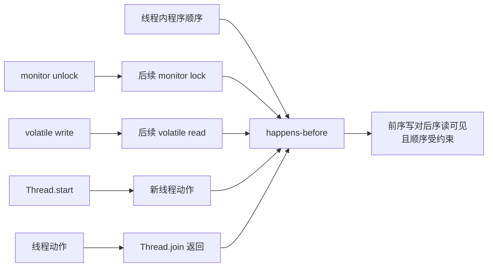

# JMM 与可见性如何讲清楚？

> **适用岗位**：高级 Java 后端　 **难度**：进阶原理　 **建议回答**：90 秒

## 60–90 秒速答

JMM 不是 JVM 内存区域图，而是 Java 线程之间如何读写共享变量的抽象规范。它主要解决
原子性、可见性和有序性：原子性关注操作是否不可分割，可见性关注一个线程的写何时能被
另一个线程看到，有序性关注编译器和 CPU 重排不能破坏跨线程语义。

判断线程安全不能靠“通常能看到”，而要找 happens-before 关系。程序顺序、锁的释放到
后续获取、volatile 写到后续读、线程 start 和 join 都能建立这种关系。`volatile` 适合
单值状态发布和禁止特定重排，但 `count++` 仍不是原子操作；复合不变量通常用锁或原子类，
复杂流程优先考虑不可变对象和消息传递。验证时用并发 stress test 和不变量断言，不能用
`sleep` 证明正确。

## 面试官评分点

- 不把 JMM 与堆、栈、方法区混淆。
- 能分别解释原子性、可见性、有序性。
- 能列出并应用关键 happens-before 规则。
- 知道 volatile 不保证复合操作原子性。

## 一句话记忆

**跨线程可见不是“等一会儿”，而是必须建立 happens-before。**

## 常见失分

- 说 volatile “保证线程安全”但不给适用边界。
- 用 CPU 缓存一句话解释所有 JMM 行为。
- 用 `Thread.sleep` 作为并发测试的同步手段。

## 原理与边界



happens-before 是可见性和顺序保证，不代表两个动作在墙上时钟中紧挨着。规则还具有传递性：
若 A happens-before B，B happens-before C，则 A happens-before C。

## 工程落地

错误的停止标记没有跨线程保证：

```java
final class Worker {
    private boolean running = true; // 错误：存在数据竞争

    void stop() { running = false; }

    void run() {
        while (running) {
            doWork();
        }
    }
}
```

单值发布可使用 volatile：

```java
private volatile boolean running = true;

void stop() {
    running = false;
}
```

但复合更新应使用原子操作或锁：

```java
private final AtomicLong completed = new AtomicLong();

void markCompleted() {
    completed.incrementAndGet();
}
```

如果更新涉及“余额不能为负 + 流水必须对应”这类多个字段不变量，单个 AtomicLong 不够，
应使用锁、事务或串行状态机。

## 方案对比

| 方案 | 适用场景 | 收益 | 代价 | 风险 |
| --- | --- | --- | --- | --- |
| volatile | 状态标志、配置引用发布 | 读写轻量、语义直接 | 只适合单次读写关系 | 复合操作丢更新 |
| synchronized | 复合不变量、临界区 | 互斥与可见性一体 | 竞争时阻塞 | 锁范围过大、死锁 |
| Lock | 超时、可中断、公平、多个条件 | 控制能力强 | 必须显式释放 | 忘记 finally、复杂度高 |
| 原子类 | 单变量原子更新、低冲突 | 无阻塞 API | 重试和状态表达有限 | 高竞争 CPU、ABA |
| 不可变/消息传递 | 可复制状态、按 key 串行 | 减少共享、容易推理 | 复制或队列成本 | 延迟、积压和状态恢复 |

## 指标与验证

JMM 错误不能靠一个“可见性指标”直接观测，应验证可观察的不变量：

| 信号 | 定义/算法 | 来源 | 示例基线 | 决策 |
| --- | --- | --- | --- | --- |
| Stress 失败率 | 违反预期结果次数 / 运行次数 | jcstress/自建并发测试 | `0` | 任一失败都说明同步关系不足 |
| 陈旧读取数 | 读到旧版本的断言次数 | 测试埋点 | `0` | 检查发布和读之间 HB |
| 竞争时间 | 锁等待时间 / 总时间 | JFR | 以历史回归为基线 | 正确后再优化性能 |
| 吞吐 | 成功状态转换 / 秒 | 压测 | 不低于容量目标 | 比较锁、原子和队列方案 |
| 不变量失败 | 余额负数等非法状态数 | 业务校验 | `0` | 立即回滚并保留并发轨迹 |

示例基线只表示“正确性失败必须为零”；吞吐和竞争阈值需按工作负载校准。

## 三级追问

1. **原理追问**：volatile 为什么不能保证 `count++`？  
   要点：读、加、写是多个步骤，多个线程可能基于同一个旧值更新。
2. **工程追问**：双重检查单例为什么实例字段要 volatile？  
   要点：禁止引用发布与构造初始化的危险重排，并建立写读可见性。
3. **架构追问**：共享状态越来越复杂时还应继续加锁吗？  
   要点：评估按 key 串行、不可变快照、消息传递或数据库事务，减少共享面。

## 自测与评分

请回答：“volatile 能保证什么、不能保证什么？请给出两个生产使用边界。”

| 维度 | 5 分锚点 |
| --- | --- |
| 正确性 | 清楚区分三种性质和 volatile 边界 |
| 深度 | 能用 happens-before 和重排解释 |
| 权衡推理 | 能在锁、原子、不可变、消息间选择 |
| 表达结构 | 定义—规则—示例—边界清楚 |
| 可运维性 | 用 stress test 和业务不变量验证 |

总分 25：`22–25` 原理与工程统一，`17–21` 需补 HB，`≤16` 需先纠正概念混淆。

## 复述任务

不看正文回答：用两个生产例子说明 volatile 能保证什么、不能保证什么，并解释何时应该改用锁、
原子类、不可变快照或消息传递。

[返回模块](./) · [锁竞争](./04-lock-contention) ·
[原并发题库](/fundamentals/基础模块3-并发基础-标准答案库)
