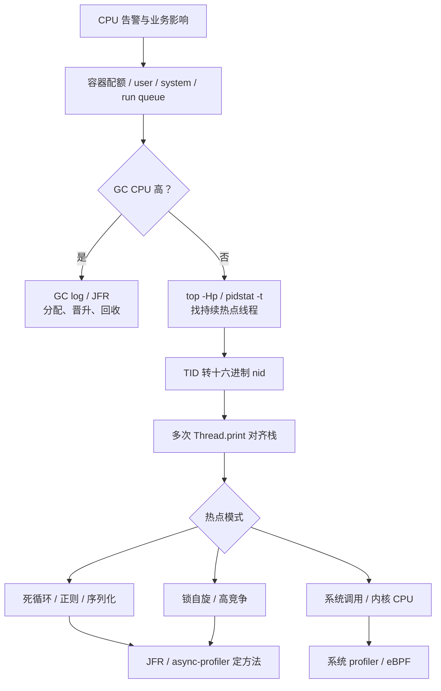

# CPU 飙高如何完成证据化排查？

> **适用岗位**：高级 Java 后端 / 架构师　 **难度**：生产排障　 **建议回答**：90 秒

## 60–90 秒速答

CPU 飙高先止损并确认影响，再分层取证。我先看容器限额、进程 CPU、user/system 比例和
run queue，确认是 Java 进程且不是宿主机争抢；再用 `top -Hp` 或 `pidstat -t` 找持续高
CPU 的原生线程，把十进制 TID 转成十六进制 nid，与多个时间点的 `jcmd Thread.print`
对应。

如果热点栈持续相同，检查死循环、正则、序列化或自旋；如果线程变化快或 GC CPU 高，
转看 GC 日志和 JFR，再用采样 profiler 获取方法级证据。单次 dump 只能是线索，至少多次
采样并对齐请求、发布和 GC 时间线。止血可以降级高耗功能、限流、摘除异常实例，修复后
用同流量回放验证 CPU、TP99、吞吐和错误率。

## 面试官评分点

- 先确认容器配额和 user/system CPU，不只会 `top`。
- 会把十进制 TID 转成线程栈中的十六进制 nid。
- 使用多次采样，知道热点线程可能变化。
- 能区分业务热点、GC、自旋和系统调用。

## 一句话记忆

**进程找线程，TID 转 nid，多次栈定方向，Profiler 定方法。**

## 常见失分

- 只抓一次 `jstack` 就宣布根因。
- 容器 1 核打满却按宿主机 16 核计算百分比。
- CPU 高时直接重启，完全没有保存证据。

## 原理与边界



一个线程打满单核，在 8 核容器总 CPU 上可能只表现为 12.5%。因此既看进程总 CPU，也看
线程和 CPU quota。`system` 高更偏内核调用、网络、磁盘或调度；`user` 高更偏 Java 计算、
GC 或自旋，但仍需栈和采样证明。

## 工程落地

```bash
PID=$(pgrep -f 'app.jar' | head -1)
pidstat -p "$PID" -t 1 10
top -H -p "$PID"

# 假设热点 TID 是 12345
printf '%x\n' 12345

for i in 1 2 3; do
  jcmd "$PID" Thread.print -l > "/tmp/cpu-thread-$i.txt"
  sleep 5
done

jcmd "$PID" JFR.start name=cpu settings=profile duration=2m filename=/tmp/cpu.jfr
```

如果三次采样中 `nid=0x3039` 都停在同一个正则匹配或 JSON 序列化栈，证据明显强于单次
快照。若热点线程每次不同但 GC 线程占用高，应回到分配率、晋升率和 GC 日志。

在已验证开销的环境中再使用采样 profiler：

```bash
./asprof -e cpu -d 60 -f /tmp/cpu-flame.html <pid>
```

## 方案对比

| 工具 | 适用场景 | 收益 | 代价 | 风险 |
| --- | --- | --- | --- | --- |
| 多次线程 dump | 持续热点线程、锁和栈 | 自带工具、定位线程快 | 方法耗时不精确 | 单次采样误判 |
| JFR | CPU、分配、锁、IO 综合分析 | 时间线完整、生产友好 | 文件分析和采样配置 | 录制过短漏掉问题 |
| async-profiler | 方法级 CPU/lock/allocation 热点 | 火焰图直观、开销较低 | 需部署工具和权限 | 未评估参数直接上生产 |
| 系统 profiler/eBPF | system CPU、内核和跨进程 | 看清 syscall/调度 | 使用门槛高 | 符号缺失或采样偏差 |

## 指标与验证

| 指标 | 定义/算法 | 来源 | 示例基线 | 决策 |
| --- | --- | --- | --- | --- |
| 进程 CPU | Java 进程 CPU / 容器 CPU 配额 | cgroup/APM | 稳态 `< 60%` | 高位先判断 user/system |
| Run queue | 等待 CPU 调度的可运行任务数 | `vmstat`/节点监控 | 不长期超过可用核数 | 超标说明 CPU 饱和或争抢 |
| GC CPU | GC 线程 CPU / 总 CPU | JFR/GC 指标 | `< 15%` | 高时查分配、晋升和堆压力 |
| 热线程持续率 | N 次采样中同一 TID 命中次数 / N | 线程采样 | `3/3` 为强线索 | 对应 nid 和重复栈 |
| 业务影响 | TP99、错误率、成功吞吐 | APM | 满足服务 SLO | 修复不能只看 CPU 降低 |

示例阈值需按容器配额、流量周期和 SLO 调整。

## 三级追问

1. **原理追问**：为什么单线程死循环在 8 核机器上可能只有约 12.5%？  
   要点：单线程占满一个逻辑核，总百分比按全部可用核汇总。
2. **工程追问**：热点 TID 每次都不同怎么办？  
   要点：JFR/采样 profiler 看方法聚合，同时检查 GC 与线程池任务分布。
3. **架构追问**：排查过程中如何止血又不丢证据？  
   要点：先采轻量指标和多次栈，再降级/限流/摘单实例，保留 JFR、日志和发布信息。

## 自测与评分

请回答：“容器 CPU 95%，接口 TP99 3 秒，但单次线程 dump 没有明显热点，下一步做什么？”

| 维度 | 5 分锚点 |
| --- | --- |
| 正确性 | 能从配额、线程、GC、系统 CPU 分层判断 |
| 深度 | 能解释 TID/nid、多次采样和 profiler |
| 权衡推理 | 能选择低风险取证工具和止血动作 |
| 表达结构 | 影响—系统—线程—方法—验证清楚 |
| 可运维性 | 保留时间线、证据、回滚和业务指标 |

总分 25：`22–25` 证据化排障完整，`17–21` 需补工具边界，`≤16` 需按决策树重答。

## 复述任务

不看正文回答：容器 CPU 95%、流量不变、单次线程 dump 没有热点时，下一轮如何从配额、GC、
多次线程采样和 profiler 逐层取证，同时保留可回滚的止血路径？

[返回模块](./) · [GC 选型](./01-gc-selection-and-tuning) ·
[原 JVM 题库](/fundamentals/基础模块2-JVM基础-标准答案库)
