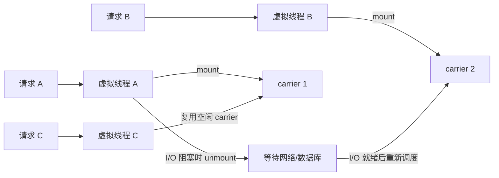

# Java 虚拟线程如何选型与落地？

> [!IMPORTANT]
> 本文以 JDK 21 的正式虚拟线程能力为基线，并单独标注 JDK 24 的 pinning 变化。示例数字是教学假设，生产参数必须通过真实负载验证。

## 60–90 秒速答

虚拟线程解决的是高并发阻塞任务占用大量平台线程的问题。它由 JDK 调度，阻塞在受支持的
I/O 操作时可以卸载，让少量 carrier 平台线程继续执行其他虚拟线程，因此适合并发度高、
等待时间长的服务，例如大量 HTTP、JDBC 或 RPC 调用。

它提升的是吞吐能力，不会让 CPU 计算更快，也不会增加数据库连接数、下游 QPS 或内存容量。
所以我不会把虚拟线程再放进固定大小线程池，而是按任务创建，同时用连接池、`Semaphore`、
限流和超时控制稀缺资源。

落地前我会比较平台线程与虚拟线程两组同负载实验，观察吞吐、TP99、carrier 利用率、连接池
等待和内存。JDK 21 还要关注长时间 pinning；JDK 24 已消除由 `synchronized` 导致的绝大多数
pinning，但 native/foreign 调用等剩余情况仍需诊断。若服务主要是 CPU 密集计算，虚拟线程
通常不会带来吞吐收益。

## 先回答三个约束

1. 任务是否大部分时间在等待 I/O，而不是持续占用 CPU？
2. 并发任务数是否已经远高于 CPU 核数，并被平台线程数量限制？
3. 数据库、下游和第三方接口允许多少真实并发？

如果第三个问题没有答案，迁移虚拟线程可能只是更快地把下游打满。

## 执行模型



平台线程通常与操作系统线程近似一一对应，创建和长期持有的成本较高。虚拟线程是
`java.lang.Thread` 的轻量实现，由 JDK 把大量虚拟线程调度到较少的 carrier 平台线程上。
业务代码仍可以使用顺序控制流、异常栈和阻塞式 API，不必为了释放平台线程把所有调用改写成
回调链。

## 容量推导示例

假设一个聚合接口有以下教学负载：

| 输入 | 数值 |
| --- | ---: |
| 峰值到达率 | 2,000 请求/s |
| 单请求 CPU 时间 | 8 ms |
| 下游等待时间 | 192 ms |
| 平均服务时间 | 200 ms |
| 数据库允许的单实例并发 | 80 |
| 外部 API 限额 | 500 请求/s |

按 Little's Law，稳态在途请求约为：

```text
并发数 ≈ 到达率 × 平均服务时间
       ≈ 2,000/s × 0.2s
       ≈ 400
```

400 个平台线程可能已经带来明显的线程栈和调度成本，虚拟线程有机会降低“等待线程”的成本。
但它不能推翻两个硬约束：数据库并发仍不能超过 80，外部 API 仍只能承受 500 请求/s。因此
设计至少需要数据库连接池和外部 API 限流两个独立门控，超过预算的请求应排队、降级或失败。

## 最小实现

```java
try (var executor = Executors.newVirtualThreadPerTaskExecutor()) {
    Future<OrderView> future = executor.submit(() -> loadOrder(orderId));
    return future.get(300, TimeUnit.MILLISECONDS);
}
```

虚拟线程适合一任务一线程，不应为了“控制数量”再把它们放进固定大小的虚拟线程池。并发控制
应该施加在真正稀缺的资源上：

```java
private final Semaphore partnerLimit = new Semaphore(80);

OrderView loadOrder(String orderId) throws Exception {
    if (!partnerLimit.tryAcquire(20, TimeUnit.MILLISECONDS)) {
        throw new RejectedExecutionException("partner concurrency budget exhausted");
    }
    try {
        return partnerClient.fetch(orderId);
    } finally {
        partnerLimit.release();
    }
}
```

这个门控不是通用模板。实际系统还要结合连接池、接口限额、租户公平性和超时预算设计。

## 什么时候值得用

| 场景 | 判断 | 原因 |
| --- | --- | --- |
| 大量 JDBC / HTTP / RPC 等待 | 适合 | 阻塞期间可以释放 carrier |
| 请求级编排和聚合 | 适合 | 保留顺序代码与清晰异常栈 |
| 少量后台定时任务 | 收益有限 | 并发量不足以体现优势 |
| 图像编码、压缩、模型推理 | 通常不适合 | CPU 仍受核数限制 |
| 受严格下游配额限制 | 可以使用但必须门控 | 线程便宜不等于依赖容量增加 |

## 方案取舍

| 方案 | 优点 | 代价与风险 |
| --- | --- | --- |
| 平台线程池 | 模型成熟，边界显式 | 高并发等待时线程成本高，参数容易失真 |
| 虚拟线程 | 顺序代码、高并发阻塞吞吐好 | 可能放大下游并发，需重新检查 ThreadLocal 和诊断体系 |
| Reactive | 对流式背压和异步链路控制强 | 调用链、调试和团队学习成本较高 |

选择标准不是“哪个更新”，而是现有瓶颈、团队能力和框架生态。已经稳定运行的 Reactive 服务
没有必要仅为了虚拟线程整体重写；大量阻塞式 Java 代码则可能用较小迁移成本获得更高并发。

## 版本边界与 pinning

- [JEP 444](https://openjdk.org/jeps/444) 在 JDK 21 正式交付虚拟线程，并明确虚拟线程提升的是高并发吞吐，不是单任务执行速度。
- JDK 21 中，虚拟线程在持有 `synchronized` 监视器时执行阻塞操作，可能固定在 carrier 上；长时间、大量 pinning 会损害扩展性。
- [JEP 491](https://openjdk.org/jeps/491) 在 JDK 24 消除了由 `synchronized` 导致的绝大多数 pinning，但 native/foreign 调用和少数 JVM 内部路径仍可能 pinning。

因此面试时先声明目标 JDK。把“虚拟线程不能配合 `synchronized`”作为无版本条件的永久结论，
同样是不准确的。

## 迁移风险

### 下游被打满

原来 200 个平台线程客观限制了并发，迁移后数千任务可能同时等待数据库。连接池等待、下游
429/超时和重试会形成放大链路。必须保留入口限流、资源门控和总超时预算。

### ThreadLocal 成本

虚拟线程支持 `ThreadLocal`，但“支持”不等于应该无边界使用。如果每个虚拟线程都复制大型
上下文，高并发下仍会消耗大量内存。迁移前应清点 MDC、租户上下文、安全信息和框架缓存。

### 只看平均延迟

平均值可能改善，但连接池等待和下游限额会把问题推到 TP99。必须分解排队时间、执行时间和
依赖等待时间。

### 一次性全量切换

线程模型会影响超时、日志、监控、压测和容量基线。应按接口或实例灰度，保留切回平台线程池
的配置开关。

## 指标与验收

| 指标 | 作用 | 教学验收示例 |
| --- | --- | --- |
| 请求吞吐与 TP99 | 判断业务收益 | 同资源吞吐提升且 TP99 不越过 SLO |
| 活跃虚拟线程数 | 判断任务并发 | 与到达率、服务时间推导量级一致 |
| carrier CPU / 利用率 | 判断调度与 CPU 瓶颈 | 不长期满载，不出现明显饥饿 |
| 数据库连接等待 TP99 | 防止压力转移 | 小于接口总超时预算的 20% |
| 下游超时 / 429 | 检查并发放大 | 不高于迁移前基线 |
| Heap、RSS、上下文大小 | 检查内存成本 | 相同负载下无持续增长 |
| pinning 事件 | 定位 carrier 被占用 | 按 JDK 版本解释并消除长时间事件 |

验收至少包含四组负载：正常峰值、两倍短突发、下游延迟放大、下游限额收紧。只测试正常链路
无法证明迁移安全。

## 灰度与回退

1. 选择 I/O 等待占比高、无资金和写入副作用的只读接口试点。
2. 用相同实例规格做平台线程与虚拟线程对照压测。
3. 灰度 5% 流量，比较 TP99、错误率、连接等待、下游并发和内存。
4. 指标稳定后逐级放量；任何下游超时、连接等待或 RSS 越线都切回原执行器。
5. 最后再迁移带写操作、事务或复杂 ThreadLocal 的链路。

## 面试官三级追问

### 一级：虚拟线程是不是越多越好？

不是。虚拟线程本身便宜，但任务使用的数据库连接、Socket、内存、下游配额和 CPU 并不便宜。
应该让线程按任务创建，同时限制稀缺资源的并发。

### 二级：有了虚拟线程，线程池参数题是不是过时了？

没有。平台线程池仍大量存在，CPU 任务也仍需要有界执行器。即使采用虚拟线程，容量治理只是
从“限制线程数”转向“限制数据库连接、下游调用和业务并发”。排队、超时、拒绝和隔离仍然存在。

### 三级：如何证明迁移收益来自虚拟线程而不是流量波动？

保持实例规格、业务数据和下游条件一致，使用同一压测模型对照；分别记录到达率、服务时间、
吞吐、TP99、CPU、RSS、连接等待和依赖错误。先小流量灰度，单次只改变执行模型，并保留回退，
才能建立可归因证据。

## 25 分自评

| 维度 | 5 分要求 |
| --- | --- |
| 正确性 | 说清虚拟线程、carrier、mount/unmount 和版本边界 |
| 深度 | 能用 Little's Law 解释为什么高等待并发可能受益 |
| 取舍 | 能与平台线程池、Reactive 比较，不把虚拟线程当银弹 |
| 表达 | 90 秒内先结论，再适用场景、风险和验证 |
| 可运维性 | 有资源门控、指标、故障压测、灰度和回退 |

## 易错点

- 说虚拟线程能降低单个 CPU 任务的执行时间。
- 再创建固定大小的虚拟线程池。
- 不做连接池和下游并发门控。
- 用 JDK 21 的 pinning 结论回答所有后续 JDK。
- 只比较吞吐，不看 TP99、下游错误和内存。

## 延伸学习

[线程池容量模型](./03-thread-pool-sizing) · [锁竞争定位](./04-lock-contention) ·
[CPU 飙高排查](./06-high-cpu-diagnosis) · [返回 JVM 与并发](./)
