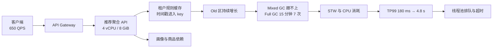
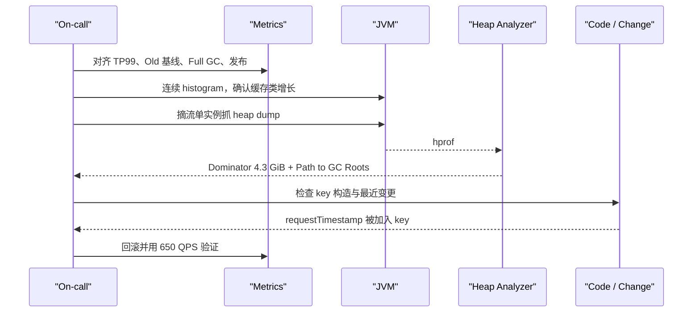

# 教学案例：Full GC 导致 TP99 飙升

> [!IMPORTANT]
> 这是基于常见生产故障模式构造的教学案例，不对应任何真实公司或未公开事故。所有数字
> 为同一虚拟场景服务，用于训练证据链、决策和面试表达。

## 场景数据

| 项目 | 数据 |
| --- | --- |
| 服务 | 推荐聚合 API |
| 运行时 | JDK 17、G1、8 GiB 堆、4 vCPU |
| 正常流量 | 650 QPS |
| 正常 TP99 | 180 ms |
| 故障 TP99 | 4.8 s |
| Old 回收后基线 | 42 分钟内从 2.1 GiB 升到 6.7 GiB |
| Full GC | 从稳定期 0/h 升到 15 分钟 7 次 |
| 最大保留对象 | 租户规则缓存，retained size 4.3 GiB |
| 直接触发 | 缓存 key 新增请求时间戳，缓存实际无界增长 |

## 面试版事故回答

我先确认影响：推荐 API 在 650 QPS 下 TP99 从 180 ms 升到 4.8 s，错误率随后上升。指标
显示 8 GiB 堆的 Old 区在每次回收后仍持续抬升，42 分钟从 2.1 GiB 到 6.7 GiB，15 分钟
发生 7 次 Full GC，所以我把优先级从“普通慢调用”转向“高 live set 或泄漏”。

止血时先降级非核心推荐、限制异常租户流量，只在一台摘流实例保留 GC 日志和 heap dump。
Histogram 显示规则缓存条目持续增长，Dominator Tree 进一步定位到 retained size 4.3 GiB
的租户规则缓存；引用链最终证明缓存 key 加入了请求时间戳，导致每次请求都产生新条目。
修复采用稳定业务 key、最大权重和 TTL，并增加 key 基数与回收后 Old 基线告警。同流量
回放后 Full GC 恢复为 0，TP99 回到约 190 ms，再逐步恢复流量。

## 架构与故障传播



缓存泄漏不仅消耗内存。Full GC 的停顿和 CPU 会拖慢请求，线程池队列变长，已经超时的请求
仍继续执行，最终可能把下游也拖入重试风暴。

## 时间线

| 时间 | 事件 | 当时动作 |
| --- | --- | --- |
| 10:00 | 新版本灰度完成 | 常规观察，未发现立即异常 |
| 10:18 | After-GC Old 超过历史基线 | 关联发布和租户流量 |
| 10:35 | TP99 超过 1 s，Full GC 出现 | 停止继续放量，降级非核心推荐 |
| 10:42 | TP99 达 4.8 s | 异常实例摘流，保留日志与 dump |
| 10:49 | Histogram 指向规则缓存 | 检查缓存条目数和 key 样本 |
| 11:02 | MAT 显示 retained size 4.3 GiB | 沿 GC Roots 定位静态 Cache |
| 11:12 | 发现 key 包含请求时间戳 | 回滚新 key 逻辑，设置临时条目上限 |
| 11:38 | Old 基线停止上涨 | 相同流量回放，观察两个回收周期 |
| 12:10 | TP99 稳定约 190 ms | 小流量恢复，继续监控 |

## 从观察到结论

| 观察证据 | 可以推断 | 还不能直接断言 |
| --- | --- | --- |
| TP99 与 Full GC 同时上升 | GC 很可能参与延迟 | GC 一定是唯一根因 |
| After-GC Old 单调上涨 | 存活集持续增长 | 一定是代码泄漏 |
| Histogram 中缓存条目持续增长 | 缓存是重点嫌疑 | 每个条目都不该存活 |
| Retained size 4.3 GiB | 缓存支配大量对象 | 具体哪段代码制造 key |
| GC Roots 指向静态 Cache，key 含时间戳 | 缓存无法命中复用，形成无界增长 | 修复已完成且不会复发 |

这张表是案例最重要的部分：排障要区分“看见了什么”和“因此能得出什么”。

## 取证过程



代表性的、经过缩写的 GC 日志：

```text
[10:34:58.122][gc] GC(184) Pause Young (Mixed) 6940M->6652M(8192M) 238.4ms
[10:35:09.886][gc] GC(185) Pause Full (G1 Compaction Pause) 7010M->6688M(8192M) 3182.7ms
[10:37:11.403][gc] GC(190) Pause Full (G1 Compaction Pause) 7134M->6701M(8192M) 3340.2ms
```

代表性的 histogram 差分：

```text
 num     #instances         #bytes  class
   1        9,842,113    2,756,000,000  com.example.rules.CompiledRule
   2        3,205,884      615,000,000  java.lang.String
   3        3,198,011      358,000,000  com.example.rules.RuleCacheKey
```

日志只能支持“回收效果差和缓存对象多”，最终根因仍依赖引用链和代码变更。

## 止血决策

1. **停止放量**：避免新版本扩大影响面。
2. **降级非核心推荐**：返回热门兜底，减少缓存写入和下游调用。
3. **限制异常租户**：按租户隔离，保护其他用户。
4. **摘流一台实例取证**：避免所有实例同时 dump。
5. **临时限制缓存条目**：阻止继续增长。
6. **保留日志、dump、版本和配置**：重启前保存证据。

直接全量重启会短暂恢复，但会清空最有价值的内存证据，而且流量重新填充后还会复发。

## 永久修复

错误 key 把每个请求变成唯一缓存项：

```java
record RuleCacheKey(String tenantId, String ruleVersion) {}

RuleCacheKey key(Request request) {
    // request.timestamp() 不属于规则身份，不能进入 key
    return new RuleCacheKey(request.tenantId(), request.ruleVersion());
}
```

缓存同时设置三道边界：

- **最大权重**：按编译后规则占用估算，而不是只限制条目数。
- **TTL**：覆盖规则更新和长尾租户。
- **Key 基数监控**：按租户观察条目数增长，提前发现高基数。

回归测试必须验证相同租户和规则版本在不同请求时间下得到同一 key：

```java
@Test
void requestTimestampMustNotChangeRuleCacheKey() {
    var a = request("tenant-a", "v7", Instant.parse("2026-07-03T10:00:00Z"));
    var b = request("tenant-a", "v7", Instant.parse("2026-07-03T10:00:01Z"));
    assertEquals(key(a), key(b));
}
```

## 方案取舍

| 方案 | 适用场景 | 收益 | 代价 | 风险 |
| --- | --- | --- | --- | --- |
| 仅扩大堆 | 临时争取取证时间 | 延后 OOM/Full GC | 成本增加 | 泄漏继续，恢复更慢 |
| 全量重启 | 已无法服务且无其他止血手段 | 快速清空堆 | 丢失证据、缓存冷启动 | 很快复发并冲击下游 |
| 回滚 key 逻辑 | 根因已确认且版本可回退 | 快、风险相对低 | 回退其他功能变化 | 数据/协议不兼容需检查 |
| 有界缓存 + 稳定 key | 长期修复 | 同时限制身份和容量 | 需定义权重、TTL | 配置过小导致命中率下降 |

## 验证与回滚

| 指标 | 故障时 | 修复后示例 | 通过标准 |
| --- | ---: | ---: | --- |
| 流量 | 650 QPS | 650 QPS 回放 | 相同流量模型 |
| TP99 | 4.8 s | 190 ms | `< 250 ms` 持续 30 分钟 |
| After-GC Old | 6.7 GiB 且上升 | 约 2.3 GiB 稳定 | 斜率接近 0 |
| Full GC | 15 分钟 7 次 | 0 次 | 峰值回放期间为 0 |
| 缓存 retained size | 4.3 GiB | `< 1.2 GiB` | 符合权重上限 |
| 缓存命中率 | 因唯一 key 接近 0 | `> 95%` | 按租户无异常偏斜 |

示例阈值服务于本案例。真实系统应按 SLO、规则大小和租户分布校准。

灰度中任一条件触发回滚：After-GC Old 连续三个周期上涨、TP99 超过 500 ms、错误率超过
1%，或缓存淘汰导致下游 QPS 超出安全水位。

## 复盘与防复发

- **检测**：增加 After-GC Old 斜率、缓存权重和租户 key 基数告警。
- **设计**：缓存 key 评审必须说明业务身份字段，时间戳/随机数默认禁止。
- **测试**：加入 key 稳定性、最大权重和长时间稳态压测。
- **发布**：内存敏感变更延长灰度观察，不能只看发布后五分钟。
- **运行**：预留单实例摘流取证能力和 heap dump 磁盘预算。

## 延伸学习

- [GC 选型与调优](./01-gc-selection-and-tuning)
- [内存泄漏证据链](./02-memory-leak-diagnosis)
- [线程池容量](./03-thread-pool-sizing)
- [锁竞争](./04-lock-contention)
- [JMM 与可见性](./05-jmm-and-visibility)
- [CPU 飙高排查](./06-high-cpu-diagnosis)
- [返回 JVM 与并发模块](./)
