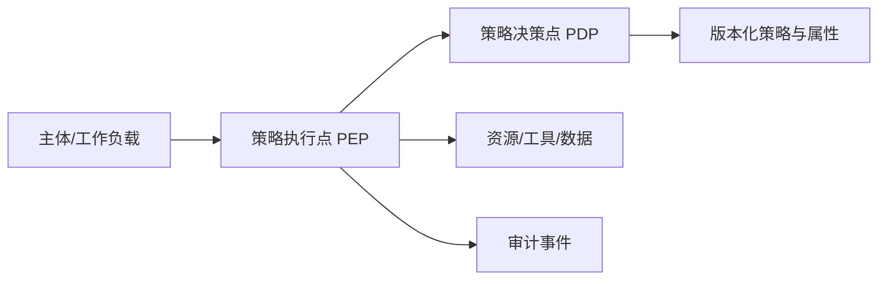

# 身份、授权与租户隔离

## 90 秒速答

我把认证、授权和业务校验分开：身份系统证明调用者是谁，策略决策根据主体、资源、动作、环境和
租户给出允许或拒绝，业务服务再校验对象状态和额度。网关只做粗粒度入口控制，对象级授权必须在
靠近数据和副作用的执行点重新检查，默认拒绝。RBAC 管稳定岗位，ABAC 处理租户、归属、地域、时间
和风险上下文；高危操作使用短期提权、双人审批和不可篡改审计。服务间优先工作负载身份与短期凭证，
持续清理休眠权限，并用越权、跨租户和撤权传播测试验证。

## 授权决策模型

```text
允许 = 主体可信
    AND 动作在权限内
    AND 资源属于当前租户/范围
    AND 业务前置条件成立
    AND 环境风险可接受
```

请求中的 `tenantId`、`ownerId` 和角色声明不能直接信任，应从可信身份和服务端资源关系推导。

## PDP 与 PEP



策略集中不等于所有请求跨网络调用一个 PDP。可使用本地缓存或 sidecar，但必须定义策略版本、失效、
撤权传播 SLO 和 PDP 故障时的 fail-closed/fail-safe 边界。

## RBAC、ABAC 与 ReBAC

| 模型 | 优点 | 风险 |
| --- | --- | --- |
| RBAC | 易理解、易审计 | 角色爆炸、对象级表达弱 |
| ABAC | 条件灵活 | 策略复杂、属性可信度要求高 |
| ReBAC | 适合资源关系图 | 查询与一致性复杂 |

生产常组合使用：RBAC 给基础能力，ABAC/ReBAC 缩小到对象与上下文，数据库行级策略作为纵深防御，
但不能代替应用业务授权。

## 高风险动作

退款、删除、导出、密钥变更等动作要求重新认证、展示确定对象和影响、审批参数冻结、稳定幂等键和
完整审计。审批不是万能：执行端仍要校验审批未过期、审批人与操作者分离、资源状态未变化。

## 面试官追问

### L1：JWT 验签成功是否代表可以访问订单？

不代表。它只证明 token 完整且由可信方签发，还要检查受众、时效、撤销风险及订单对象级授权。

### L2：权限缓存如何处理紧急撤权？

使用短 TTL、版本或撤权事件；高风险动作实时查询。定义撤权传播 SLO，并演练身份泄露后的批量吊销。

### L3：管理员是否可以绕过租户隔离？

常规管理员不应默认全局访问。支持场景使用按工单、时间和范围的临时授权，并全量审计和事后复核。

## 25 分自测

| 维度 | 5 分要求 |
| --- | --- |
| 正确性 | 认证、授权、业务校验、审计分层准确 |
| 深度 | 覆盖对象、租户、撤权、工作负载身份 |
| 取舍 | 灵活性、性能、可用性与风险平衡 |
| 表达 | 主体 → 资源 → 动作 → 条件 → 证据 |
| 可运维性 | 策略版本、传播 SLO、越权测试和应急提权完整 |

## 复述任务

不看正文回答：携带合法 JWT 的用户为何仍可能越权读取其他租户订单？

