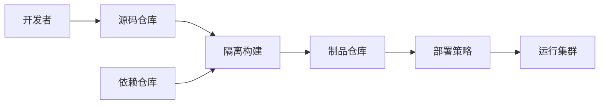

# 供应链安全与威胁建模

## 90 秒速答

威胁建模从业务资产、入口、主体、数据流和信任边界开始，枚举伪造、篡改、抵赖、泄露、拒绝服务和
权限提升等路径，再按影响与可利用性排序。供应链要覆盖源码、依赖、构建环境、制品仓库和部署身份：
锁定并审查依赖，生成 SBOM；构建使用隔离、最小权限和短期凭证；制品生成签名与来源证明；部署端只
接受受信策略的制品。漏洞治理结合是否实际可达、暴露面、业务影响和修复可用性，不仅按分数排队。
通过密钥泄露、恶意依赖、制品篡改和回滚演练验证。

## 信任边界图

每条边都要回答：谁认证谁、凭证多久、允许什么、产物能否被替换、证据保存多久。

## 分层控制

| 阶段 | 关键控制 |
| --- | --- |
| 源码 | 分支保护、评审、签名提交、高风险 CODEOWNERS |
| 依赖 | 锁文件、可信源、SBOM、许可证与漏洞策略 |
| 构建 | 临时环境、无长期密钥、网络限制、可复现性 |
| 制品 | 不可变标签、签名、来源证明、扫描 |
| 部署 | 策略校验、最小权限、环境隔离、审计 |
| 运行 | 行为检测、网络边界、工作负载身份、响应 |

扫描不是证明安全；它只覆盖已知规则。门禁要按风险分级，并给紧急修复保留受审计的例外路径。

## 面试官追问

### L1：发现高危 CVE 是否立即全量阻断？

先判断组件是否实际使用、漏洞路径是否可达、是否暴露及是否有补丁。核心高风险可阻断，低可达风险
可先补偿控制并限期修复；决策必须有 owner 和证据。

### L2：镜像扫描通过为何仍可能被攻击？

可能存在零日、运行配置错误、凭证泄露、构建后篡改或业务逻辑缺陷。需要签名、来源证明和运行时控制。

### L3：紧急发布如何不绕过全部安全控制？

预设 break-glass 流程，限制范围和时效，双人批准，全量审计；事后补齐检查并自动回收权限。

## 25 分自测

| 维度 | 5 分要求 |
| --- | --- |
| 正确性 | 资产、威胁、漏洞、来源证明边界准确 |
| 深度 | 覆盖源码到运行时及例外路径 |
| 取舍 | 风险、发布速度和修复成本平衡 |
| 表达 | 边界 → 攻击路径 → 控制 → 验证 |
| 可运维性 | SBOM、签名、策略、owner 和演练完整 |

## 复述任务

不看正文回答：镜像扫描通过为什么不能证明“可以安全部署”？

