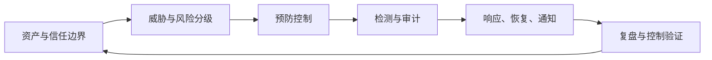

# 安全与合规工程

安全架构的核心不是堆产品，而是明确资产、主体、信任边界、允许动作和失败后果，再用独立控制、
不可抵赖证据和演练证明风险被限制。

## 学习地图

| 专题 | 核心问题 | 面试产出 |
| --- | --- | --- |
| [身份、授权与租户隔离](./01-identity-authorization) | 谁能在什么条件下对哪个对象做什么 | PDP/PEP、最小权限、越权测试 |
| [数据保护与生命周期](./02-data-lifecycle) | 数据从采集到删除如何持续受控 | 分类、加密、密钥、删除证明 |
| [供应链安全与威胁建模](./03-supply-chain-threat-modeling) | 风险如何在上线前发现并阻断 | 信任边界、SBOM、签名、门禁 |
| [安全事件响应与 AI 边界](./04-security-incident-ai) | 泄露、注入、越权后如何止损与恢复 | 取证、吊销、工具隔离、复发验证 |

## 安全闭环

## 完成标准

- 能区分认证、授权、业务前置条件和审计。
- 能解释加密不等于密钥安全，删除不等于删主表一行。
- 能把依赖、构建、制品、部署身份连成可验证供应链。
- 能把 Prompt Injection 当作不可信输入问题，并在模型外限制工具能力。

