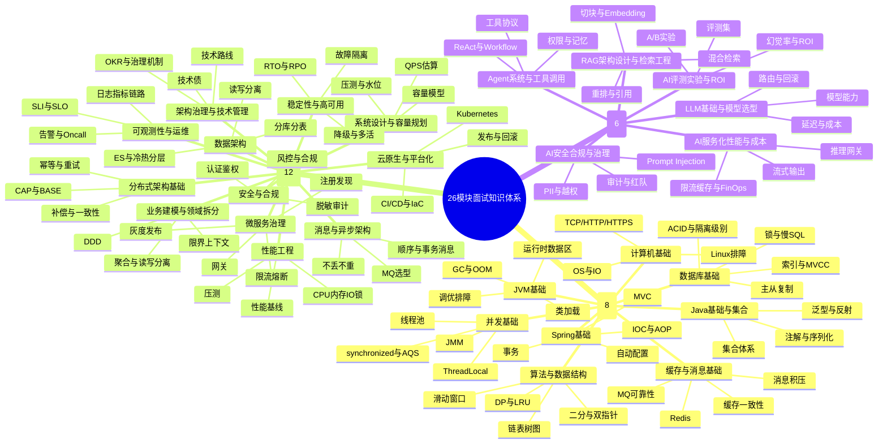
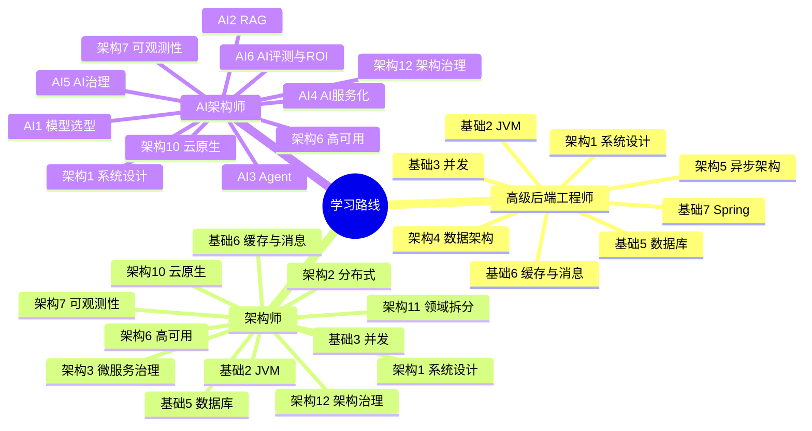
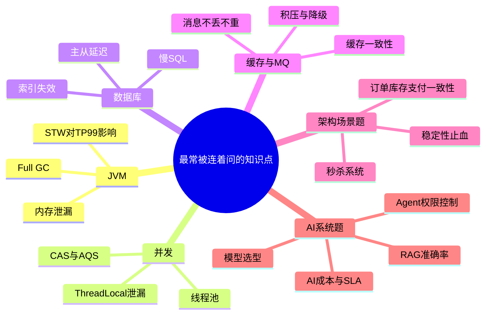

# 26模块知识脑图版

这份文件把 `基础8 + 架构12 + AI6` 压成一张可展开的学习脑图。  
建议用法：先看总图，再按你当前目标岗位只展开一条主线去刷。

## 总脑图

## 三条学习主线

## 高频交叉点

## 怎么用这张脑图

1. `第一遍`：只看一级和二级节点，建立全局地图。
2. `第二遍`：沿着一条路线展开，比如先只刷“高级后端工程师”。
3. `第三遍`：每天挑一个“高频交叉点”，反向回到具体模块文档。
4. `面试前冲刺`：优先刷“系统设计、分布式一致性、缓存/MQ、RAG/Agent”这几个交叉区。

## 推荐搭配

- 总入口：[基础 8 + 架构 12 + AI 6 总索引](/guides/基础8+架构12+AI6-总索引)
- 抽认卡：[高频 100 题](/guides/高频100题-抽认卡版)
