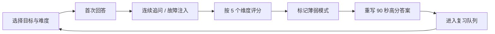

# 架构师面试实战工作台升级设计

## 1. 背景

现有题库已经形成 `520 道标准题 + 深度专题 + 27 个完整案例 + 训练台` 的内容体系，能够覆盖
高级后端、架构师和 AI 架构师的大部分知识准备。当前训练台主要从 15 道场景题中随机抽取
5 道，用户展开检查点后自行评分，适合从“看过”过渡到“能复述”。

资深架构师面试还会持续验证三类能力：

1. 能否用本人做过的项目和数据证明架构判断，而不是只讲标准答案。
2. 能否面对信息不完整的问题，主动澄清约束、逐步设计并处理故障注入。
3. 能否处理跨团队冲突、业务压力、技术风险和组织落地，并明确自己的责任边界。

本次升级把这三类能力合并为一个“架构师面试实战工作台”，形成从证据准备、现场推演到复盘
补强的闭环。

## 2. 产品目标

### 2.1 核心目标

- 让用户至少准备 3 个可经受连续追问的真实项目案例。
- 训练用户在看到模糊系统设计题后先澄清，而不是立即堆砌组件。
- 把领导力回答从抽象方法论升级为包含冲突、行动、结果和反思的真实故事。
- 三种训练统一使用 25 分评价、薄弱标签和复习队列。
- 保持静态站点可部署、个人数据本地保存、无账号也能完整使用。

### 2.2 非目标

第一阶段不做：

- 登录、云端同步、多人协作和面试官后台。
- 自动读取简历或将用户项目数据发送给第三方模型。
- 语音转写、实时音频分析和完全自动化的开放文本评分。
- 为了增加数量而复制大量只有标题差异的场景。

这些能力只有在本地版验证训练价值、并完成隐私和成本设计后再进入后续阶段。

## 3. 统一训练闭环

三个工作台共享同一条状态机：



每次训练必须保留四类产物：

- `原始回答`：用户第一次作答，不能被参考答案覆盖。
- `追问记录`：面试官问题和用户补充回答。
- `评分证据`：每个分数对应命中或遗漏的检查点。
- `改写答案`：用户复盘后形成的最终口述版本。

## 4. 统一能力模型

所有训练总分为 25 分，每个工作台保留 5 个维度，每维 0–5 分。维度名称可以针对场景变化，
但最终映射到统一能力标签，便于跨训练统计。

| 通用能力 | 项目答辩 | 系统设计 | 领导力与行为 |
| --- | --- | --- | --- |
| 问题定义 | 业务目标与约束 | 澄清需求与容量 | 情境、利益相关者与冲突 |
| 深度与证据 | 本人职责与事实证据 | 核心链路与数据语义 | 诊断根因与责任边界 |
| 取舍决策 | 候选方案与选择理由 | 方案比较与演进条件 | 决策原则、影响与协商 |
| 风险落地 | 迁移、故障、回退 | 失败模式、降级、恢复 | 推进、升级、例外与止损 |
| 结果表达 | 指标结果与反思 | SLO、验证与表达结构 | 结果、组织收益与反思 |

统一薄弱标签：

- `missing_constraints`：没有主动澄清业务或技术约束。
- `missing_numbers`：缺少 QPS、TP99、SLO、成本或结果数字。
- `solution_first`：未定义问题就直接给方案。
- `no_alternative`：只有一个方案，没有比较和放弃理由。
- `happy_path_only`：只讲正常路径，没有失败与恢复。
- `weak_ownership`：无法区分本人、团队和管理者的贡献。
- `no_business_result`：只有技术动作，没有业务或组织结果。
- `abstract_leadership`：只讲原则，没有具体冲突、行动和证据。
- `no_reflection`：没有错误判断、遗留风险或下一步演进。
- `poor_structure`：答案无法在 90 秒内形成清晰主线。

## 5. 项目答辩工作台

### 5.1 目标

把用户真实经历整理成可验证的“项目证据卡”，再通过连续追问判断真实性、架构深度、个人贡献
和业务结果。工作台不帮助用户编造经历；未知数据必须明确标记为未知或估算。

### 5.2 用户流程


### 5.3 项目证据卡

每个项目使用以下结构：

1. **项目背景**：业务、用户、周期、团队和系统边界。
2. **问题与基线**：原始故障、交付瓶颈或业务目标，以及改造前指标。
3. **规模约束**：DAU、峰值 QPS、数据量、增长率、TP99、SLO、RTO/RPO、预算和合规。
4. **本人职责**：本人直接决定、参与推动、仅提供建议的内容分别列出。
5. **候选方案**：至少两个选择、未选择原因、最大不确定性和验证方式。
6. **关键设计**：边界、数据流、事实源、一致性、可靠性和可观测性。
7. **迁移落地**：试点、灰度、兼容、双轨、回退、owner 和退场条件。
8. **事故与分歧**：错误判断、反对意见、上线问题和解决过程。
9. **结果证据**：上线前后指标、业务收益、成本、交付效率和事故变化。
10. **反思演进**：遗留风险、如果重做会改变什么、何时进入下一架构阶段。

每个数字带来源状态：`已验证`、`合理估算`、`未知`。未知数字不会阻止保存，但会成为答辩追问。

### 5.4 答辩模式

每次选择一个主题：

- 架构决策：为什么这样选，替代方案为什么不合适。
- 容量与性能：数据从哪里来，容量模型如何验证。
- 稳定性：最危险的失败模式、止损和恢复验收。
- 迁移与演进：如何灰度、如何回退、旧路径如何退场。
- 个人贡献：本人决定了什么，如何影响他人，结果如何证明。
- 失败复盘：做错过什么，何时发现，后来改变了什么机制。

追问按三级推进：

- `L1 事实核验`：规模、时间、角色、基线和结果。
- `L2 决策挑战`：替代方案、边界条件、成本和残余风险。
- `L3 反事实推演`：约束改变、故障发生或组织不配合时如何调整。

示例：

> 首问：介绍一次你主导的架构改造。
>
> L1：你个人做出的三个关键决策分别是什么？
>
> L2：为什么不继续优化原系统？迁移成本如何证明值得承担？
>
> L3：如果试点指标没有改善，但管理层已宣布全面推广，你会怎么办？

### 5.5 项目卡完整度规则

系统只做可解释的确定性检查：

- 没有改造前后指标：标记 `no_business_result`。
- 只有一个方案：标记 `no_alternative`。
- 本人职责全部使用“我们”：标记 `weak_ownership`。
- 有双写、双轨或灰度但无退场/回退条件：标记 `happy_path_only`。
- 所有规模数字都是估算：提示补充证据，但不判定经历不真实。
- 没有失败、分歧或反思：标记 `no_reflection`。

## 6. 信息不完整的系统设计面试

### 6.1 设计原则

场景开始时只给一句模糊问题，不能提前展示完整需求、参考架构和检查点。事实按用户提出的澄清
问题逐步披露；如果用户没有询问某类约束，该约束保持隐藏并在评分时指出。

### 6.2 面试阶段

| 阶段 | 建议时间 | 用户任务 | 系统行为 |
| --- | ---: | --- | --- |
| Brief | 1 分钟 | 理解一句话问题 | 只展示目标，不给容量与答案 |
| Clarify | 5 分钟 | 提出澄清问题 | 按问题类别披露事实 |
| Design | 12 分钟 | 给出架构和关键链路 | 记录方案，不显示检查点 |
| Challenge | 6 分钟 | 处理两次变化或故障 | 注入负载、依赖或组织约束 |
| Defend | 4 分钟 | 比较方案并定义验证 | 追问最大风险与替代方案 |
| Review | 5 分钟 | 自评并重写 | 展示遗漏事实、评分和参考路线 |

计时默认可暂停，练习模式不强制；模拟模式严格计时。

### 6.3 场景协议

每个场景不是一篇 Markdown 答案，而是一份可执行的题目定义：

```ts
type ScenarioFactCategory =
  | 'business' | 'traffic' | 'data' | 'latency'
  | 'availability' | 'consistency' | 'compliance'
  | 'cost' | 'team' | 'migration'

type SystemDesignScenario = {
  id: string
  title: string
  brief: string
  roles: Array<'architect' | 'backend' | 'ai'>
  difficulty: 1 | 2 | 3
  facts: Array<{
    category: ScenarioFactCategory
    answer: string
    keywords: string[]
  }>
  requiredClarifications: ScenarioFactCategory[]
  rubric: Array<{ dimension: string; checkpoints: string[] }>
  injections: Array<{
    stage: 1 | 2
    prompt: string
    expectedResponses: string[]
  }>
  referencePath: string
}
```

第一阶段使用分类按钮加自由文本记录澄清问题。分类按钮确保静态站点可以可靠判断用户询问了哪些
约束；自由文本保留真实面试的表达训练。后续如引入模型，可解析自由文本，但不能改变题目事实。

### 6.4 首批场景

首批只做 8 个高质量场景，每个场景包含完整事实、两次注入和评分规则：

| 场景 | 核心能力 | 注入示例 |
| --- | --- | --- |
| 全球订单与库存预占 | 一致性、分片、多地域 | MQ 故障；新增长尾地区 |
| 千万级通知平台 | 扇出、优先级、成本 | 突发十倍；供应商限流 |
| 多租户 SaaS 权限平台 | 隔离、授权、合规 | 大客户独立密钥；跨租户漏洞 |
| 实时风控决策平台 | 延迟、规则、特征一致性 | 特征服务超时；规则误杀 |
| 日志与可观测平台 | 摄取、冷热分层、成本 | 单租户流量异常；存储预算减半 |
| 内部开发者平台 | 平台边界、采用率、治理 | 团队绕过；迁移期限提前 |
| 企业 RAG 知识平台 | 数据权限、质量、评测 | 权限泄露；召回质量下降 |
| Agent 工具执行平台 | 状态、幂等、安全、审计 | 工具结果未知；模型供应商故障 |

难度来自约束冲突和演进注入，不通过堆叠更多中间件制造难度。

### 6.5 示例场景展开

初始只展示：

> 设计一个供多个业务使用的实时风控决策平台。

隐藏事实包括：峰值请求、TP99、规则变更频率、强制同步的决策、特征允许陈旧时间、误杀成本、
审计保留期限、团队规模和迁移约束。用户询问后才逐项披露。

第一次注入：特征平台 TP99 从 30ms 上升到 800ms，但支付链路不能整体失败。

第二次注入：监管要求能解释 12 个月内每一次拒绝决定，而当前在线特征只保留最新值。

高分回答必须覆盖 deadline、关键/非关键特征分级、降级语义、决策快照、规则版本、审计证据、
误杀与放过指标，而不是只说缓存、异步和扩容。

## 7. 领导力与行为面试

### 7.1 目标

训练架构师用真实事件说明如何影响决策、处理冲突和推动落地。答案必须包含具体利益相关者、约束、
本人行动和可验证结果，不能只复述“先对齐目标、再沟通协调”。

### 7.2 故事模板

使用六段式结构，不强制用户记忆新缩写：

1. **情境与影响**：发生了什么，为什么重要。
2. **冲突与约束**：各方目标、权力边界和不可回避的限制。
3. **本人判断**：根因、可选方案和决策原则。
4. **影响过程**：如何用数据、试点、协商或升级推动。
5. **结果证据**：业务、稳定性、成本、效率或团队行为变化。
6. **反思**：做错了什么，下次如何更早识别或降低成本。

### 7.3 题目主题

首批建设 6 个主题，每个主题 4 个场景，共 24 题：

1. **无职权影响**：推动平台采用、跨团队标准、公共能力建设。
2. **冲突与决策**：架构路线分歧、数据所有权、资源优先级。
3. **速度与风险**：业务催上线、合规门禁、接受残余风险。
4. **架构转型**：单体演进、技术债治理、旧平台退场。
5. **事故与责任**：重大故障、错误决策、复盘和机制修复。
6. **团队与组织**：能力梯队、委派、架构评审和标准例外。

每题包含三层追问：

- `真实性`：当时谁反对、你说了什么、你亲自做了什么。
- `判断力`：有哪些替代方案、何时升级、接受了什么风险。
- `反思力`：什么没有做好、如果没有结果如何止损、机制如何改变。

### 7.4 典型题目

> 业务要求今天上线，但你判断存在低概率、高损失的数据一致性风险。你如何处理？

不能只回答“沟通风险并准备回滚”。高分检查点包括：

- 把风险转换为影响范围、概率、可探测性和不可逆性。
- 区分架构师建议权、业务风险接受权和合规否决权。
- 提供缩小范围、关闭高风险路径、灰度或延迟等可选方案。
- 明确接受风险的 owner、补偿控制、观察指标和到期时间。
- 在时间压力下仍保留审计证据，事后复盘门禁是否需要自动化。

故障注入追问：上线后没有出事故，业务方认为架构评审只是拖慢交付，你如何回应并改进机制？

### 7.5 反模板规则

以下情况不能得到 4 分以上：

- 全程只说“我们”，无法说明本人判断和行动。
- 使用“充分沟通”“达成共识”等表述，但没有对象、分歧和方法。
- 结果只有“顺利上线”“获得认可”，没有证据。
- 通过架构师权威直接压制业务或其他团队。
- 把业务优先级、资源分配等组织决策伪装成纯技术结论。
- 没有说明失败、妥协、残余风险或后续机制变化。

## 8. 信息架构

```text
/training/                    实战训练总览与最近记录
/training/project-defense     项目答辩工作台
/training/system-design       信息不完整系统设计
/training/leadership          领导力与行为面试
/training/history             历史、能力雷达和复习队列
```

项目详情、训练场景和历史记录使用查询参数选择，如
`/training/project-defense?id=project-1`，避免在 VitePress 静态站点里引入动态路由服务端。

训练总览展示：

- 三个工作台的最近一次训练和当前分数。
- 项目证据卡完整度。
- 最近 10 次训练中最常见的三个薄弱标签。
- 建议的下一次训练，而不是随机推荐全部内容。

## 9. 数据模型与本地存储

### 9.1 核心数据

```ts
type ScoreDimension = {
  id: string
  score: 0 | 1 | 2 | 3 | 4 | 5
  evidence: string[]
  missing: string[]
}

type TrainingAttempt = {
  id: string
  mode: 'project' | 'system-design' | 'leadership'
  targetId: string
  startedAt: number
  completedAt?: number
  answers: Array<{ stage: string; prompt: string; answer: string }>
  dimensions: ScoreDimension[]
  weaknessTags: string[]
  rewrittenAnswer?: string
}

type ProjectEvidenceCard = {
  id: string
  title: string
  role: string
  fields: Record<string, string>
  metrics: Array<{
    name: string
    before?: string
    after?: string
    source: 'verified' | 'estimated' | 'unknown'
  }>
  updatedAt: number
}
```

系统设计题目和领导力题目属于版本化静态内容；用户项目和训练记录属于本地个人数据。

### 9.2 存储选择

现有掌握度记录继续使用 `localStorage`。项目长文本、训练回答和历史记录改用 IndexedDB，理由是：

- 项目答辩数据可能超过 localStorage 的常见 5MB 限制。
- IndexedDB 支持按工作台、时间和薄弱标签查询。
- 后续可以增加音频或附件元数据而不改变存储层。

新增版本化仓库 `interview-workbench-v1`，提供：

- 自动保存与最近修改时间。
- JSON 导出、导入和覆盖前预览。
- 单个项目删除和全部训练数据清除。
- schema 版本迁移；解析失败时保留原始备份，不静默清空。

项目内容默认永不离开浏览器。界面明确提示用户不要填写公司密钥、客户身份信息或受保密协议约束的
数据；可以使用范围、比例或脱敏名称。

## 10. 组件与代码组织

```text
docs/.vitepress/theme/
├── training/
│   ├── TrainingHub.vue
│   ├── ProjectDefense.vue
│   ├── SystemDesignInterview.vue
│   ├── LeadershipInterview.vue
│   ├── TrainingHistory.vue
│   ├── ScorePanel.vue
│   ├── AnswerEditor.vue
│   └── SessionTimer.vue
├── training-data/
│   ├── systemDesignScenarios.ts
│   ├── leadershipScenarios.ts
│   ├── rubrics.ts
│   └── weaknessTags.ts
├── training-store/
│   ├── db.ts
│   ├── projects.ts
│   ├── attempts.ts
│   └── export.ts
└── TrainingDashboard.vue

docs/training/
├── index.md
├── project-defense.md
├── system-design.md
├── leadership.md
└── history.md
```

`TrainingDashboard.vue` 逐步收敛为总览，不继续承载题库、状态、评分和三个复杂页面。题目数据从组件
中移出，保证内容可以独立审查和测试。

## 11. 评分与反馈策略

第一阶段采用“规则评分 + 用户确认”：

1. 系统根据选择的澄清类别、结构化字段和命中的检查点给出建议分。
2. 用户可以调整分数，但必须选择调整原因。
3. 每个维度显示命中证据和遗漏项，不能只显示一个总分。
4. 参考答案只在首次回答和追问结束后显示。
5. 训练报告推荐一个重练场景和一篇现有深度文章。

后续 AI 评审作为可替换适配器加入，必须满足：显式启用、发送前预览、项目字段脱敏、可选择本地模型
或远程模型、保留评分证据。AI 分数不能覆盖原始回答和用户自评。

## 12. 分期实施

### 阶段一：训练基础设施

- 拆出训练总览、通用计时器、答案编辑器和 25 分评分组件。
- 建立 IndexedDB、本地导出导入和版本迁移。
- 建立统一训练记录、薄弱标签和历史报告。
- 保留现有随机 5 题作为“快速热身”，避免功能回退。

验收：刷新后回答不丢失；可以完成、恢复、导出和导入一次训练；旧学习记录继续可用。

### 阶段二：项目答辩工作台

- 项目证据卡、完整度检查、90 秒介绍和六类答辩主题。
- 至少准备 30 条三级追问规则，可根据项目缺口选择追问。
- 项目评分报告能定位数字、角色、替代方案、回退和结果缺口。

验收：用户能创建 3 个项目，并为任一项目完成一次包含三级追问的答辩。

### 阶段三：信息不完整系统设计

- 实现场景状态机、分类澄清、事实披露、计时和两次故障注入。
- 交付 8 个首批场景，每个场景关联现有深度文章或完整案例。
- 首次回答完成前，不在 DOM 中渲染参考架构和评分检查点，避免查看源码泄题。

验收：每个场景都能从 Brief 完整走到 Review；未询问的关键约束会出现在遗漏报告中。

### 阶段四：领导力与综合报告

- 交付 6 个主题、24 道行为场景和三级追问。
- 建立项目故事复用：允许把项目证据卡选择为行为题背景，但不自动编造内容。
- 总览生成最近 10 次训练的能力趋势和前三个薄弱标签。

验收：抽查每道题都包含明确冲突、责任边界、反模板规则和结果证据要求。

### 阶段五：可选智能评审

只有在本地版收集到评分一致性与训练完成率后，再评估模型适配器、语音输入和云端同步。

## 13. 内容质量门禁

新增审计规则：

- 系统设计场景必须包含模糊 brief、至少 8 类隐藏事实、2 次注入和 5 维评分。
- 场景 facts、注入和参考答案中的数字不能互相矛盾。
- 领导力题必须包含明确利益冲突、责任边界和三级追问。
- 项目答辩追问不能暗示用户编造指标或夸大个人职责。
- 参考答案不得在首次回答完成前渲染。
- 每个薄弱标签必须映射至少一个推荐动作和现有学习资源。

工程门禁：

- `npm run build` 与 `npm run audit` 通过。
- 390px 移动端可以完成填写、计时、评分和导出。
- 键盘可以完成所有训练步骤，计时器具有无障碍提示且不强制抢焦点。
- IndexedDB 不可用时降级到内存并提示导出，不静默丢失回答。
- 导入数据必须校验 schema 和大小，不能执行其中的 HTML 或脚本。

## 14. 成功指标

本地产品无法统计全站用户行为时，先向用户本人展示可验证结果：

- 至少 3 张项目卡完整度达到 80%。
- 每张项目卡完成至少 2 个不同主题的答辩。
- 系统设计首次澄清覆盖率达到 80%，且不再连续出现 `solution_first`。
- 最近 5 次系统设计中 `happy_path_only` 出现次数下降。
- 领导力答案中本人行动、冲突和结果证据完整度达到 4/5。
- 同一薄弱标签经过三次针对性训练后，相关维度提升至少 1 分。

## 15. 关键设计取舍

1. **先确定性规则，后 AI 评分**：保证静态部署、隐私和反馈可解释性；代价是第一阶段不能精确理解任意自由文本。
2. **8 个高质量设计场景，不追求大量题目**：把成本投入事实一致性、追问和注入；后续按训练缺口扩充。
3. **项目数据本地保存**：降低隐私门槛；代价是用户需要主动导出备份，暂不支持跨设备同步。
4. **统一能力标签，不统一所有评分细节**：三个工作台可以横向比较，同时保留各自真正重要的能力。
5. **现有训练台保留为快速热身**：新工作台承担深度训练，避免简单需求被复杂流程拖慢。

这套设计的最终产物不是更多“正确答案”，而是三类可被面试官验证的证据：做过什么、如何在未知中
决策、以及如何让决策在组织中真正落地。
